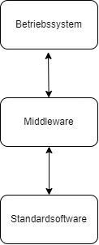

# Betriebliche Anwendungen 
+ Standardsoftware
+ Individualsoftware
+ Branchensoftware

+ Mittels IT-Anwendungen Probleme zu lösen
+ IT-Lösungen + Betrieblsorganisation

## Anwendungssoftware 

### Anwendungssoftware - Aufbau
Anwendungssysteme werden modular aufgebaut. Ziel ist es, die Unabhängigkeit der Software von der eingesetzten Hardware und der entsprechenden Datenspeicherung zu errreichen.

### Anwendungssoftware - Schnittstellen
Für die Verwirklichung der Portabilität sind standardisierte Schnittstellen 
zu schaffen. Standardisierte Schnittstellen gestatten offene Systemarchitekturen, Programmerweiterungen und Kommunikation mit anderen Systemen. Somit ist die spezielle Anwendungs- bzw. Softwarelösung viel einfacher 
in eine heterogene Hard- und Softwarelandschaft bzw. 
Anwendungsumgebung integrierbar. Die bekannteste Form sind Client-Server-Architekturen

Wichtige Standardschnittstellen und Protokolle
+ SQL
+ ODBC
+ ALE
+ EDI
+ CPI-C
+ TCP/IP
+ OLE

## Anwendungssoftware - Individualsoftware
Die für spezielle Aufgaben eines oder mehrerer Unternehmen extra erstellten betrieblichen Anwendungen basieren auf Individualsoft-ware, die ausschließlich für den bekannten Zweck entwickelt und eingesetzt wird.

## Kapitel -3- Komplexe betriebliche Anwendungen
Enterprise Resource Planning ->  komplexe Softwarelösungen, die die betrieblichen 
Prozesse in den Bereichen Materialwirtschaft (Beschaffung, Lagerhaltung, Disposition, Bewertung), Produktion, Finanz- und Rechnungswesen, Controlling, Personalwirtschaft, Forschung und Entwicklung, Verkauf und Marketing, Stammdatenverwaltung informell erfassen, planen, steuern und auswerten, verwandt.
+ ERP bedeutet Integration von Anwendungen und Nutzung von Software, die den gesamten Planungs- und Steuerungsprozess eines Unternehmens über alle Wertschöpfungsstufen abbildet.

### Customer Relationship Management – Nutzen
+ Vorteile
    + Kundendaten werden nur einmal erfasst
    + Redundante Daten und deren Bereinigung werden vermieden
    + Daten werden automatisch abgegelichen
    + Medienbrüche werden vermieden
    + Mitarbeiter kennen Kunden besser
    + Kunden werden kompetenter und effezienter bedient
    