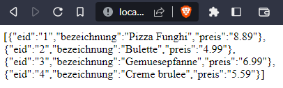

# Essen im Netz

## Gegeben
MySQL-Server
c#-Programm

## Ausgabe einer Liste mit Essen vom Server

## MySql

+ MySql-Server:
    + Datenbank:    Lieferdienst
    + Tabelle:      Essen 

### Datenbank erstellen
1. Starten in der Shell:
```SQL 
mysql -u root
```

2. Datenbank erstellen:
+ Create Datenbank:  
 ```SQL 
 create database
 ```
+ Datenbank benutzen:       
```SQL 
use lieferdienst;
```
3. Tabelle erstellen:
```SQL
MariaDB [lieferdienst]> create table essen (
    -> eid int auto_increment primary key,
    -> bezeichnung varchar(50),
    -> preis decimal(5,2));
```
+ Tabelle beschreiben lassen:
```SQL
describe essen;
```
+ Screenshoot Ausgabe beschreibung: 


### User erstellen
+ User Erstellen
```SQL
MariaDB [lieferdienst]> create user ronny@localhost identified by "1234";
```
+ User rechte zuweisen
```SQL
MariaDB [lieferdienst]> grant select on lieferdienst.essen to ronny@localhost;
```
+ kontrollieren 
    + root abmelden: ``` exit; ```
    + ronny anmelden: ``` mysql -u ronny -p ```

+ Ronny versucht etwas in die Tabelle einzufügen
```SQL
MariaDB [lieferdienst]> insert into essen (bezeichnung, preis) values ("Kartoffelbrei mit zwiebeln", 12.99);
ERROR 1142 (42000): INSERT command denied to user 'ronny'@'localhost' for table 'essen'
```

## Server
1. Apache starten
2. Ordner Prog in Verzeichnis: C:\xampp\htdocs erstellen 

## PHP
In Notepad++ wird ein neues PHP dokument mit folgendem Inhalt erstellt:

```php
<?php
	//Verbindung zur Datenbank
	$db = new mysqli("localhost", "ronny", "1234", "lieferdienst");
	
	//Erstellen SQL
	$sql = "select eid, bezeichnung, preis from essen";
	
	//wir senden die sql an den DB-Server
	//wir erhalten Zeiger an Anfang der Tabelle (vor der 1. Zeile)
	$tabelle = $db->query($sql);
	
	//wir holen die 1. Zeile in der Tabelle
	//fetch_assoc: assoziatives Array für eine Zeile
	//Zuordnung: feld->Wert
	$zeile = $tabelle->fetch_assoc();
	
	//solange noch eine zeile in der Tabelle
	while($zeile == true)
	{
		//Ausgabe der Zeile
		print_r($zeile);
		print("<br/>");
		
		//hohle die nächste Zeile
		$zeile = $tabelle -> fetch_assoc();
	}
	
	//Schließen Verbindung
	$db->close();
```

Zweite Variante:
```php
<?php
	//Verbindung zur Datenbank
	$db = new mysqli("localhost", "ronny", "1234", "lieferdienst");
	
	//Erstellen SQL
	$sql = "select eid, bezeichnung, preis from essen";
	
	//wir senden die sql an den DB-Server
	//wir erhalten Zeiger an Anfang der Tabelle (vor der 1. Zeile)
	$tabelle = $db->query($sql);
	
	//wir holen die 1. Zeile in der Tabelle
	//fetch_assoc: assoziatives Array für eine Zeile
	//Zuordnung: feld->Wert
	$zeile = $tabelle->fetch_assoc();
	
	//solange noch eine zeile in der Tabelle
	while($zeile == true)
	{
		//Ausgabe der Zeile
		print "$zeile[eid] <br/> $zeile[bezeichnung] <br/> $zeile[preis] <br/> <br/>";
		print("<br/>");
		
		//hohle die nächste Zeile
		$zeile = $tabelle -> fetch_assoc();
	}
	
	//Schließen Verbindung
	$db->close();
```
Das PHP Dokument wird als essen.php unter C:\xampp\htdocs\Prog abgespeichert.

### Ausgabe Browser
Zur Kontrolle im Browser folgenden link eingeben:  
http://localhost/prog/essen.php

Aufruf phpMyAdmin:  
http://localhost/phpmyadmin/


Ausgabe im Browser:
```PHP
Array ( [eid] => 1 [bezeichnung] => Pizza Funghi [preis] => 8.89 )
Array ( [eid] => 2 [bezeichnung] => Bulette [preis] => 4.99 )
Array ( [eid] => 3 [bezeichnung] => Gem?sepfanne [preis] => 6.99 )
Array ( [eid] => 4 [bezeichnung] => Creme brulee [preis] => 5.59 )
```

Seitenquelltext im Browser:
```html
Array
(
    [eid] => 1
    [bezeichnung] => Pizza Funghi
    [preis] => 8.89
)
<br/>Array
(
    [eid] => 2
    [bezeichnung] => Bulette
    [preis] => 4.99
)
<br/>Array
(
    [eid] => 3
    [bezeichnung] => Gem?sepfanne
    [preis] => 6.99
)
<br/>Array
(
    [eid] => 4
    [bezeichnung] => Creme brulee
    [preis] => 5.59
)
<br/>
```

### Hinzufügen von json_encode

```php
<?php
	//Verbindung zur Datenbank
	$db = new mysqli("localhost", "ronny", "1234", "lieferdienst");
	
	//Erstellen SQL
	$sql = "select eid, bezeichnung, preis from essen";
	
	//wir senden die sql an den DB-Server
	//wir erhalten Zeiger an Anfang der Tabelle (vor der 1. Zeile)
	$tabelle = $db->query($sql);
	
	//wir holen die 1. Zeile in der Tabelle
	//fetch_assoc: assoziatives Array für eine Zeile
	//Zuordnung: feld->Wert
	$zeile = $tabelle->fetch_assoc();
	
	//wir erstellen ein neues Array
	$daten = array();
	
	//solange noch eine zeile in der Tabelle
	while($zeile == true)
	{
		//wir fügen die Zeile dem Array hinzu
		array_push($daten, $zeile);
		
		//Ausgabe der Zeile
		//print_r($zeile);
		//print("<br/>");
		
		//print "$zeile[eid] <br/> $zeile[bezeichnung] <br/> $zeile[preis] <br/> <br/>";
		
		//hohle die nächste Zeile
		$zeile = $tabelle -> fetch_assoc();
	}
	
	//wir wandeln das Array in eine Zeichenkette - formatierung nach JSON - um
	$text = json_encode($daten);
	
	
	//wir lassen und den text ausgeben
	print $text;

	//Schließen Verbindung
	$db->close();
```

#### Ausgabe json im Browser
Screenshot von: http://localhost/prog/essen.php


+ Erklärung:  

ein Array/Liste in Eckigen Klammern []  

ein Objekt befindet sich in geschweiften Klammern {}

## HTTP zu JSON
1. Visual Studio: neue Konsolenanwendung TestHttpJASON.cs im Ordner repos erstellen
```C#
static void Main(string[] args)
        {
            //Start einer Asynchronen Methode
            //dieses wird beendet, wenn Main beendet wird
            //Wait() -- Main() muss warten, bis Methode beendet
            Method().Wait();
        }

        //diese Methode soll eine Verbindung zum WebServer herstellen
        //das Php-Skript ausführen
        //Ergebnis ausgeben
        //die Methode wird asynchron (async) ausgeführt -- im Hintergrungn 
        //Task ist eine Aufgabe, die asynchron ausgeführt wird
        static async Task Method()
        {
            //wir brauchen eine Verbindung zum Server
            HttpClient client = new HttpClient();

            //wir bauen eine Verbindung zum php.Skript auf
            //await -- warten auf Ergebnis und speichern in einer Variablen
            var response = await client.GetAsync("http://localhost/prog/essen.php");

            //wenn Verbindung erfolgreich
            if (response.IsSuccessStatusCode)
            {
                //wir holen uns den Inhalt des Datenpakets
                string json = await response.Content.ReadAsStringAsync();
                Console.WriteLine(json);
            }
        }

```

2. Wir fügen eine Klasse mit der Bezeichnung Essen hinzu

```C#
    public class Essen
    {
        public int eid { get; set; }
        public string bezeichnung{ get; set; }
        public double preis { get; set; }

    }
```

3. Newtonsoft.Jason installieren 

Using Newton hinzufügen
```php
using Newtonsoft.Json
```

4. Liste erstellen
```C#
//wir erstellen eine leere Liste
                List<Essen> liste = new List<Essen>();

                //deserialisieren - wir wandeln um den json-string in eine liste von objekten
                //< List<Essen> > --> in den <> den finalen Typ hinschreiben -- was kommt raus
                //wir müssen schon vor der Deserialisierung mitteilen, was Ergebnis ist.
                liste = JsonConvert.DeserializeObject<List<Essen>>(json); 

                foreach(Essen e in liste)
                {
                    Console.WriteLine(e.eid + "|" + e.bezeichnung + "|" + e.preis);
                }
```

Für Später

```C#
        //diese Methode soll eine Verbindung zum WebServer herstellen
        //das Php-Skript ausführen
        //Ergebnis ausgeben
        //die Methode wird asynchron (async) ausgeführt -- im Hintergrungn 
        //Task ist eine Aufgabe, die asynchron ausgeführt wird
        static async Task Method()
        {
            //wir brauchen eine Verbindung zum Server
            HttpClient client = new HttpClient();

            //wir bauen eine Verbindung zum php.Skript auf
            //await -- warten auf Ergebnis und speichern in einer Variablen
            var response = await client.GetAsync("http://localhost/prog/essen.php");

            //wenn Verbindung erfolgreich
            if (response.IsSuccessStatusCode)
            {
                //wir holen uns den Inhalt des Datenpakets
                string json = await response.Content.ReadAsStringAsync();
             
                //wir erstellen eine leere Liste
                List<Essen> liste = new List<Essen>();

                //deserialisieren - wir wandeln um den json-string in eine liste von objekten
                //< List<Essen> > --> in den <> den finalen Typ hinschreiben -- was kommt raus
                //wir müssen schon vor der Deserialisierung mitteilen, was Ergebnis ist.
                liste = JsonConvert.DeserializeObject<List<Essen>>(json); 

                foreach(Essen e in liste)
                {
                    Console.WriteLine(e.eid + "|" + e.bezeichnung + "|" + e.preis);
                }
            }
        }
```
Klasse für Später

```C#
namespace TestHttpJSON
{
    public class Essen
    {
        public int eid { get; set; }
        public string bezeichnung{ get; set; }
        public double preis { get; set; }

    }
}
```


## WPF-Anwendungen für grafische Oberflächen
-- WPF - Windows Presentation Foundation --

Layout: xaml (extensible application markup Language)  
Funktion: C#


## Neues Projekt

WPF-App(.NET Framework) --> Name: Wpf_Lieferdienst