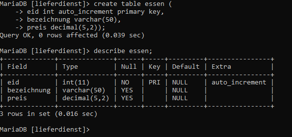

# Essen im Netz

## Gegeben
MySQL-Server
c#-Programm

## Ausgabe einer Liste mit Essen vom Server

+ MySql-Server:
    + Datenbank:    Lieferdienst
    + Tabelle:      Essen 

1. Starten in der Shell: mysql -u root 

2. 
+ Erstellen der Datenbank: create database 
+ Datenbank benutzen:         lieferdienst; use lieferdienst;


```SQL
MariaDB [lieferdienst]> create table essen (
    -> eid int auto_increment primary key,
    -> bezeichnung varchar(50),
    -> preis decimal(5,2));
```
Screenshoot 



### User erstellen
+ User Erstellen
```SQL
MariaDB [lieferdienst]> create user ronny@localhost identified by "1234";
Query OK, 0 rows affected (0.014 sec)
```
+ User rechte zuweisen
```SQL
MariaDB [lieferdienst]> grant select on lieferdienst.essen to ronny@localhost;
Query OK, 0 rows affected (0.006 sec)
```
+ kontrollieren 
    + root abmelden: ```SQL exit; ```
    + ronny anmelden: ```SQL mysql -u ronny -p ```

+ Ronny versucht etwas in die Tabelle einzufügen
```SQL
MariaDB [lieferdienst]> insert into essen (bezeichnung, preis) values ("Kartoffelbrei mit zwiebeln", 12.99);
ERROR 1142 (42000): INSERT command denied to user 'ronny'@'localhost' for table 'essen'
```


## Server
1. Apache starten
2. Ordner Prog in Verzeichnis: C:\xampp\htdocs erstellen 


Wir erstellen einen Nutzer, 


## PHP

```php
<?php
	//Verbindung zur Datenbank
	$db = new mysqli("localhost", "ronny", "1234", "lieferdienst");
	
	//Erstellen SQL
	$sql = "select eid, bezeichnung, preis from essen";
	
	//wir senden die sql an den DB-Server
	//wir erhalten Zeiger an Anfang der Tabelle (vor der 1. Zeile)
	$tabelle = $db->query($sql);
	
	//wir holen die 1. Zeile in der Tabelle
	//fetch_assoc: assoziatives Array für eine Zeile
	//Zuordnung: feld->Wert
	$zeile = $tabelle->fetch_assoc();
	
	//solange noch eine zeile in der Tabelle
	while($zeile == true)
	{
		//Ausgabe der Zeile
		print_r($zeile);
		print("<br/>");
		
		//hohle die nächste Zeile
		$zeile = $tabelle -> fetch_assoc();
	}
	
	//Schließen Verbindung
	$db->close();
```