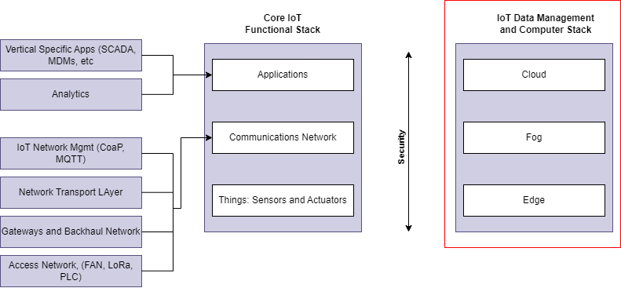

# IoT- Datenmanagement

## Traditionelles IT-Cloud-Computing-Modell

|Vorteile|Nachteile|
|---|---|

## Zugriffsarten auf Daten
+ Blockbasiert

+ Dateibasiert

|Blockbasiert|Dateibasiert|
|---|---|
|**Vorteile**|**Vorteile**|
|||
|**Nachteile**|**Nachteile**|
|||

### Unternehmensspeicherlösungen
+ Festplatten und Solid State Drives (SSDs)

+ RAID (Redundant Array of Indenpent Disks)

+ Storage Controller

+ Netzwerkverbindungen

### Anwendungsfälle für Unternehmensspeicherlösungen
+ Speicherung von Unternehmensdaten
+ Archivierung von E-Mails
+ Sicherung von Backups
+ Gemeinsame Nutzung von Daten und Zusammenarbeit in Teams

## DAS - Direct Attached Storage 
DAS-Datenträger sind dem Server physisch angefügt
+ Vorteile
    + Einfach zu konfigurieren
    + Preisgünstige Lösung

+ Nachteile
    + Isoliert, da nur einem einzelnen Server anfügt
    + Langsam

## NAS - Network Attached Storage

# IoT Datenspeicher und Datenverarbeitungskonzepte

## Edge Computing
Edge Computing bezeichnet eine dezentralisierte Cloud-Computing-Architektur. Generierte DAten (z.B. von lokalen Rechnern oder IoT-Geräten), werden unmittelbar selbst oder in der Nähe, am Rand (Edge) einer IT-Infrastruktur verarbeitet. Dies entlastet die Netzbandbreite zu einem Rechenzentrum (Cloud)  

Edge Computing nutzt die zunehmende geräteinterne Rechenleistung, um nahezu in Echtzeit detaillierte Einblicke und vorausschauende Analyse zu ermöglichen.
+ 

## Fog Computing

## Cloud Computing