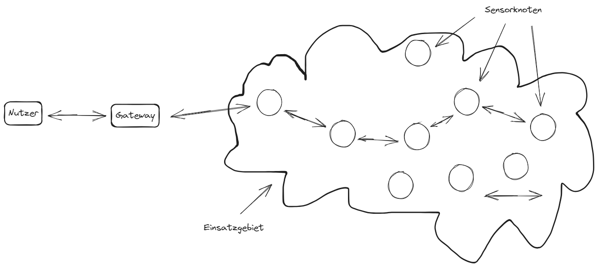

# Smarte Objekte
**Vereinfachte Definition**  
+ Physische Gegenstände mir Sensoren, Aktuatoren und Kommunikationsfähigkeit
+ Teil des Internet of Things (IoT) und ermöglicht Vernetzung und Kommunikation
+ Erfassen Informationen über die Umgebung (Sensorik)
+ Führen Aktionen basierend auf Informationen aus (Aktuatorik)
+ Drahtlose oder kabelgebundene Konnektivität zu anderen Geräten und Systemen
+ Intelligente Algorythmen und Logik für Datenverarbeitung und Entscheidungsfindung

**Anwendungsbereiche:**  
Smart Home, Industries 4.0, Gesundheitswesen, Logistik, Verkehr, etc.

## Eingeschränkte Geräte
+ Intelligente Sensoren
+ Eingebettete Geräte
+ Prototyping 

## Eingebettete Systeme
Eingebettete Systeme sind fpr bestimmte Funktionen innerhalb eines größeren konzipiert.

**Beispiel:**  
Haussicherheitsgeräte

## Definition
+ Funktionalität und Aufgaben:
    + Erfassen von Sensordaten
    + Informationsverarbeitung
    + Ausführen von Steuerungsaktionen
    + Drahtlose Kommunikation mit anderen Geräten
+ Intelligenz und Entscheidungsfindung:
    + Datenanalyse und -interpretation
    + Autonomes HAndeln basierend auf Algorithmen, KI-Techniken oder Regeln
    + Interaktion mit anderen Systemen
+ Kommunikationsfähigkeit
    + Drahtlose Kommunikationstechnologien (z.B. WLAN, Bluetooth, Zigbee)
    + Teil eines größeren Netzwerks oder einer intelligenten Infrastruktur sein
+ Anpassungsfähigkeit und Lernfähigkeit
    + Anpassung an verschiedene Umgebung und Anforderungen
    + Lernfähigkeit zur Selbstverbesserung
    + Anpassung an neue Bedienungen für bessere Ergebnisse
+ Kontextsensivität
    + Erfassung und Nutzung von Umgebungsinformationen
    + Anpassung von Funktionen oder Aktionen basieren auf Standortdaten, Umgebungstemperatur oder Benutzerpräferenzen

## Eingebettete Systeme

## Cyber-physische Systeme (CPS)

### Unterschied Klassisches Computersystem / Cyber-physische Systeme

## Sensoren
+ Ein Sensor misst eine physikalische Größe und wandelt diesen Messwert in eine digitale Darstellung um. 
+ Sensordaten können direkt angewendet werden, um eine physikalische Umgebung oder einen physikalischen Prozess zu steuern.
+ 

### Physikalisches Grundprinzip der Sensoren
+ Widerstandsbasierte Sensoren
    + Diese Sensoren nutzen die Veränderung des elektrischen Widerstands, um physikalische Größen wie Druck, Dehnung oder Feuchtigkeit zu messen. Sie basieren auf Materialien, deren Widerstand von diesen Größen beeinflusst wir
+ Kapazitive Sensoren
    + Sie messen die Kapazitätsänderung zwischen zwei Elektroden, die durch ein Dielektrikum getrennt sind. Diese Sensoren eignen sich zur Messung von Nähe, Berührung oder Feuchtigkeit
+ Optische Sensoren
    + Sie nutzen optische Prinzipien wie Reflexion, Absorption oder Streuung von Licht, um Informationen über Entfernungen, Farben oder Oberflächeneigenschaften zu liefern.

## Aktoren
+ Aktoren sind natürliche Ergänzungen zu Sensoren. Aktoren empfangen eine Art von Steuersignal. Ein elektrisches Signal oder einen digitalen Befehl. Dadruch wird ein physikalischer Effekt ausgelöst. In der Regel eine Art von Bewegung, Kraft usw. 

### Klassifizierung der Aktoren nach Energieart
|Typ|Beispiel|
|---|---|
|Mechanische Aktoren|Hebel, Spindelhubgetriebe, Handkurbel|
|Elektrische Aktoren|Thyrisator, bipolarer Transistor, Diode|
|Elektromechanische Aktoren|AC-Motor, DC-Motor, Schrittmotor|
|Elektromagnetische Aktoren|Elektromagnet, Hubmagnet|
|Hydraulische und pneumatische Aktoren|Hydraulikzylinder, Pneumatikzylinder, Kolben, Druckregelventile, Druckluftmotoren|
|Aktoren aus Intelligenten Materialien (umfasst thermische und magnetische Aktoren|Formgedächtnislegierung, Ionenflüssigkeitsaustauscher, magnetorestriktives Material, Bimetall Streifen, piezoelektrischer Bimorph|
|Mikro- und Nanoaktoren|Elektrostatischer Motor, Mikroventil, Kammantrieb|

### Biespiele für Aktoren im IoT
+ Motorbasierte Aktoren
    + 
+ Ventilbasierte Aktoren

+ Beleuchtungssteuerung

## MEMS Micro-Electro-Mechanical Systems
+ Es handelt sich um miniaturisierte mechanische und elektronische Komponenten, die auf einem einzigen Chip integriert sind.
+ MEMS ermöglichen die Kombination von Sensoren, Akuatoren und Elektronik auf kleinstem Raum
+ Sie bieten eine Vielzahl von Anwendungsmöglichkeiten in verschiedenen Bereichen

### Einsatzgebiete von MEMS
+ Kommunikationstechnologie
    + MEMS-Mikrofone, Beschleunigungssensoren im Smartphone
+ Medizintechnik
    + Implantierbare Sensoren, Lab-on-a-Chip-Systeme
+ Automobilindustrie
    + Airbad-Sensoren, Fahrdynamikregelung
+ Umweltüberwachung
    + Luftqualitätssensoren, Wetterstationen
+ Industrieautomatisierung
    + Präzisionsmessungen, Prozesssteuerung

## Sensornetzwerke (SANET)

### Aufbau von Sensornetzwerken
+ Große Anzahl an Sensorknoten welche die Datenaufnahme realisieren
+ Gateway welches die Verbindung zwischen Sensorknoten und dem Internet / Netzwerk ermöglicht
+ Nutzer als Abnehmer der Informationen (kann auch ein Informationssystem sein)

Im Rahmen von engmaschigen Sensornetzwerken sind Sensorknoten nur selten direkt mit dem Internet verbunden. Häufig übernimmt ein Gateway die Verbindung zwischen Sensornetzwerk und dem Internet. Ein Funkstandard zu diesem Zweck ist LoRaWAN.

