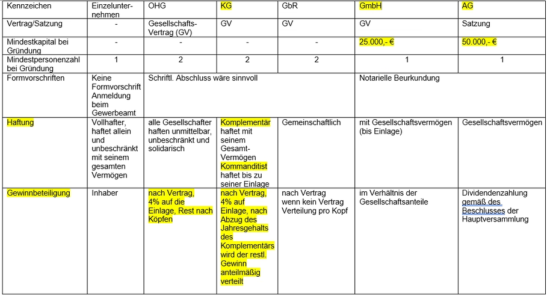

# **Das Unternehmen** 

## Unternehmensformen
+ GmbH --> Gesellschaft mit beschränkter Haftung
+ AG --> Aktiengesellschaft
+ GbR --> Gesellschaft bürgerlichen Recht
+ KG --> Kommanditgesellschaft
+ OHG --> Offene Handelsgesellschaft
+ e.G. --> eingetragene Genossenschaft
+ Einzelunternehmen
+ VEB --> Volkseigener Betrieb 
+ UG --> Unternehmergesellschaft
+ GmbH & Co KG --> 
Bei der Wahl der richtigen Rechtsform für das Unternehmen sollte man verschiedene charakteristische Merkmale der einzelnen Unternehmensformen beachten:

- soll das Unternehmen allein oder mit anderen gegründet werden.
- welche Haftungsverhältnisse möchten Sie?
- Welche Höhe der Gründungskosten fallen an?
- wie soll das Unternehmen gelenkt und geleitet werden?
- wie soll das Unternehmen finanziert werden.
- wie soll der Gewinn und Verlust verteilt werden?
- welche gesetzlichen Vorschriften gibt es?

Unternehmensform ist die rechtliche Verfassung (Rechtsform) des Unternehmens. Durch sie wird die Rechtsbeziehung des Unternehmens im Innen- und Außenverhältnis geregelt.

Die Entscheidung für die Unternehmensform hängt ab:
- Von der Größe der Unternehmen
- Von der Möglichkeit der Kapitalbeschaffung
- Von der Haftung
- Von den steuerlichen Überlegungen

## Rechtliche Grundlage für die Unternehmensformen

+ Bürgerliches Gesetzbuch (BGB) --> gbR u. Vereine
+ Handelsgesetzbuch (HGB) --> e.K. OHG, KG, GmbH&Co, KG
+ Spezielle Gesetze: Aktiengesellschaft (AktG), GmbH-Gesetz (GmbHG), Eingetragene Genossenschaftsgesetz (GenG).

## **Einzelunternehmen** 
wird von 1 Person gegründet. Ca. 90%.  

**Vorteile:**
- Kann frei und schnell entscheiden
- Kann den Gewinn allein verteilen
- Geringer Kapitalaufwand
- Glaubwürdigkeit bei der Bank ist hoch
- Formalitäten sind einfach

**Nachteile**
- Hohe Arbeitsbelastung
-  Persönlicher Ausfall kann schnell zur Krise führen
- Trägt das Unternehmensrisiko allein
- Unbeschränkte Haftung auch mit Privatvermögen
- Kapitalkraft ist begrenzt.

## **OHG - Offene Handelsgesellschaft**
**Vorteile:**
- Keine gesetzlichen Vorschriften über mögliches Startkapital (kein Mindestkapital) unkomplizierte und kostengünstige Gründung.
- Frei gestaltbare Regeln zur Unternehmensführung und Aufgabenverteilung (über Gesellschaftsvertrag) persönlich haftenden Gesellschafter haben hohes Ansehen bei den Banken

**Nachteile**
- Gesellschafter haften mit ihrem Privatvermögen.
- Die Rechtsform ist nur für Kaufleute zugänglich.
- Die doppelte Buchführung ist für die OHG verpflichtend, was einen hohen Aufwand mit sich bringt.

## **KG - Kommanditgesellschaft**
**Vorteile**
- Haftungsbeschränkung des Kommandisten.
- rasche und einfache Gründung: keine Formvorschriften beim Vertrag.
- Einnahmen-Ausgaben-Rechnung bis Bilanzierungspflicht.
- Flexible Gestaltung der Rolle des Kommandisten.
- Es reicht, wenn einer der Komplementäre die gewerberechliche Befähigung erbringt.

**Nachteile**
- unbeschränkte persönliche Haftung der Komplementäre
-  großes Vertrauen unter den Gesellschaftern ist notwendig. Denn die "Einzelvertretungsmacht" gilt für jeden der Komplementäre. 

## **GbR**
**Vorteile**
-die einfachste Form für zwei oder mehr Gründer, gemeinsam ein Unternehmen zu gründen.
- auch für Freiberufler möglich
- kein Mindest-Stammkapital erforderlich.
- hohes Mitbestimmungsrecht der Gesellschadter.
**Nachteile**
- Der größte Nachteil der GbR bzw, von Personengesellschaften ist wohl die **umfangreiche Haftung**. Sollte etwas schief laufen, sind ihre Verluste nicht auf das Gesellschaftsvermögen begrenzt. Im schlimmsten Fall kommt es nicht nur zur Insolvenz der Gesellschaft, sondern auch zur Privatinsolvenz der Gesellschafter.

## **GmbH**
**Vorteile**
- Hohe Flexibilität
- Beschränkte haftung
- Steuerliche Vorteile
- Eigene Rechtsfähigkeit
**Nachteile**
- Hohes Mindestkapital
- Hoher Arbeitsaufwand
- Risiko der persönlichen Haftung.

## **Gesellschaftsunternehmer**
**Gesellschaftsunternehmen** werden in der Regel durch einen Vertrag zwischen mindestens zwei Personen zur Erreichung eines gemeinsamen Zieles/Zweckes gegründet.

Gründe, die im Wirtschaftsleben zur Bildung einer Gesellschaft führen sind vielfältig:
- Haftungsverteilung
- Verteilung der Kosten
- Verteilung der Arbeiten
- Steuerliche Vorteile
- Repräsentation der Unternehmung
- Wissen wird erweitert.
- Erhöhung der Kreditwürdigkeit
- Ausschalten der Konkurenz
- Erhöhung des EK
- Persönliche Gründe (Alter, Krankheit, ...)

Unterschiede:
|Merkmale|Personengesellschaften|Kapitalgesellschaften|
|---|---|---|
|Rechtspersönlichkeit|Natürliche Person|Juristische Person|
|Gesellschaftsvermögen|Gesamthandvermögen der Gesellschaft|Eigenes Vermögen der juristischen Person|
|Haftung|Gesellschaftsvermögen und dem Privatvermögen der Gesellschafter|Gesellschaftsvermögen|
|Geschäftsführungsbefugnis Vertretungsmacht|in der Regel durch Gesellschafter|in der Regel Leitungsorgane|
|Bestehen der Unternehmung|Grundsätzlich vom Gesellschaftsbestand abhängig|Grundsätzlich vom Gesellschaftsbestand abhängig|
|Besteuerung des Gewinns|einkommenssteuerpflichtig|körperschaftssteuerpflichtig|

## Unternehmensformen 

## Stakeholder
Als Stakeholder werden alle Personen, Personengruppen oder Institutionen bezeichnet, die direkt oder indirekt von den Tätigkeiten eines Unternehmens betroffen sin, Ansprüche und Erwartungen haben und daher Einfluss auf das Unternehmen ausüben

## Shareholder
Shareholder sind Inhaber und Anteilseigner eines Unternehmens. Demnach können Shareholder finanziell von dem Unternehmen profitieren. Darüber hinaus haben Shareholder auch eine gewisse Macht und können beispielsweise bei regelmäßigen Versammlungen über die Unternehmensleitung bestimmen bzw. diese beeinflussen. Der Begriff wird oft bei Börsendotierten unternehmen verwendet bsp. Aktionäre.

# **Rechtliche Rahmenbedingungen für die Gründung von Unternehmen**
Grundgesetz und Gewerbeordnung: Gewerbefreiheit  
Grundsätzlich kann jedermann ein Gewerbe betreiben  
Die Gewerbefreiheit ermöglicht den freien Wettbewerb und damit preisgünstige Bedarfsdeckung.  
Um die Öffentlichkeit vor möglichen negativen Folgen zu schützen muss diese in gewisser weise eingeschränkt werden. Gewerbebetriebe dürfen nur dort errichtet werden, wenn der Flächennutzungsplan diese als Gewerbegebiete, Industriegebiete oder Mischgebiete ausweist.

## **Kaufmannseigenschaften**
**Istkaufmann**  
Ist eine Person, die ein Handelsgewerbe betreibt. (z.B. Großhändler, Einzelhändler, Kreditinstitute, Versicherungsinstitute)  
*Mitglieder freier Berufe*: Journalisten, Architekten, Ärzte, Rechtsanwälte ... . Sind keine Kaufleute, weil die kein Handelsgewerbe betreiben.

**Kannkaufmann**  
Ist eine Person, die die Kaufmannseigenschaften durch die Eintragung ins Handelsregister erworben hat.   
z.B.
- Gewerbliche Unternehmen (Handwerker, ...)
- Land- und Forstwirtschaftliche Unternehmen 

**Formkaufmann**  
Werden auf Grund der gewählten Rechtsform (Kapitalgesellschaften, Genossenschaften, versicherungsvereine auf Gegenseitigkeit)

---

Auf die Kaufleute finden alle Vorschriften des HGB Anwendung.

Die Eintragung von Istkaufmann in das Handelsgesetzbuch hat rechtsbezeugende (deklaratorische) Wirkung.   

Kann- und Formkaufleute werden erst durch die Eintragung ins Handelsregister zu Kaufleuten. Die Eintragung hat rechtserzeugende (konstitutive) Wirkung.

Das Handelsregister ist ein amtliches Verzeichnis der Kaufleute eines Amtsgerichtsbezirks oder mehrerer Amtsgerichtsbezirke, das vom Registergericht eines Amtsgerichts elektronisch geführt wird.  

Handelsregister ist über die Seite des Unternehmensregisters Veröffentlichungen und Bekanntmachungen im elektronischen Bundesanzeiger.

Eintragungspflicht:  
Inhaber muss anmelden --> Antrag stellen  

Gliederung des Handelregisters

Abteilung A und B

---
12.12.2022

---
# Grundlegende Funktionsweisen von Unternehmen

## **Zielsystem des Unternehmens**
### **Das Unternehmensteitbild**

Grundlage für die Unternehmensziele bilden die in vielen Unternehmen im Unternehmensleitbild formulierten Unternehmensgrundsätze.

### **Definition Unternehmensleitbild:**   
Das Unternehmensleitbild ist ein Gefüge von Normen, Werten, Verhaltens- und Arbeitsweisen eines Unternehmens. Es enthält Leitlinien und Ziele für die Handelnden des Unternehmens. 

Die folgenden Inhalte sind typisch für Unternehmensleitbilder:
- Wer sind wir?
- Welche Ziele haben?
- Wir wollen wir miteinander umgehen?
- Wie wollen wir kommunizieren?
- Wie wollen wir uns nach außen hin verhalten?
- Wie wollen wir nach außen kommunizieren?

Das Unterleitbild möchte folgende Adressaten ansprechen:
- andere Geschäftsleute  -- Waren liefern  -- Lieferanten
- Kunden
- Mitarbeiter
- Anteilseigner
- Öffentlichkeit

Aus dem Unternehmensleitbild lassen sich die Unternehmensziele ableiten. Aus der Unternehmenskultur erwächst die Unternehmensidentität (Corporate Identity). Sie zeigt sich in der Form der Selbstdarstellung gegenüber der Öffentlichkeit und der Bildung eines Wir-Gefühl beim Personal.
### **Unternehmensziele:**
**Oberstes Ziel ist:**
- Unternehmergewinn  
Erwerbswirtschaftliches Prinzip ist oberstes Ziel in der Marktwirtschaft. 
- Gewinnmaximierung

**Ökonomische Ziele:**
- Umsatzsteigerung
- Kostensenkung
- Erhöhung der Marktanteile
- Verdrängung von Konkurrenten
- Erschließung von neuen Märkten 
- Erhöhung der Kundenbindung  

**Ökologische Ziele:**
- Klimaneutral zu produzieren (CO²)
- Lärmreduzierung 
- Natürliche Ressourcen schonen
- Einhaltung von Umweltstandards
- Recycling 
- Nachhaltigkeit
- Kurze Wege
- Umweltfreundliche Transportmittel 

**Soziale Ziele:**
- Sicherung von Arbeitsplätzen
- Gerechte Entlohnung
- Glückliche und zufriedene Mitarbeiter*Innen
- Weiterbildungsmöglichkeiten (Aufstiegschancen)
- Mitarbeiter in betrieblichen Fragen
- Gewinnbeteiligung der Mitarbeiter*Innen
- Menschenwürdige Arbeitsbedingungen

Jedes Unternehmen ist dem Wirtschaftlichkeitsprinzip unterworfen. Die Wirtschaftlichkeit ist Ausdruck dafür, wie weit eine Tätigkeit dem Wirtschaftlichkeitsprinzip genügt. Die Wirtschaftlichkeit ist also Maß für die Einhaltung des ökonomischen Prinzips. Dieses Prinzip ist darauf gerichtet ein möglichst günstiges Verhältnis von Aufwand und Ertrag bzw. Kosten und Leistungen zu erzielen.

**Zielbeziehungen**
- **Zielharmonie:** Das Erreichen eines Ziels durch die Anderen unterstützt wird. Eine gute Zielharmonie kann dazu beitragen, dass das Unternehmen effizienter und erfolgreicher arbeitet. Es kann besser auf Veränderungen und Herausfoderungen reagiert werden.

- **Zielkonflikt:** Das Erreichen des Hauptzieles wird erschwert durch die ökologischen/sozialen Ziele. Diese Zielbeziehung ist in der Wirtschaft die Normalität.

- **Zielneutralität:** Das Erreichen eines Ziels berührt die Zielerreichung in einem anderen Bereich nicht.   
z.B. Unternehmen plant die Erweiterung der Produktionsanlagen und gleichzeitig den Ausbau eines internen Fortbildungswesens.

---
Corporate Identity --> Unternehmensleitbild

Corporate Design --> Logo, Farbe, Typographie

Corporate Behavior --> schlüssige und widerspruchsfreie Verhaltensweise von Unternehmensleitung bis Mitarbeiter

Corporate Communication --> Werbung, Einsatz aller Kommunikationsinstrumente

---
## **Ökonomisches Prinzip**
|Maximalprinzip|Minimalprinzip|
|---|---|
|Wenn mit gegebenen Mitteln der Größtmögliche Erfolg erzielt wird|Wenn ein bestimmter Erfolg mit geringsten Mitteln erzielt wird.|

Die rechnerische Erfassung der Wirtschaftlichkeit ist auf verschiedene Weise möglich.
Als Relation von Istgrößen: Dabei handelt es sich um bewerte Größen, d.h. Veränderung der Beschaffungspreise von Produktionsfaktoren und/oder der Absatzpreise beeinflussen die Wirtschaftlichkeit.  
+ (Ertrags-) Wirtschaftlichkeit = Ertrag Aufwand
+ (Kosten-) Wirtschaftlichkeit = Leistung Kosten

Problematisch, weil variable Kosten dabei enthalten sind. Eine feste Bezugsbasis wäre für eine aussagekräftige Beurteilung notwendig.

Zwcksmäßiger Relation von Soll und Istgröße

+ Wirtschaftlichkeit = Sollkosten Istkosten

In allen Fällen ist die Wirtschaftlichkeit um so höher, je größer der Wert des Quotienten ist.
