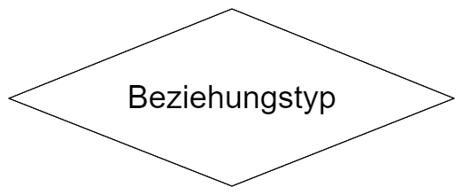

# Datenbankdesign
## Phasen des Datenbankentwurfs

## Begriffe
|Beschreibung|Typ|Darstellung|
|---|---|---|
|**Entitäten:**  individuell identifizierbare Objekte der Wirklichkeit|**Entitätstyp:**  Typisierung gleicher Entitären||
|**Beziehungen:**  Verknüpfungen/Zusammenhänge zwischen zwei oder mehreren Entitäten|**Beziehungstyp:**  Typisierung gleichartiger Beziehungen||
|**Eigenschaften:**  Merkmal, Kennzeichen, Informationsdetail, das einem konkreten Objekt zugeordnet ist|**Attribut:**  Typisierung gleichartiger Eigenschaften||
## Transformationsregeln
+ **Regel 1:** Jeder Entitätstyp wird als Tabelle dargestellt. Jede Tabelle benötigt einen Primärschlüssel
+ **Regel 2:** 