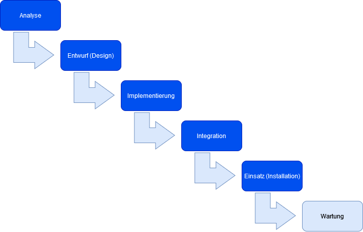

# Grundlagen der Softwareentwicklung

## Vorgehensmodelle
Modularität -  Gesamtaufgabe wird in Teilaufgaben (Modeule) zerlegt.
Vorteile:
+ verkürzte Entwicklungszeit
+ Bessere Verteilung von Arbeiten und Ressourcen
+ Bessere Wartbarkeit
+ Wiederverwendbarkeit
+ Sicherheit und Zuverlässigkeit

Abstraktionsprinzip - eine Auswahl relevanter Informationen aus einer größeren Menge von verfügbaren Informationen.
+ Unwesentliche Informationen für die gegebene Aufgabenstellung ausschließen-

## Methoden
Eine Methode ist ein systemische Vorgehensweise, um bestimmte Aufgaben im Rahmen festgelegter Prinzipien zu lösen.

Schrittweise Verfeinerung:
+ Was soll gemacht werden? (hohe Abstraktionsebene)
+ Wie ist die Aufgabenstellung zu lösen? (schrittweise Verfeinerung)
+ Womit ist die Aufgabenstellung zu lösen? (Programmiersprache, Algorithmen, Softwarekomponenten)

**Top-down-Methode** - Gesamtaufgabe wird in Teilaufgaben zerlegt  

**Bottum-up-Methode** - einzelne Module werden entwickelt und dann zum Gesamtsystem zusammengesetzt.  

**Up-down-Methode** (Middle-Out, Gegenstromverfahren) - testen von kritischen Teilaufgaben - Gesamtaufgabe durch Top-down-Methode verfeinert und Teilaufgaben durch Bottom-up-Methode abstrahiert.

## Software-Lebenszyklus
Professionelle Software wird immer komplexer - um besser planen und kontrollieren zu können, ist eine strukturierte Vorgehensweise notwendig. Der Software-Lebenszyklus wird in Phasen eingeteilt. In jeder Phase werden bestimmte Aufgaben erledigt, getestet und dokumentiert. Fehler bei der Entwicklung werden frühzeitig erkannt.

### Analysephase - Was soll die Software tun?
Folgende Anforderungen werden in dieser Phase definiert:
+ Funktionsumfang und Qualitätsmerkmale des Programms.
+ Art der Benutzeroberfläche.
+ Schnittstelle der Systemumgebung.
+ Eingesetzte Hardware während der Programmierung.
+ Software, die zum erstellen des Programms eingesetzt wird (entfällt bei programmiersprachenunabhängigen Entwurf).
+ Umfang der Dokumentation
+ Ein-/Ausgabe- und Testdaten festlegen

Außerdem können Wirtschaftlichkeitsbetrachtungen angestellt, Verantwortlichkeiten bestimmt und Termine für die Fertigstellung der einzelnen Phasen festgelegt werden.

#### Anforderungstest
Bei großen Softwaresystemen werden die Anforderungen in einer formalisierten Sprache erstellt und können mit geeigneten Testverfahren automatisch kontrolliert werden. Als formale Sprache kommt im Fall der objektorientiertern Programmierung beispielsweise UML (Unified Modeling Language) zum Einsatz, die Methoden für verschiedene Phasen zur Verfügung stellt.

Ergebnis ist das Pflichtenheft mit eindeutig beschriebenen Anforderungen.

### Entwurfsphase - Wie ist die Software zu realisieren?

