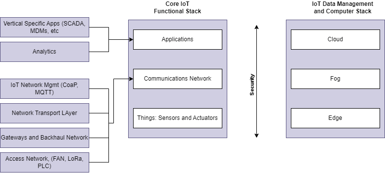
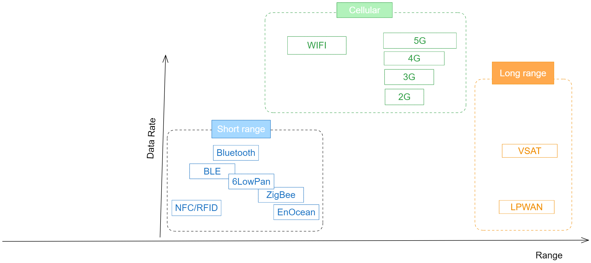
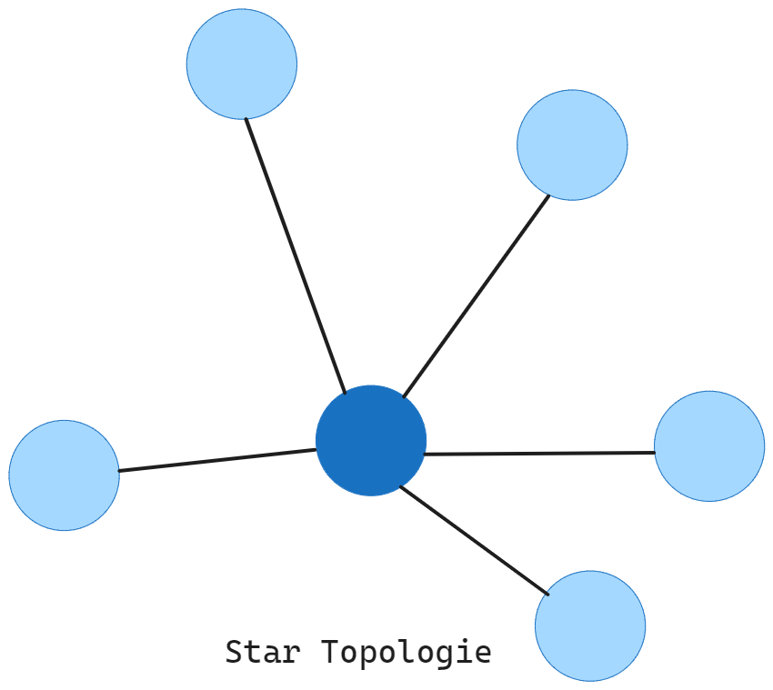
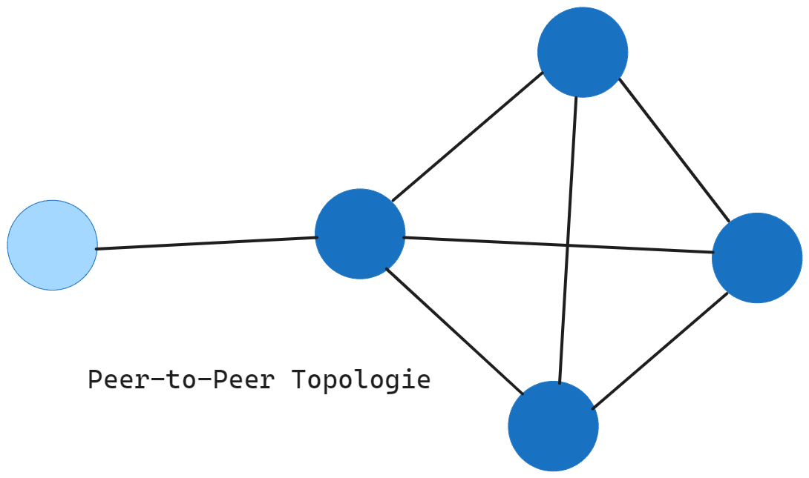
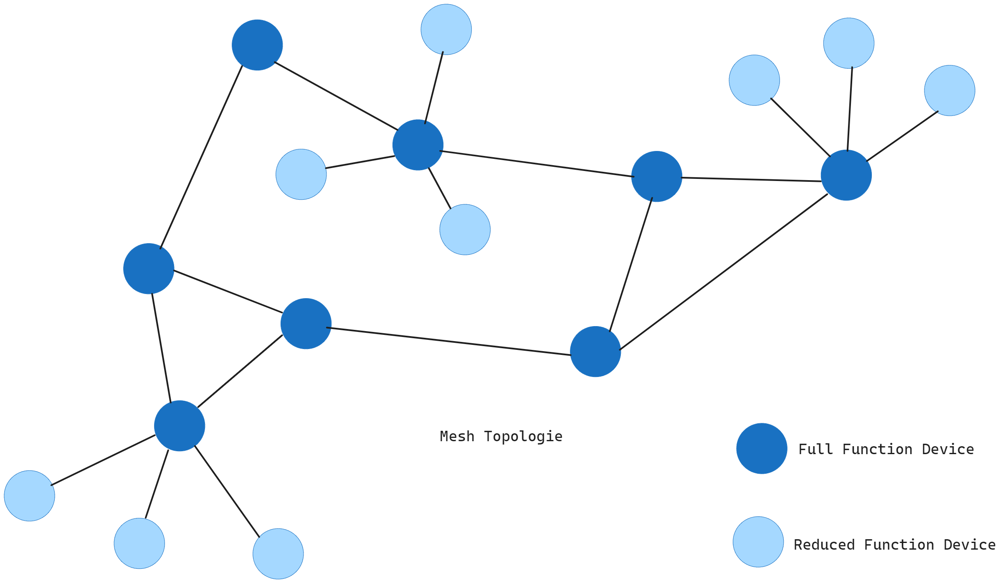

# IoT Netzwerkarchitektur und -design

## ETSI M2M Standardisierte Architektur
Ziel des Modells ist es einen gemeinsamen Rahmen für das Verständnis der Plazierung verscheidener Standards und Protokolle in einem IoT-System zu schaffen.  
Das Modell umfasst drei Bereiche:
+ Anwendungsbereich  
Managementfunktionen wie Datenanalyse, Konnektivitätsmanagement, intelligentes Energiemanagement, Fuhrparkmanagement und andere können auftreten.

+ Netzwerkbereich  
hier verlassen die Daten das lokale Netzwerk und werden mit Hilfe von drahtgebundenen und drahtlosen Protokollen zum Anwendungsbereich transportiert.

+ M2M Device Domain  
hier werden Endgeräte wie Sensoren, Aktoren und Steuerungen über M2M-Gateways mit dem Netz verbunden

|Schicht|Name|Funktion|
|:---:|---|---|
|7|Collaboration & Processes (Involving people and business processes)||
|6|Application (Reporting, analytics, control)||
|5|Data Abstraction (Aggregation and access)||
|4|Data Accumulation (Storage)||
|3|Edge (Fog) Compiuting (Data element analysis and transformation)||
|2|Connectivity (Connection and processing units)||
|1|Physical Devices & Controllers||

1. Schicht beherbergt die Dinge in der Internetbewegung. Endgeräte, verscheidene Sensoren. Alle Dinge, die Informationen Senden und Empfangen können. Ein Ding wird es in dem Moment, in dem es seine Umgebung wahrnehmen kann.

Eine Entsprechende Schicht fehlt im OSI Modell (1. Schicht)

2. 

3. Edge. Umwandlung von Daten. Die Informationsverarbeitung so früh wie möglich am Rand des Netzwerkes

4. Datensammlung. Erfasste Daten werden gespeichert. Die Daten werden konvertiert. 

5. Gleicht mehrere Datenformate ab. Viele Quellen werden verglichen. Vollständigkeit würd geprüft. Datanabstraktion wird geboten. Datenvirtualisierung. Aggregiert

6. Interpretation von Daten mit Softwareanwendungen. Überwachen, Berichte erzeugen. Datenanalyse findet hier statt. 

7. Eigene Daten werden mir Vergleichswerten Verbunden. Verscheidene Buisseness intelegent Lösungen teilen Daten aus und fügen dieße Werte zusammen.

### Schicht 1: Dinge: Sensoren und Aktoren Schicht
Es gibt unzählige Möglichkeiten, intelligente Objekte zu klassifizieren. Eine architektonische Klassifizierung könnte sein:
+ Batteriebetrieb oder Netzbetrieb
+ Mobil oder stationär -> klärt mögliche Energiequelle
+ Niedrige oder hohe Meldefrequent -> Höhere Frequenzen bedingen einen höheren Energieverbrauch
+ Einfache oder umfangreiche Daten
+ Report-Reichweite
+ Objektdichte pro Zelle

Beispiele:
+ **Energiequelle:**  batteriebetriebe, netzbetrieben, Solar betrieben, kinetisch betrieben
+ **Mobilität:** stationär, mobil, tragbar
+ **Sensorik:** Temperatur, Luftfeuchtigkeit, Bewegung, Licht, Beschleunigung, Druck, Lautstärke, CO2-Gehalt, Luftqualität
+ **Datenkomplexität:** einfache Daten (z.B. Temperatur), komplexe Daten (z.B. maschinelles Lernen)
+ **Drahtlose Kommunikation:** WLAn, Bluetooth, NFC, Mobilfunk, LoRaWAN
+ **Verbindungstyp:** Punkt-zu-Punkt, Mesh, Stern
+ **Report-Reichweite:** kurz, mittel, lang
+ **Objektdichte pro Zelle:** gering, mittel, hoch
+ **Verwendungszweck:** Heimautomation, industrielle Automatisierung, Smart-City, Gesundheitswesen, Landwirtschaft
+ **Echtzeit-Anforderungen:** Echtzeit-Verarbeitung, zeitlich unempfindlich

### Schicht 2: Kommunikationsschicht
Anbinden von Dingen an das Netzwerk

+ **Kommunikationsnetzwerk-Schicht:** Schicht zwei wird in vier weitere Teilschichten aufgeteilt.
    + Zugangsnetzwerk-Sublayer
    + Gateways und Backhaul-Netzwerk-Teilschicht
    + Netzwerk-Transport-Teilschicht
    + Iot-Netzwerkmanagement-Teilschicht

#### Einteilung nach Reichweiten (Entfernungsklassen im IoT)
+ PAN (Personal Area Network)
+ HAN (Home Area Network)
+ NAN (neighborhood area network)
+ FAN (field area network)
+ LAN (Local Area Network)

### Schicht 3: Anwendungs und Analyseschicht

#### Analyse- versus Steuerungsanwendung
Mehrere Anwendungen können dazu beitragen, die Effizienz eines IoT-Netzwerks zu steigern. Jede Anwendung sammelt Daten und bietet eine Reihe von Funktionen, die auf der Analyse der gesammelten Daten basiert. Es kann schwierig sein, die angebotenen Funktionen zu vergleichen.
+ Analyse Anwendung:
    + sammelt Daten von meheren intelligenten Objekten, verarbeitet die gesammelten Daten und zeigt Informationen an, die sich aus den verarbeiteten Daten ergeben.

+ Steuerungsanwendung
    + Steuert das Verhalten des Smart-Objekts ider das Verhalten eines mit dem Smart-Objekt verbundenen Objekts. Zum Beispiel kann ein Drucksensor mit einer Pumpe verbunden sein.

#### Daten- versus Netzwerkanalyse
Analytik ist ein allgemeiner Begriff, der die Verarbeitung von Informationen beschreibt, um aus dem gesammelten Daten einen Sinn zu machen. In der Welt des IoT ist eine mögliche Klassifizierung der Analysefunktion wie folgt:

+ Datenanalytik
    + Verarbeitet die von Intelligenten Objekten gesammelten Daten und kombiniert sie, um eine intelligente Ansicht in Bezug auf das IoT-System bereitzustellen
    + Dashboard kann auf sehr einfacher Ebene einen Alarm anzeigen.

+ Netzwerk-Analytik
    + Die meisten IoT-Systeme bestehen aus intelligenten Objekten, die mit dem Netzwerk verbunden sind. Ein Verlust oder eine Verschlechterung der Konnektivität hat warscheinlich Auswirkungen auf die Effizienz des Systems.

#### Erklärung Datenarten

## Datenanalyse
### Descriptive Analytics / beschreibende Datenanalyse
Daten aus der Vergangenheit helfen dabei Fragen, wie z.B. "Was ist passiert?" zu beantworten. Descriptive Analytics wertet Rohdaten aus mehreren Datenquellen aus. Es gibt aber nur Richtig oder Falsch als Output. Eine Erklärung oder ein Ansatz, dass Probelm  zu lösen findet nicht statt.

+ Was ist passiert?

### Diagnostic Analytics / diagnostischen Analyse
Historische Daten können mit anderen Daten verglichen werden. Die Frage "Warum ist es passiert?" lässt sich daruch klären. Ursachen und Aus- sowie Wechselwirkung zu klären. Muster zu identifizieren. Tiefere Einblicke in ein bestimmtes Problem zu bekommen.

+ Warum ist etwas passiert?
+ Untersucht Ursachen und Zusammenhänge von Ereignissen

### Predictive Analytics / Vorhersageanalyse
Predictive Analytics möchte in die Zukunft zu blicken, und versucht das Folgende herauszufinden: Was könnte bzw. wird in Zukunft passieren? Diese Methode der Datenanalyse ermöglicht es, basierend auf den Ergebnissen von deskriptiven und diagnostischen Analysen, Tendenzen zu ermitteln, Abweichungen von Normwerten frühzeitig zu erkennen und zukünftige Trends möglichst genau vorherzusagen. Die Predictive Analytics verwendet ausgefeilte Algorithmen und moderne Technologien, um zukünftige Prognosen zu erstellen. **Die Prognosen sich nur Schätzungen!**

+ Was wird passieren?
+ Prognostiziert zukünftige Ereignisse oder Trends
+ Zum Beispiel die Schätzung der verbleibenden Lebensdauer von Motrorenkomponenten basierend auf historischen Temperaturwerten

### Prescriptive Analytics / verordnende Analyse
+ Was sollen wir tun?
+ Bietet Lösungsvorschläge für anstehende Probleme
+ Zum Beispiel die Berechnung verscheidener Wartungsoptionen basierend auf Temperaturdaten, um die kosteneffizienteste Lösung zu finden.

## Herausforderungen bei der IoT-Datenanalyse
### Skalierungsprobleme

### Unbeständigkeit der Daten

## Erinnerung

## Links
https://www.computerweekly.com/de/definition/Die-sechs-Vs-von-Big-Data
## Kriterien für IoT Zugangstechnologien
+ **Komplexes IoT-Ökosystem**
    + Das IoT umfasst eine Vielzahl von Geräten, Protokollen und Anwendungen
    + Eine Diskussion über Kriterien ermöglicht eine ganzheitliche Betrachtung des Ökosystems und der Berücksichtigung der unterscheidlichen Anforderungen
+ **Vielfalt der IoT-Geräte**
    + IoT-Geräte varriieren in ihren Funktionen, Kommunikationsfähigkeiten und Ressourcen
    + Die Kriteriendiskussion hilft bei der Auswahl von Zugangstechnologien, die mit verscheidenen Geräteklassen kompatibel sind.
+ **Ressourcenbeschränkungen der IoT-Geräte**
    + IoT-Geräte haben begrenzte Ressourcen wie Energie, Rechenleistung und Speicherplatz
    + Die Berücksichtigung von Kriterien ermöglicht eine effiziente Nutzung der Ressourcen und verlängert die Lebensdauer der Geräte
+ **Unterschiedliche Kommunikationsanforderungen**
    + IoT-Anwendungsszenarien erfordern unterscheidliche Arten von Kommunikation (Echtzeit, periodisch, energiegesteuert)
    + Die Diskussion über Kriterien ermöglicht die Auswahl von Zugangstechnologien, die den spezifischen Anforderungen gerecht werden.

## Funkstandards
### Reichweite
Die Reichweite bezieht sich auf die maximale Entfernung oder den Aktionsradium´s, üder den eine IoT-Zugangstechnologi Daten senden oder empfangen kann. Die Reichweite spielt eine entscheidende Rolle bei der Wahl der geeigneten Zugangstechnologie, da die die räumliche Abdeckung und Konnektivität der IoT-Geräte beeinflusst. Eine ausreichende Reichweite ist erfoderlich, um Geräte in verschiedenen Entfernungen effektiv zu verbinden und eine nahtlose Kommunikation zu ermöglichen.
+ Kategorisierung der Zugangstechnologien basierend auf Reichweite:
    + **kurze Reichweite:** Bis zu einigen Metern
        + Bluetooth
        + NFC
        + Zigbee
    + **Mittlerer Bereich:** Reichweite von einigen zehn, bis hundert Metern.
        + Wi-Fi (802.11)
        + Z-Wave
    + **Große Reichweite:** Kann mehrere Kilometer abdecken
        + LoRaWAN
        + NB-IoT
        + Sigfox

### Frequenzbänder
Funkspektrum wird von Ländern und/oder Organisationen reguliert, wie z.B. der Internationale Telecommunication Union (ITU) und der Federal Communications Commission (FCC). Auf der ganzen Welt wird das Spektrum für verscheidene Kommunikationszwecke oft als kritische Ressource betrachtet. Frequenzbänder, die von der drahtlosen Kommunikation genutzt werden, sind in **lizenzierte** und **nicht lizenzierte Bänder** aufgeteilt.

Die ITU hat auch nicht lizenzierte Frequenzen für die industriellen, wissenschaftlichen und medizinischen (ISM) Teile der Funkbänder definiert:
+ 2,4-GHz-Band wie von IEEE 802.11b/g/n Wi-Fi verwendet
+ IEEE 802.15.1 Bluetooth
+ IEEE 802.15.4 WPAN

Unterscheidliche Frequenzbänder eignen sich für unterscheidliche Anwendungsszenarien und Umgebungen.

+ **Lizenzfreie Frequenzbänder:**
    + Diese Bänder erfordern keine spezielle Lizenzierung und stehen für allgemeine Nutzung zur verfügung.
        + 2,4 GHz (Wi-Fi, Bluetooth)
        + 868 MHz (Zigbee)
        + 915 MHz (LoRa)
+ **Lizenzierte Frequenzbänder:**
    + Diese Bänder erfordern eine spezielle Genehmigung oder Lizenzierung von Behörden
        + 900 MHz
        + 1800 MHz
        + 2.6 GHz 
        + -> Mobilfunknetze

## Stromverbrauch
+ Ein Stromversorgter Knoten hat eine direkte Verbindung zu einer Stromquelle, und die Kommunikation wird normalerweise nicht durch Kriterien des Stromverbrauchs eingeschränkt
+ Die einfache Bereitstellung von stromversorgten Knoten wird jedoch durch die Verfügbarkeit einer Stromquelle eingeschränkt, was die Mobilität komplexer macht
+ Batteriebetriebene Knoten bringen viel mehr Flexibilität in IoT-Geräte. Diese Knoten werden oft nach der erforderlichen Lebensdauer ihrer Batterie klassifiziert.
+ Die drahtlosen IoT-Zugangstechnologien müssen die Anforderungen an einen geringen Stromverbrauch und Konnektivität für batteriebetriebene Knoten erfüllen. Dies hat zur Entwicklung einer neuen drahtlosen Umgebung geführt, die als **Low-Power Wide-Area (LPWA)** bekannt ist.

|Stromverbrauchskategorie|Beschreibung|Beispieltechnologien|Ungefährer Stromverbrauch|
|---|---|---|---|
|Niedrig|Geringer Stromverbrauch, batteriebetrieben|Bluetooth Low Energy (BLE)|Weniger als 1 mA|
|Moderat|Mäßiger Stromverbrauch, längere Akkulaufzeit|Zigbee, Z-Wave|1-10 mA|
|Hoch|Hoher Stromverbrauch, Netzstrom oder kabelgebunden|Wi-Fi, Cellular (4G/5G)|Mehr als 10 mA|

## Topologien 
### Star Topologie

**Beschreibung:**  
Zentrales Gerät (Hub oder Gateway) ist mit allen IoT-geräten verbunden

**Beispiele:**  
Zigbee, Z-Wave, Wi-Fi

### Peer-to-Peer Topologie

**Beschreibung:**  
Jedes Gerät kommuniziert direkt mit einem anderen Gerät

**Beispiele:**  
Bluetooth, Wi-Fi

### Mesh Topologie

**Beschreibung:**  
Jedes GErät ist mit mehreren anderen Geräten verbunden, um ein Netzwerk zu bilden

**Beispiele:**  
WirelessHART, Thread

### Andere
|Topologie|Beschreibung|Beispiele|
|---|---|---|
|Baum-Topologien|Geräte sind hierarchisch in einem Baumstruktur-Netzwerk angeordnet, mit einem zentralen Gerät|EnOcean, LoraWAN|
|Hybrid-Topologie|Kombination verschiedener Topologien, um die Vorteile mehrer Ansätze zu nutzen|Hybridnetzwerke mit Wi-Fi|