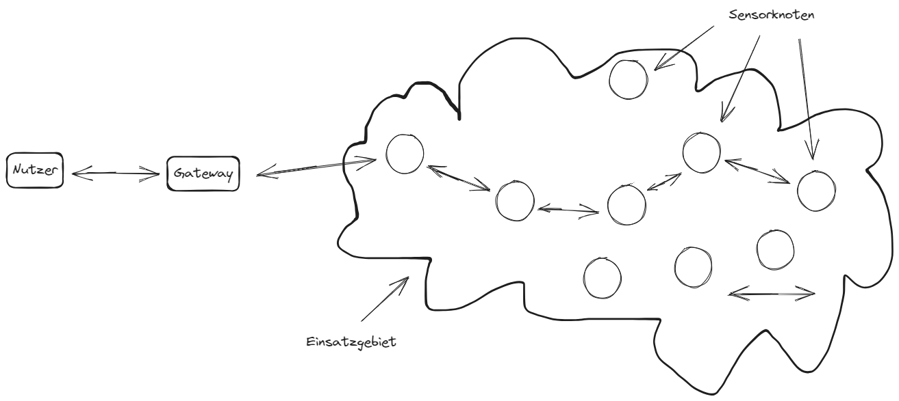

# Smarte Objekte
**Vereinfachte Definition**  
+ Physische Gegenstände mir Sensoren, Aktuatoren und Kommunikationsfähigkeit
+ Teil des Internet of Things (IoT) und ermöglicht Vernetzung und Kommunikation
+ Erfassen Informationen über die Umgebung (Sensorik)
+ Führen Aktionen basierend auf Informationen aus (Aktuatorik)
+ Drahtlose oder kabelgebundene Konnektivität zu anderen Geräten und Systemen
+ Intelligente Algorythmen und Logik für Datenverarbeitung und Entscheidungsfindung

**Anwendungsbereiche:**  
Smart Home, Industries 4.0, Gesundheitswesen, Logistik, Verkehr, etc.

## Eingeschränkte Geräte
Das IoT besteht aus eingeschränkten Geräten, die in der Regel nur über sehr begrenzte Leistung, Speicher und Verarbeitungszyklen verfügen. Die Kommunikationsmöglichkeiten sind begrenzt und es ist unwarscheinlich, dass Verschlüsselung implementiert ist (eine der OWASP-Schwachstellen).

+ **Eingeschränkte Geräte:**
    + Intelligente Sensoren
        + Zentrum der IoT-Geräte. Sie sind in der Lage, durch einen Mikroprozessor mit einem Überwachungssystem zu kommunizieren und haben die Fähigkeit ein Problem selbst zu Diagnostizieren.
    + Eingebettete Geräte
        + Ernhalten ein Computersystem, das für einen speziellen Zweck entwickelt wurde, in der Regel für eine einzige Anwendung. Die Produkte können mit dem Internet verbunden werden und gelten als smart oder intelligent.
    + Prototyping
        + Raspberry Pi und Arduino sind Prototyping-Geräte für eingebettete Systeme. Der Raspberry Pi benötigt zum Betrieb ein vollständiges Betriebssystem. Der Arduino ist ein Einplatinen-Mikrocontroller, der durch das schreiben von Programmcode konfiguriert werden kann, um ihn mit verschiedenen Funktionen zu beauftragen. Das Programm wird dann kompiliert und an den nichtflüchtigen Flash-Speicher des Arduino gesendet.

## Eingebettete Systeme
Eingebettete Systeme sind für bestimmte Funktionen innerhalb eines größeren  Systems konzipiert.
+ Beispiel: Haussicherheitsgeräte
    + Alle Vorgänge werden von einem speziell für diesen Zweck entwickelten Mikrocontroller gesteuert.
    + Der Mikrocontroller kann für die spezifischen Sensoren der Anlage programmiert werden.
        + Zu den Sensoren können Rauch, Bewegungs, Gas und Temperatursensoren gehören, die Daten an den Mikrocontroller liefern, der dann einen Alarm auslöst, wenn for den jeweiligen Sensor festgelegten Schwellenwerte überschritten werden.
### Eingebettete Systeme - Merkmale
+ Rechner (HW + SW) meist unsichtbar in System integriert
+ Systemumfeld bestimmt Anforderungen an das eingebettete System
+ Echtzeitanforderungen
+ Ausfallsicherheit
+ Batteriebetrieb
+ Begrenzte Ressourcen
+ Eingebettete Betriebssysteme

## Definition
+ Funktionalität und Aufgaben:
    + Erfassen von Sensordaten
    + Informationsverarbeitung
    + Ausführen von Steuerungsaktionen
    + Drahtlose Kommunikation mit anderen Geräten
+ Intelligenz und Entscheidungsfindung:
    + Datenanalyse und -interpretation
    + Autonomes HAndeln basierend auf Algorithmen, KI-Techniken oder Regeln
    + Interaktion mit anderen Systemen
+ Kommunikationsfähigkeit
    + Drahtlose Kommunikationstechnologien (z.B. WLAN, Bluetooth, Zigbee)
    + Teil eines größeren Netzwerks oder einer intelligenten Infrastruktur sein
+ Anpassungsfähigkeit und Lernfähigkeit
    + Anpassung an verschiedene Umgebung und Anforderungen
    + Lernfähigkeit zur Selbstverbesserung
    + Anpassung an neue Bedienungen für bessere Ergebnisse
+ Kontextsensivität
    + Erfassung und Nutzung von Umgebungsinformationen
    + Anpassung von Funktionen oder Aktionen basieren auf Standortdaten, Umgebungstemperatur oder Benutzerpräferenzen

## Cyber-physische Systeme (CPS)

### Unterschied Klassisches Computersystem / Cyber-physische Systeme

## Sensoren
+ Ein Sensor misst eine physikalische Größe und wandelt diesen Messwert in eine digitale Darstellung um. 
+ Sensordaten können direkt angewendet werden, um eine physikalische Umgebung oder einen physikalischen Prozess zu steuern.
+ 

### Physikalisches Grundprinzip der Sensoren
+ Widerstandsbasierte Sensoren
    + Diese Sensoren nutzen die Veränderung des elektrischen Widerstands, um physikalische Größen wie Druck, Dehnung oder Feuchtigkeit zu messen. Sie basieren auf Materialien, deren Widerstand von diesen Größen beeinflusst wir
+ Kapazitive Sensoren
    + Sie messen die Kapazitätsänderung zwischen zwei Elektroden, die durch ein Dielektrikum getrennt sind. Diese Sensoren eignen sich zur Messung von Nähe, Berührung oder Feuchtigkeit
+ Optische Sensoren
    + Sie nutzen optische Prinzipien wie Reflexion, Absorption oder Streuung von Licht, um Informationen über Entfernungen, Farben oder Oberflächeneigenschaften zu liefern.

## Aktoren
+ Aktoren sind natürliche Ergänzungen zu Sensoren. Aktoren empfangen eine Art von Steuersignal. Ein elektrisches Signal oder einen digitalen Befehl. Dadruch wird ein physikalischer Effekt ausgelöst. In der Regel eine Art von Bewegung, Kraft usw. 

### Klassifizierung der Aktoren nach Energieart
|Typ|Beispiel|
|---|---|
|Mechanische Aktoren|Hebel, Spindelhubgetriebe, Handkurbel|
|Elektrische Aktoren|Thyrisator, bipolarer Transistor, Diode|
|Elektromechanische Aktoren|AC-Motor, DC-Motor, Schrittmotor|
|Elektromagnetische Aktoren|Elektromagnet, Hubmagnet|
|Hydraulische und pneumatische Aktoren|Hydraulikzylinder, Pneumatikzylinder, Kolben, Druckregelventile, Druckluftmotoren|
|Aktoren aus Intelligenten Materialien (umfasst thermische und magnetische Aktoren|Formgedächtnislegierung, Ionenflüssigkeitsaustauscher, magnetorestriktives Material, Bimetall Streifen, piezoelektrischer Bimorph|
|Mikro- und Nanoaktoren|Elektrostatischer Motor, Mikroventil, Kammantrieb|

### Biespiele für Aktoren im IoT
+ Motorbasierte Aktoren
    + 
+ Ventilbasierte Aktoren

+ Beleuchtungssteuerung

## MEMS Micro-Electro-Mechanical Systems
+ Es handelt sich um miniaturisierte mechanische und elektronische Komponenten, die auf einem einzigen Chip integriert sind.
+ MEMS ermöglichen die Kombination von Sensoren, Akuatoren und Elektronik auf kleinstem Raum
+ Sie bieten eine Vielzahl von Anwendungsmöglichkeiten in verschiedenen Bereichen

### Einsatzgebiete von MEMS
+ Kommunikationstechnologie
    + MEMS-Mikrofone, Beschleunigungssensoren im Smartphone
+ Medizintechnik
    + Implantierbare Sensoren, Lab-on-a-Chip-Systeme
+ Automobilindustrie
    + Airbad-Sensoren, Fahrdynamikregelung
+ Umweltüberwachung
    + Luftqualitätssensoren, Wetterstationen
+ Industrieautomatisierung
    + Präzisionsmessungen, Prozesssteuerung

## Sensornetzwerke (SANET)

### Aufbau von Sensornetzwerken
+ Große Anzahl an Sensorknoten welche die Datenaufnahme realisieren
+ Gateway welches die Verbindung zwischen Sensorknoten und dem Internet / Netzwerk ermöglicht
+ Nutzer als Abnehmer der Informationen (kann auch ein Informationssystem sein)

Im Rahmen von engmaschigen Sensornetzwerken sind Sensorknoten nur selten direkt mit dem Internet verbunden. Häufig übernimmt ein Gateway die Verbindung zwischen Sensornetzwerk und dem Internet. Ein Funkstandard zu diesem Zweck ist LoRaWAN.

### Sensornetzwerke mit Aktoren
+ Sensor- und Aktorennetzwerk oder drahtloses Sensor-Aktor-Netzwerk
    + Im Englischen: Wireless Sensor and Actor Network (WSAN)

+ drahtlose SANETs üblicherweise aks drahtlos Sensor- und Aktorennetzwerke (**WSANs**) bezeichnet

Da es sich bei vielen IoT-Implementierungen überwiegend um Sensoren handelt, werden WSANs häufig als drahtlose Semsorennetzwerke (**WSNs**) beueichnet.

## Sensor-Netzwerk vs. Drahtloses Sensor-Netzwerk
+ **Sensornetzwerk:**
    + Sensoren sind miteinander Verbunden
    + Daten werden über eine kabelgebundene Infrastruktur übertragen
    + Kommunikationsprotokolle: Ethernet, serielle Verbindungen
    + Beispiel für Technologien: RS-485, Modbus

+ **Drahtloses Sensor-Netzwerk:**
    + Sensoren sind drahtlos verbunden
    + Daten werden über drahtlose Kommunikationstechnologien übertragen
    + Kommunikationsprotokolle: WLAN, Bluetooth, Zigbee, LoRaWAN
    + Biespiele für Technologien: Zigbee, IEEE 802.15.4, Bluetooth Low Energy

+ **Gemeinsamkeiten:**
    + Beide erfassen Daten über ihre Umgebung
    + Daten können an eine zentrale Verarbeitungseinheit gesendet werden
    + Energieeffizienz und Batterielaufzeit sind wichtige Überlegungen

+ **Unterschiede:**
    + Sensor-Netzwerk verwendet kabelgebundene Kommunikation
    + Drahtlose Sensor-Netzwerk nutzt drahtlose Kommunikationstechnologien
    + Kommunikationsprotokolle und Technologien variieren je nach Netzwerktyp

### Bestandteile eines Sensornetzwerks
|Bestandteil|Beschreibung|
|---|---|
|Sensoren|Erfassen physikalischer Größen wie Temperaturen, Druck, Bewegung usw.|
|Aktoren|Führen Aktionen basierend auf den von den Sensoren erfassten Daten aus|
|Gateway / Hub|Zentraler Knotenpunkt, der die Kommunikation zwischen Sensoren, Aktoren und anderen Komponenten ermöglicht.|
|Kommunikationsprotokoll|Definiert die Standards und Regeln für die Kommunikation zwischen den Sensoren und dem Gateway/Hub |
|Drahtlose Kommunikation|Funktechnologien wie WLAN, Bluetooth, Zigbee usw., die für die drahtlose Übertragung von Daten im Netzwerk verwendet werden|
|Verkabelte Kommunikation|Verkabelte Verbindungen wie Ethernet, RS-485 usw., für die Datenübertragung über Kabel verwendet werden|
|Energiequelle|Batterien, Netzteile oder Energieerzeugung aus der Umgebung (z.B. Solar, kinetische Energie)|
|Datenverarbeitung|Mikrocontroller oder Prozessoren zur Verarbeitung der von den Sensoren erfassten Daten|
|Datenspeicherung|Speichermedien wie Festplatten, Flash-Speicher oder Cloud-Services zur Aufbewahrung der erfassten Daten|
|Datenanalyse|Algorithmen und Software zur Auswertung und Interpretation der erfassten Daten|
|Sicherheitsmaßnahmen|Verschlüsselung, Authentifizierung und andere Sicherheitsprotokolle zum Schutz der Daten und des Netzwerks|

### Drahtlose Sensornetze

