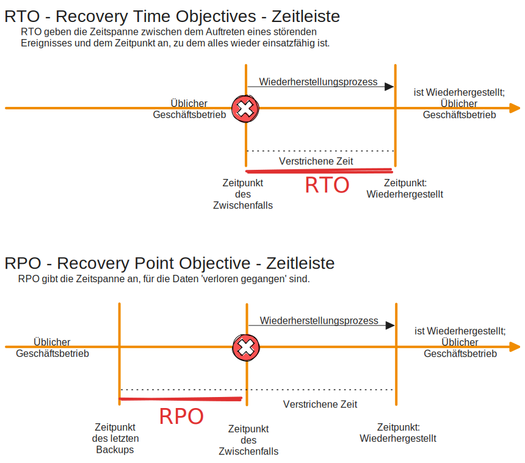

# Datensicherungskonzept
+ Daten Identifizieren und bestimmen
+ Kennen der eigenen Infrastruktur
+ Bewertung / Bestimmung von Risiken
+ Festlegen von Sicherheitszielen
+ Auswahl von Sicherheitsstrategien
+ Sicherungszyklus (Backupstrategien)
+ Festlegen der Speichermedien
+ Auswahl Hard und Software
+ Test und Restore
+ Dokumentation
+ Verantwortlichkeit
+ Überprüfung und Aktualisierung

## Bestimmen welche Daten sollen gesichert werden
+ Was für Daten habe ich in der Infrastruktur
+ Inventarisierung der Daten
+ Klassifizierung von Daten
    + Identifizierung kritischer Daten
+ Wie häufig ändern sich Daten
+ Was ist der Wiederherstellungsbedarf
+ Gesetzliche Anforderungen der Daten 

## Sicherungsmodalitäten
TOM = Technisch Organisatorische Maßnahme

## Festlegen der Sicherheitsziele
+ RTO - Wiederherstellungszeitziele  
Die Wiederherstellungszeit (Recovery Time Objective, RTO) bezieht sich häufig auf die Zeit, die eine Anwendung, ein System oder ein Prozess ausfallen kann, ohne dass ein erheblicher Schaden für das Unternehmen entsteht, sowie auf die Zeit, die für die Wiederherstellung der Anwendung und ihrer Daten benötigt wird, um den normalen Geschäftsbetrieb nach einem schwerwiegenden Vorfall wieder aufzunehmen. Die Berechnung der Wiederherstellungszeit (Recovery Time Objective, RTO) für Ihr Unternehmen ist für Ihren Notfallwiederherstellungsplan entscheidend.

+ RPO - Wiederherstellungspunktziele  
Das Recovery Point Objective bezieht sich auf die Berechnung der Menge an Datenverlusten, die ein Unternehmen innerhalb eines für sein Geschäft relevanten Zeitraums erleiden kann, bevor ein signifikanter Schaden entsteht, und zwar vom Zeitpunkt eines Störungsereignisses bis zur letzten Datensicherung. Mit Hilfe des RPO wird ermittelt, wie viele Daten ein Unternehmen bei einem unvorhergesehenen Ereignis verlieren kann.

## Kriterien for die Auswahl 
### Eines geeigneten Sicherungsmediums
+ Kapazität
+ Geschwindigkeit
+ Zuverlässigkeit
+ Ggf. Portabilität
+ Skalierbarkeit
+ Kosten (sind wichtig für Wirtschaftlichkeit)
+ Sicherheit
+ Kompatibilität

### Einer geeigneten Backup-Software
+ Kompatibilität
+ Kosten (Lizenz)
+ Zuverlässigkeit / Wiederherstellungszeit
+ Benutzerfreundlichkeit
+ Skalierbarkeit
+ Support
+ Funktionsumfang 
+ Datensicherheit u. Datenschutz
+ Wiederherstellungszeit / Zuverlässigkeit
+ Zentrale Verwaltung
+ Schnittstellen

## Datenträger sicher aufbewahren
+ Datenträger vor Physischen Schäden schützen
    + Feuchtigkeit
    + Staub
    + Licht / Wärme
    + magnetische Felder
+ Daten auf dem Medium verschlüsseln
+ Lebensdauer der Datenträger beachten
+ Faktoren des einzelnen DAtenträger beachten welche zu einer verkürzten Lebensdauer führen

## Verantwortlichkeiten und Zuständigkeiten
+ klare Rollen - Aufgabenbeschreibung
    + Im Backup und Resrore-Prozess
+ Verantwortung an Endbenutzer ist ungünstig
    + allgemein Automatisierung nach Standardisierung ist der Optimalfall - ausschließen des Fakto Mensch wo es geht
+ Richtlinien so festlegen, dass sie überprüftbar nach Verantwortlichen bzw. allgemein überpfüfbar sind.
+ Wer ist Zuständig / Verantwortlich für Test und überprüfung des Konzepts
+ Schulen und Bewusst machen

## Notfallmaßnahmen für Datensicherungskonzept
+ Was für Risiken / Szenarien können eintreten?
    + Prozess, Faktoren, Verantwortlichkeiten, ... kennen und abwägen
+ Risikoanalyse - Anschliesend werden Maßnahmen festgelegt
+ GGF. Notfallteam das in soch einem Fall Aktiv wird
+ Wer muss Informiert werden
+ Welche Maßnahmen werden wann, wie und duch wen realisiert.
+ Maßnahmen die RTO und RPO sicherstellen

## Testen des Datensicherheitskonzepts
+ Überprüfung der IT-Sicherheitsziele
    + CIS-Prinzip
    + Besonders sind meine Daten korrekt
+ BAckup und restore-Prozess testen
+ ggf. simulieren eines Datenverlustes
+ Testen der Sicherheitsziele / Strategien
+ Überprüfen RTO und RPO
+ wird der Datenschutz berücksichtigt
+ Tests entsprechend dokumentieren
    + ggf. Maßnahmen ableiten z.B. Schulung und Sensibilisierung