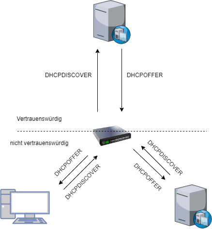

# DHCP - Dynamic Host configuration Protocol

## Vergabe
Es werden IP-Adresse, Routeradresse und die Subnetzmaske dynamisch vergeben.  
Arbeitet nach dem D.O.R.A - Prinzip   
D = Discover O = Offer R = Request A = Acknowledge

Konfliktlösung -> 3x APR-Request (auf eigene IP-Adresse)
+ Dynamisch / Statisch
+ Nachteile Dynamisch
    + brauchen extra SRV
+ Nachteile Statisch
    + hoher Aufwand
    + kann schnell zu Fehlern führen 

+ Cleints vergebn sich eine APIPA-Adresse (Automatic Private IP Adress Configuration) 169.254.0.1 - 169.254.255.254  
Allgemeine SE D.R. 0.0.0.0  
SN 255.255.0.0

|**Dynamisch Vorteile**|**Statisch Vorteile**|
|---|---|
|Server macht keine Tippfehler|Netzidentität bleibt erhalten|
|Konfliktlösung -> doppelte Vergabe wird reduziert|Verbinden möglich trotz Probleme bei der Namensauflösung|
|schneller + effizienter|Administratoren haben die volle Kontrolle|
||Netzwerkressourcen sind kinstanter abzubilden|
|**Dynamische Nachteile**|**Statische Nachteile**|
|Fremde Geräte einfacher einzusteuern|Dem Admin dürfen keine Fehler passieren (ggf. mehr kontrollieren)|
|Server bietet Technikfehler|Keine automatische Überprüfung ob Adressen doppelt vergebn wurden|
|Ohne Leasereservierung kann es zu unübersichtlichkeit kommen (ggf. schwerer zu Identifizieren)|Zeitaufwendig (auch Finanziel -> Arbeitszeit)|

## DHCP-Starvation-Angriff
### Erklärung
Bei einer DHCP Starvation Attacke (Angriff durch Aushungern) handelt es sich um ein Angriff gegen ein Computer-Netzwerk

Dieser Angriff nutzt aus, dass die früher unveränderbar an die Hardware gebundene MAC-Adresse bei vielen Netzwerkschnittstellen frei konfigurierbar ist. Bei einer DHCP Starvation Attack wird unter Verwendung einer Vielzahl gefälschter MAC-Adressen jeweils eine automatische oder dynamische IP-Adresse beim DHCP-Server angefordert. Dies geschieht so lange, bis der verfügbare Adressraum des DHCP-Servers aufgebraucht ist und dieser keine Adressen mehr bereitstellen kann. Die Anmeldung weiterer Netzwerkclients ist dann nicht mehr möglich

Die Störwirkung ist auf eine Broadcast-Domäne begrenzt.

### Abwehrmaßnahmen 
Zugriffsschutz / Port Security. Bei einem Switch wird anhand der Mac Adresse festgelegt den Switch/Port verwenden darf.   
DHCP antwortet nur geräten die bereits im Netzwerk identifiziert sind. Public Key / Kerberos

## DHCP-Spoofing
### Erklärung

### Abwehrmaßnahmen
DHCP-Snooping

