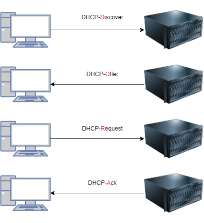

# DHCP - Dynamic Host configuration Protocol

## Vergabe
Es werden IP-Adresse, Routeradresse und die Subnetzmaske dynamisch vergeben.  
Arbeitet nach dem D.O.R.A - Prinzip   
D = Discover O = Offer R = Request A = Acknowledge

Konfliktlösung -> 3x APR-Request (auf eigene IP-Adresse)
+ Dynamisch / Statisch
+ Nachteile Dynamisch
    + brauchen extra SRV
+ Nachteile Statisch
    + hoher Aufwand
    + kann schnell zu Fehlern führen 

+ Cleints vergebn sich eine APIPA-Adresse (Automatic Private IP Adress Configuration) 169.254.0.1 - 169.254.255.254  
Allgemeine SE D.R. 0.0.0.0  
SN 255.255.0.0

