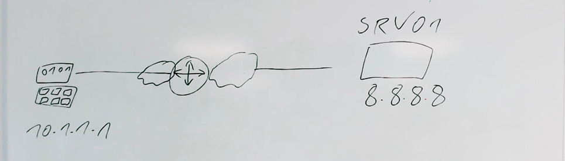

# **Netzwerke**

## **Was von Computer-Netzen erwartet wird.**
Ein Netzwerk bietet Vorteile gegenüber einer Einzelplatzumgebung. Allerdings ist der Einsatz auch mit einigem Aufwand verbunden.
Umso mehr muss vor der Entscheidung für ein Netzwerk der zu erwartende Nutzen analysiert werden.
Der Hauptgrund für die nicht unerheblichen Investitionen liegt letztendlich immer bei den zu erwartenden ökonomischen und unternehmerischen Vorteilen.
Die im Folgenden dargelegten Gründe sprechen für eine Vernetzung.  

# **Verbesserte Kommunikation**
Netzwerke dienen verstärkt dem Informationsaustausch, der Kommunikation.
Klassifikation von Netzwerken.
## **PAN Personal Area Network**
USB, Fire Wire oder Bluetooth
Wenige Meter gleicher Raum maximal ein Nebenraum
Geringe Bandbreite
Hobby und Privatbereich  Internet of Things 
## **LAN Local Area Network**
Mehrere Geräte in einem Verbund  Mindestens zwei
Auch bezeichnet als Ortsnetz
standartmäßig wird Ethernet verwendet
Netz im eigenen Zuhause oder Standort im Unternehmen.
## **WLAN**
WLAN-Standards warden durch die Normenfamilie IEEE 802.11 definiert.
Geräte bequem im Heim- oder Unternehmensnetz einzubinden.
Kompatibel zu Kabelgebundenen Ethernet-LANs
Geringer Datendurchsatz als bei Ethernet-Verbindungen
MAN Metropolitan Area Network
breitbandiges Telekommunikationsnetz genannt, das mehrere LANs in geografischer Nähe verbindet.
Ein Standard für größere regionale Funknetze
Wireless Metropolitan Area Networks (WMAN) IEEE 802.16
In Deutschland, um Endkunden in Regionen mit fehlender Infrastruktur eine leistungsstarke Anbindung an das Internet zu bieten.

## **WAN Wide Area Network**
Mehrere MANs zusammengeschlossen
große geografische Bereiche wie Länder oder Kontinente
Wide Area Networks sind meist im Besitz einer bestimmten Organisation oder eines Unternehmens.

## **GAN Global Area Network**
Ein weltumspannendes Netzwerk wie das Internet.
Umfasst mehrere WANs
GANs nutzen die Glasfaserinfrastruktur von Weitverkehrsnetzen und Schließen diese durch internationale Seekabel oder Satellitenübertragungen zusammen.  

# **Grundkonzepte der Vernetzung**
## Peer-to-Peer
Das Wort Peer (engl. Gleichgestellter, Ebenbürtiger) beschreibt den Grundgedanken dieser Art der Vernetzung bereits recht gut. Im lokalen Netzwerk sind damit beispielsweise Drucker- oder Netzlaufwerksfreigaben gemeint, im Internet bezieht sich der Begriff Peer-to-Peer meist auf Filesharing-Netze wie z.B. BitTorrent.  
In einem Peer-to-Peer-Netz sind prinzipiell alle Computersysteme gleichberechtigt.
Die Ressourcen im Netz sind auf den beteiligten Rechnern verteilt und jeder Benutzer ist für die Sicherheit und Freigabe „seiner“ lokalen Ressourcen verantwortlich.  
Jeder Rechner kann anderen Rechnern Ressourcen zur Verfügung stellen und umgekehrt auf freigegebene Ressource anderer Rechner zugreifen, sofern er dazu berechtigt ist.

**Vor und Nachteile von Peer-to-Peer Netzwerken**  
* Die **Hauptvorteile** sind, dass keine Extrakosten für einen Server anfallen und kein spezielles Betriebssystem nötig ist, da alle gängigen PC-Betriebssysteme Funktionen für diese Art der Vernetzung bereits integriert haben.
* Als **Nachteil** stellt sich heraus, dass es weder in Bezug auf Ressourcen noch in Bezug auf Benutzer eine zentrale Verwaltung gibt und Sicherheitsrichtlinien im Netzwerk nur sehr eingeschränkt umsetzbar sind.

## Einsatzgebiet
Peer-to-Peer-Netze werden vorrangig für die Datenverteilung und das dezentrale Suchen von Dateien genutzt. Dabei wird durch die Verteilung der Daten eine effizientere Auslastung der Verbindungswege erreicht. Ein anderer Aspekt ist das Zusammenschalten von Rechnern mit dem Ziel, die Ressourcen für die Lösung einer gemeinsamen Aufgabe zu nutzen. (z.B. Grid- oder Cloud-Computing - Rechenaufgaben oder Daten werden dabei auf mehrere Rechner bzw. Festplatten Speicher verteilt).

## Client-Server

Sobald ein Netzwerk größere Dimensionen annimmt, wird das Peer-to-Peer-Konzept zunehmend unübersichtlich und schwerer zu administrieren. 
Durch den Einsatz von Servern und Workstations nach dem Client-Server Prinzip kann dem entgegengewirkt werden, da technisches Personal sowohl die Server als auch die Workstations verwaltet und die Netzwerksicherheit sicherstellt.
Alle Standard-Betriebssysteme unterstützen das Client-Server-Prinzip. Das Peer-to-Peer-Prinzip kann für einzelne Dienstmerkmale (z.B. Filetransfer) innerhalb von Betriebssystemen weiter genutzt werden.
Das Grundprinzip ist hierbei, dass es auf der einen Seite ein Programm gibt (die Server-Anwendung bzw. Applikation), welches über eine Netzwerkverbindung eine Dienstleistung (Service) bereitstellt und passiv auf Anfragen wartet.
Auf der anderen Seite fordert die Client-Anwendung (Programm auf dem PC des Anwenders) diese Dienstleistung aktiv an. Das Client-Programm kommuniziert mit dem Server-Programm über eine eindeutige „Sprache“, dem Protokoll. Im Protokoll sind alle möglichen Anweisungen und Antworten definiert.
Jede Dienstleistung hat in der Regel ein eigenes Protokoll.

**Beispiel:** ein Webserver, von dem ein Webclient (ein Browser wie Internet Explorer oder Firefox) bestimmte Seiten über das HTTP-Protokoll anfordert.
Bei einer Server-Client-Konzeption findet eine Aufgabenteilung statt.
Eine oder mehrere Server-Anwendungen stellen zentrale Ressourcen und Dienstleistungen zur Verfügung. Die Clients können in der Regel nach erfolgreicher Anmeldung auf diese zugreifen. Oft ist eine Anmeldung nicht erforderlich, wie dies bei Web-, DNS- und DHCP-Servern normalerweise der Fall ist. Da Server-Programme meist auf besonders gut ausgestatteten Rechnern aktiv sind, hat sich eingebürgert, auch diese Hardware als „Server“ zu bezeichnen, was mit dem Client-Server-Prinzip nichts zu tun hat. Ebenso werden auch Rechner mit Client-Anwendungen vereinfacht als „Client“ bezeichnet. Generell ist für das Verständnis die Erkenntnis wichtig, dass es sich beim Client-Server-Modell um Programme handelt (oft als Teil vom Betriebssystem), die auf einer Hardware aktiv sind.
Es besteht die Möglichkeit, alle gewünschten Dienste von einem einzigen Server anbieten zu lassen.
Bei größeren Netzen ist es üblich, die entsprechend anfallenden Aufgaben auf mehrere spezialisierten Server zu verteilen.
Neben der effektiven Ausnutzung der Server-Ressourcen ergibt sich als weiterer Vorteil die Erhöhung der Sicherheit, indem auf dem jeweils spezialisierten Server nur die Dienste laufen, die wirklich benötigt werden.
Je weniger Dienste ein einzelner Server anbietet, desto weniger Angriffsfläche bietet er.
Viele Dienste können auch redundant auf mehreren Servern installiert werden, wodurch der Dienst bei Ausfall eines einzelnen Servers im Netzwerk erhalten bleibt.

# **Zentrale Benutzerverwaltung**
Mit dem Client-Server-Konzept wird häufig eine zentrale Benutzerverwaltung eingeführt.
Dabei werden Benutzer in verschiedene Gruppen zugeordnet und diesen Gruppen Berechtigungen eingeräumt oder bestimmte Zugriffe verweigert.
Einer der Vorteile davon ist, dass neue Benutzer schnell integriert werden können, indem sie passenden, bereits bestehenden Gruppen zugeordnet werden.
Von einem serverbasierten Netzwerk spricht man, wenn mindestens ein zentraler Fileserver im Netzwerk bereitsteht, meistens kommt ein Domänecontroller zur einfacheren Verwaltung der vorhandenen Netzwerk-Ressourcen über eine Windows-Domäne hinzu.
Beide zusammen ermöglichen dem Benutzer, dass er sich von jedem beliebigen Rechner aus unter seinem Namen am Netz anmelden und durch seine Zugehörigkeit zu Benutzergruppen auf seine benötigten Ressourcen zugreifen kann.
Ein Nachteil sind die höheren Kosten, die für zusätzliche Rechner anfallen, die als Server dienen sollen, sowie für Betriebssysteme und Programme, die für diese Art der Verwaltung geeignet sind.
Für den Fall, dass ein Server ausfällt, muss ein Ersatz-Server bereitstehen.
Oft kommen noch Kosten für die Schulung von Mitarbeitern hinzu, die administrative Aufgaben übernehmen sollen.

 
# **Total Cost of Ownership (TCO) und Return on Investment (ROI)**
## **TCO** ist ein Begriff aus der Wirtschaft.  
Damit wird versucht, die Gesamtkosten eines ComputerNetzes zu erfassen.
Dazu gehört neben den Anschaffungskosten für Hard- und Software auch die Kosten für den laufenden Betrieb bzw. entstehende Kosten durch den Ausfall und Instandsetzung von Rechnern. So sind z.B. die Anschaffungskosten für Betriebssystem-Software meist niedriger als die Kosten, die für die notwendige Schulung der Mitarbeiter aufgewendet werden müssen.

Auch muss von Anfang an klar sein, dass der Betrieb eines Netzwerks immer und dauerhaft mit zusätzlichem Personalaufwand verbunden ist.
Ein weiterer Begriff, der in diesem Zusammenhang öfters verwendet wird, ist ROI.
Hier wird versucht, die Kosten-Nutzen-Relation von Investitionen zu bestimmen.
ROI ist das Produkt von Umsatzrendite und Kapitalumschlag.
So entstehen etwa die Schulungskosten die Zeitersparnisse gegenüber, die sich durch die verbesserte Verwaltbarkeit eines zentralisierten Netzes ergeben.

# **Abgrenzung Physikalische – Logische Topologien**
**Topologie** ist die griechische Bezeichnung für die „Lehre von Orten“.  

## **Logische Topologie**
Die Logische Topologie des Netzwerks beschreibt die grundlegenden Verkehrsregeln, die auf den Verkehrswegen gelten.
Sie beschreiben, mit welchen Regeln (Netzwerkzugriffsverfahren) auf das Übertragungsmedium zugegriffen werden darf Bzw. wie darauf der Datenfluss erfolgt.

## **Bus Topologie**

Die Bus-Topologie ist eine passive Topologie, d.h., die Angeschlossenen Stationen führen keine Wiederaufbereitung des Signals durch. Sie greifen die Signale vom Kabel ab oder senden auf das Kabel, wo sich das Signal in beide Richtungen ausbreitet.

Hier wird von einem **Diffusionsnetz** gesprochen.
Auf dem Weg über die Kabel werden die elektromagnetischen Signale gedämpft und dadurch schwächer, sodass die mögliche Länge des Busses beschränkt ist.

## **Stern Topologie**  
Bei einer Stern-Topologie wird jedes physikalisch angeschlossene Gerät separat mit einem zentralen Verteiler verbunden. Als zentrale Komponente ist häufig ein Switch im Einsatz, an den die Endgeräte direkt angeschlossen werden. Der Switch realisiert eine Punkt-zu-Punkt-Verbindung zwischen zwei direkt kommunizierenden Endgeräten.

 ### _Stern Topologie Bus Struktur_
 

 ### _Stern Topologie Stern Struktur_
 

### **Vorteil der Stern-Topologie**
* Der Ausfall einer Station oder der Defekt eines Kabels hat keine Auswirkung aus das restliche Netz.
* Aktive Verteiler wirken gleichzeitig als Signalverstärker.
* Bei entsprechender Funktionalität des Sternverteilers können zwei Stationen die volle Bandbreite des Übertragungsmediums für ihre Kommunikation nutzen, ohne dabei andere Stationen zu behindern.
Dadurch erlaubt diese physikalische Topologie in der Summe höhere Datendurchsatzraten.
* Weitere Stationen und/oder Verteiler können Problemlos hinzugefügt werden.

### **Nachteile der Stern-Topologie**
* Große Kabelmengen
* Kosten für den Switch als zentrale Komponenten
* Beim Ausfall des Verteilers ist kein Netzverkehr mehr möglich.

### **Einsatzgebiet**
Die Stern-Topologie stellt die häufigste physikalische Netzwerkstruktur dar.
Mit dem Aufkommen von Hub und Switch hat sie den physikalischen Bus komplett verdrängt.

## **Ring Topologie**
  
Bei einer Ring-Topologie bilden die Kabel eine geschlossene Form.

## **Baum Topologie**

  
Mehrere Sterne ergeben zusammen einen Baum

## **Maschennetz Topologie**

  
Maschennetze werden häufig für Weitverkehrsnetze  oder Sicherheitsnetze verwendet.
Es werden viele Kabel benötigt. Wodurch höhere Kosten entstehen.
Des weiteren kann noch unterschieden werden, ob die redundanten Leitungen aktiv     

---
---
# **Kommunikationsprotokoll**
## **Notwendigkeit von Normierungen.**
+ Der IT-Bereich ist geprägt von enormen Herstellervielfalt.  
+ Auch beim Thema Netzwerke finden sich viele Kombinationsmöglichkeiten von Hard- und Software-Produkten unterschiedlichster Hersteller.  
+ Um die Kompatibilität von Produkten gewährleisten zu können, ist es für die Hersteller unumgänglich, Normen als Richtlinie zu erhalten.  

---
An vielen Stellen ist die Entwicklung der Vernetzung geprägt von Firmen, die Neuentwicklungen so schnell wie möglich umsetzen wollen. Häufig hat der Markt solche Entwicklungen angenommen, und es wurden dadruch De-facto-Standards (lat. für "aufgrund der Tatsache") geschaffen.

Beispiel IBM:
* **SNA** -  Systems Network Architecture - Netzwerkarchitektur für Großrechner  
* **DAN** - Digital Network Architektur - eine Protokollsammlung für lokale Netzwerke.

Bei einem komplexeren Thema wie Vernetzung können proprietäre Lösungen aufgrund Inkompatibilität Probleme verursachen. Deswegen sind internationale De-jure-Standards (lat. Für "von Rechts wegen") wichtig. Viele Standardisierungsgremien sind jedoch starr strukturiert und brauchen oft lang, um einen Standard zu definieren. Die folgenden Abschnitte schildern die wichtigsten Gremien.  
## **International Organization For Standardization (ISO)**
Die ISO ist eine Dachorganisation von 163 nationalen Normungsausschüssen, darunter z.B. **A**merican **N**ational **S**tandards **I**nstitute (ANSI) oder **D**eutsches **I**nstitut für **N**ormung (DIN).

Aufgabe der ISO ist es, die von den einzelnen Ländern vorgeschlagenen Standardisierungen abzustimmen, zu vereinheitlichen und dann den nationalen Ausschüssen als Empfehlung weiterzugeben. Zwei der bekanntesten Beispiele dürften der **A**merican **S**tandards **C**ode for **I**nformation **I**nterchange (ASCII) -Zeichensatz sein, der 1968, 1977 und 1986 Thema war, und der Begriff "Qualitätsmanegment", der unter dem Kürzel ISO 9000 publik wurde.

## **Institute Of Electrical And Electronics Engineers (IEEE)**
Dieser Fachverband bemüht sich in mehrmaligen Treffen pro Jahr hauptsächlich um die Normierung auf dem Gebiet der Elektrotechnik.

## **International Engineering Task Force (IETF)**
Diese Organisation ist eine offene internationale Gemeinschaft von Herstellern, Netzwerktechnikern, netzbetreibern, Anwendern und Forschern, die die Technische Entwicklung des Internet koordiniert und standardisiert.

## **Requests for Comments (RFC)**
Die Requests for Comments (RFC; englisch für Bitte um Kommentare) sind eine Reihe technischer und organisatorischer Dokumente zum Internet (ursprünglich Arpanet), die seit dem 7. April 1969 vom RFC-Editor herausgegeben werden. Handelte es sich ursprünglich um im Wortsinne zur Diskussion gestellte Dokumente, so findet die Diskussion heute während der Erstellung der Entwürfe statt, sodass ein veröffentlichtes RFC in der Regel eine begutachtete technische Spezifikation darstellt Jedes RFC besitzt einen Dokumentenstatus, der im Gegensatz zum Inhalt nachträglich verändert werden kann.

* **Unknown (unbekannt)**  
Dem RFC ist kein Status zugeordnet. Dies trifft auf einige frühe RFCs zu.  
* **Draft (Entwurf)**  
Kein RFC, da noch im Entwurfsstadium.  
* **Informational (informativ)**  
Informatives Dokument jeglicher Art, beispielsweise Terminologie-Erklärungen, Nutzungshinweise, Problemstellungen oder neue Ideen. Vereinzelt kommen auch Antworten auf allgemeine Fragen oder Nachrufe vor.

* **Experimental (experimentell)**  
Protokollspezifikation, die als Teil eines Forschungs- oder Entwicklungsvorhaben entstand. Der Zweck ist es, innerhalb der Netzgemeinde weitere Erfahrung zu sammeln, um auf dieser Basis in der Zukunft ggf. einen Internetstandard zu entwerfen. Beispielsweise begann das Sender Policy Framework als experimentelles RFC 4408 und kam mit RFC 7208 ins Standardisierungsverfahren.  

* **Best Current Practice (beste gegenwärtige Praxis)**
Ein technisches Dokument, das durch Veröffentlichung in der Dokumentenreihe BCP einen verbindlichen Charakter erhält.  

* **Proposed Standard (vorgeschlagener Standard), Draft Standard (Standardisierungsentwurf) und Internet Standard**  
Verschiedene Reifegrade eines Internetstandards. Proposed Standards sind Spezifikationen, die eine rigorose Begutachtung und Konsensfindung der entsprechenden IETF-Arbeitsgruppe durchlaufen haben. Draft Standard wird nicht länger als Status verwendet.[7] Internet Standards haben die höchste Reife und werden zusätzlich in der Dokumentenreihe STD veröffentlicht.  

* **Historic (historisch) und Obsolete (überholt)**   
Veraltete Spezifikationen werden von der IESG als Historic gekennzeichnet, wenn ihre Verwendung nicht mehr empfohlen ist. Wird eine Spezifikation durch ein neues RFC abgelöst, wird hingegen der Status Obsolete verwendet. Letzteres hat den Zweck überholte Spezifikationen zu kennzeichnen, die aber weiterhin relevant sind, etwa weil sie noch verbreitet sind.

## **Internet Corporation for Assigned Names and Numbers (ICANN)**
Die ist für die Vergabe von eindeutigen Namen (hauptsächlich der TopLevel-Domains) und IP-Adressen im Internet verantwortlich und koordiniert die Strukturierung vom Dienst DNS. Die Vergabe von IP-Adressen wird an die Unterorganisation **I**nternet **A**ssigned **N**umbers **A**uthority (IANA) delegiert.

## **Internet Assigned Numbers Authority (IANA)**
Eine Abteilung der ICANN mit Name IANA ist verantwortlich für die Vergabe der IP-Adressen, Portnummern und Namensvergaben im Internet.

### **Unterorganisationen der IANA**  
* **AFRINIC**	Africa Region  
* **APNIC**	Asia/Pacific Region  
* **ARIN**	Canada, USA, and some Caribbean Islands  
* **LACNIC**	Latin America and some Caribbean Islands  
* **RIPE NCC**	Europe, the Middle East, and Central Asia  
---
# OSI Schichtmodell
|Schicht|Bezeichnung|Beschreibung|Protokolle|
|:---:|---|---|:---:|
|7|Application Layer (Anwendungsschicht)|Die Anwendungsschicht ist die OSI-Schicht, mit der der Benutzer in Berührung kommt. Den Anwendungen des Benutzers werden Netzdienste zur Verfügung gestellt. Sie stellt keine der anderen OSI-Schicht Dienste zur Verfügung, sondern nur den Anwendungen, b.B. Browser oder Officeprogrammen. Sie realisiert die Verfügbarkeit der Kommunikationspartnern, synchronisiert Prozeduren und sorgt für die Einigung auf Verfahren zur Fehlerbehebung und Steuerung der Datenintegrität.|Telnet, HTTP, FTP, Browser|  
|6|Presentation Layer (Darstellungsschicht)|Die Darstellungsschicht gewährleistet, dass Daten, die von der Anwendungsschicht eines Systems gesendet werden, von der Anwendungsschicht eines anderen Systems gelesen werden können (Übersetzerfunktion in ein verständliches Datenformat).|ASCII, JPEG, MPEG, MIDI|
|5|Session Layer (Sitzungsschicht, Kommunikationssteuerungsschicht)|Die Sitzungsschicht baut die Sitzungen zwischen zwei kommunizierenden Hosts auf, verwaltet und beendet diese. Sie synchronisiert Dialoge zwischen den Darstellungsschichten der beiden Hosts und verwaltet den stattfindenden Datenaustausch. Die Sitzungsschicht bietet Möglichkeiten für die effiziente Datenübertragung und die Dienstgüte (Quality of Service).|SOC Niro HEC|
|4|Transport Layer (Transportschicht)|Die Transportschicht segmentiert vom sendenden Host-System empfangene Daten und setzt sie auf dem System des empfangenden Host wieder zu einem Transport Datenstrom zusammen (Realisierung eines zuverlässigen Datentransport zwischen zwei Hosts). Virtuelle Verbindungen werden aufgebaut, verwaltet und ordnungsgemäß beendet. Transportfehler können erkannt und behoben und der Datenfluss gesteuert werden.|**TCP, UDP**, SPX|
|3|Network Layer (Vermittlungs-/Netzwerkschicht)|Die Vermittlungsschicht sorgt für den Verbindungsaufbau und die Pfadauswahl (Routing) zwischen zwei Hostsystemen, die sich in Netzen an verschiedenen geografischen Standorten befinden können (Internetworking). Sie stellt die Adressierung der Zielsysteme (IP-Adressen, logische Adressen) sicher.|**IP, IP sec, ICMP** IPX|
|2|Data Link Layer (Sicherungs-/Datenverbindungs-Schicht)|Die Sicherungsschicht sorgt für de zuverlässige Übertragung der Daten über eine physikalische Verbindung. Sie ist für die physikalische Adressierung (MAC-Adressen), die Netztopologie, den Netzzugang, die Benachrichtigung bei Fehlern, die Übertragung der Frames in der richtigen Reihenfolge und die Flusskontrolle zuständig.|IEEE 802.3/802.2, ATM, HDLC, **Ethernet**|
|1|Physical Layer (Bit-Übertragungsschicht)|Die Bit-Übertragungsschicht definiert die elektrischen, mechanischen, prozeduralen und funktionalen Spezifikationen für die Aktivierung, Aufrecht-erhaltung und Deaktivierung der physikalischen Verbindung zwischen End-systemen. Hierzu gehören Spannungspegel, Datenraten, Entfernungen, An-schlüsse.|EIA/TIA 232, RJ45, NRZ|
## Kapselung von Daten mit OSI-7-Schichtenmodell
Bei der Datenkapselung (Encapsulation) werden die Daten mit den Protokollinformationen gepackt. Jede OSI-Schicht fügt hierbei Protokollinformationen an den Anfang (Header) und Protokollinformationen
an das Ende (Trailer) eines Datenpaketes an und reicht anschließend die gesamten
Informationen eine Schicht weiter nach unten. Damit Datenpakete von der Quelle zum Ziel übertragen werden, muss jede Schicht des Senders mit der gleichrangigen Schicht des Zieles kommunizieren. Jede Schicht tauscht hierbei Protokollinformationen (PDU = Protocol-Data-Unit) mit der gleichrangigen
Schicht aus. Im TCP/IP-Modell werden die OSI-Schichten zum
Teil zusammengefasst.

## Datenkapselung
Schritte bei der Datenkapselung (Senden) 
1. Daten erzeugen  
Ein Benutzer, der z. B. eine E-Mail schreibt und versendet, verwendet alphanumerische Zeichen. Diese werden in Daten, die auf dem Netzwerk transportiert werden können, gewandelt. Die beteiligten Schichten sind meist die Sitzungsschicht, die Darstellungsschicht und die Anwendungsschicht.

2. Daten für den Transport packen  
Die Daten werden für den Ende-zu-Ende-Transport in Segmente verpackt. Durch die Segmentierung garantiert die Transportschicht, dass Sender und Empfänger zuverlässig miteinander kommunizieren können.

3. Netzwerkadressen hinzufügen  
Die Segmente werden in ein Paket, das die Netzwerkadressen der Quelle und des Senders enthält eingepackt. Die Pakete werden auch Datagramme genannt. Durch die Netzwerkadressen können die Netzwerkkomponenten einen Pfad zum Versenden bestimmen.

4. MAC-Adressen hinzufügen
Jede Netzwerkkomponente packt die Pakete in einen Rahmen (Frame), welcher die Ziel-MAC-Adresse
und die Sender-MAC-Adresse enthält. Der Rahmen ermöglicht eine Verbindung zum nächsten direkt angeschlossenen Netzwerk.

5. Konvertierung in Bits
Die im Rahmen enthaltenen Daten werden in Bits konvertiert. Die einzelnen Bits werden über das Medium versandt.

Schritte bei der Datenkapselung (Empfang)  
Beim Empfang werden die Schritte 1 bis 5 in umgekehrter Reihenfolge durchlaufen, die Daten werden hierbei schrittweise entkapselt (Decapsulation).

## **OSI-Modell TCP/IP Modell**

|OSI-Modell|TCP/IP-Modell|
|---|---|
|7. Application|Application|
|6. Presentation|Application|
|5. Session|Application|
|4. Transport|Transport|
|3. Network|Internet|
|2. Data Link|Network Access|
|1. Physical|Network Access|

# ***Mittwoch 23.11.2022***

# ***Dienstag 29.11.2022***
---
<> tcpi kopplungsgeräte welche protokolle

---
# Wichtige Begriffe
**IP** von Internet Protokoll  
**Subnet** = Subnetz  
**DDN** von Dotted Decimal Notation = Dezimaldarstellung mit Punkten.  
**CIDR** sprich Caider; von Classless Internet Domain Routing  

# **IPv4**
Die IPv4-Adresse besteht aus 32 Bit. Der vordere Teil adressiert das Netz, in dem sich der Computer befindet, der zweite Teil adressiert den Computer selbst.

|Klasse|A|B|C|
|---|---|---|---|
|Werte des ersten Oktetts|Dezimal 1 bis 126, dual 0XXXXXXX|Dezimal 128 bis 191, dual 10XXXXXX|Dezimal 192 bis 223, dual 110XXXXX|
|Gültige Netzwerknummern|1.0.0.0 bis 126.0.0.0|128.0.0.0 bis 191.255.0.0|192.0.1.0 bis 223.255.254.0|
|Anzahl möglicher Netzwerke|2^7 minus zwei spezielle Fälle|2^14 minus zwei spezielle Fälle|2^21 minus zwei spezielle Fälle|
|Anzahl Hosts je Netzwerk|2^24 minus zwei spezielle Fälle|2^16 minus zwei spezielle Fälle|2^8 minus zwei spezielle Fälle|
|Standard Subnetzmaske|255.0.0.0|255.255.0.0|255.255.255.0|
|Größe von Netzwerkanteil und Hostanteil|Netzwerkanteil 8 bit, Hostanteil 24 bit|Netzwerkanteil 16 bit, Hostanteil 16 bit|Netzwerkanteil 24 bit, Hostanteil 8 bit|

# **Broadcast**   
 

## **Subnet**

# **Subnetting**

# **DHCP Dynamic *Host Configuration Protocol***
Das Dynamic Host Configuration Protocol, kurz DHCP, ermöglicht das dynamische Zuweisen von IP-Adressen und weiteren Konfigurationsparametern an Geräte in einem Netzwerk, was das Einbinden neuer Rechner, Tablets oder Smartphones einfach macht. Administratoren müssen die Geräte so nicht mehr von Hand konfigurieren, da der DHCP-Server diesen Job übernimmt. Damit eignet sich DHCP vor allem für große Netzwerke mit oft wechselnden Clients, wie Unternehmen oder Schulen.

Das Dynamic Host Configuration Protocol, kurz DHCP, ermöglicht folgende Dienste, die vor allem in IPv4-Netzen unerlässlich sind und IPv6-Netze bereichern können:

+ dynamisches Zuweisen der IP-Adressen und weiterer Konfigurationsparameter  
+ kein händisches Einbinden durch Admins nötig  
+ zwei Arten der Adressvergabe:
    + dynamisch aus vordefinierten IP-Adressraum ( sinnvoll für Netzwerke mit vielen nicht gleichzeitig aktiven Clients wie z.B. große Netzwerke von Bildungseinrichtungen oder Unternehmen mit Niederlassungen in verschiedenen Zeitzonen)
    + statisch anhand der MAC Adressen (bei Geräten, die ständig erreichbare Dienste hosten z.B. Drucker)
+ Festlegen und Überprüfen der Gültigkeit einer IP-Adresse
+ Übermitteln von Informationen an Clients, wie:
+ Subnetzmaske  
+ Nameserver
+ Domainname
+ Gateway
+ Angaben zum Bootserver für den PXE-basierten Roll-Out (optional)
+ Angaben zum Zeitserver (optional)
+ Angaben zur Proxy-Konfiguration via WPAD (Web Proxy auto-Discovery Protocol) (optional)

# Mitwoch 30.11.2022
## **ARP Adress Resolution Protocol**
- ARP steht für das Adress Resolution Protocol
- ARP abreitet auf der Sicherungsschicht im OSI-Modell
- Auf dieser Schicht finden wir auch Ethernet und andere Ableger davon.
## **Warum ARP?**
Ein Netzwerk sollte so benutzerfreundlich wie möglich sein. Namen sind für und Menschen benutzerfeundlicher, nicht aber für den Computer. Der Protokollstapel braucht also "Übersetzungsprogramme" um unsere Wünsche zu erfüllen. 
Im LAN kann ich entweder die MAC-Adresse oder die IP-Adresse meines Gegenübers kennen. Für die Korrekte Kommunikation brauchen wir beides. 
## Der ARP Prozess
- Client 01 startet also den ARP-Broadcast um die dazugehörigen MAC-Adressen herauszufinden.

 Übersetzungstabellen für IP-Adressen/physische
Adressen an, die von ARP (Address Resolution-Protokoll

# **ICMP Internet Control Message Protocol**
+ Internet Control Message Protocol
+ Dient Rechnernetzwerken einen Austausch von Informationen und Daten.  
+  Es ist kein eigenständiges Protokoll, es nutzt dafür das IP Protokoll. 
+ Die Übertragung über IP ist unsicher. Gehen Meldungen von ICMP verloren, dann löst das keine Fehlermeldung aus. Von diesem Paketverlust bekommt niemand etwas mit.
+ Ping basiert auf ICMP
+ Es gibt verschiedene ICMP typen. 
    + Eco Request (Rückmeldung)
+ ICMP kann blockiert werden (es gibt keine rückmeldung) auf den Dienst kann trotzdem zugegriffen werden.

# **TCP**
+ Wir befinden uns auf dem Transport Layer (4 Layer) im OSI Modell
+ Die zwei wichtigsten Funktionen auf dieser schicht sind die Fehlerkorrektur und die Flusssteuerung
+ TCP ist für viele Anwendungszwecke ein notwendiges und gängiges Protokoll
    + Exkurs: Router verwerfen falsche oder "kaputte" Pakete
+ TCPs wichtigstes Merkmal ist die Fehlerkorrektur.

|Funktionen|Beschreibung|
|---|---|
|Multiplexing mit Ports|Funktion, die es dem Empfängerhost erlaubt, anhand der Portnummer die richtige Anwendung auszuwählen, für die die Daten bestimmt sind.|
|Fehlerkorrektur (Zuverlässigkeit)|Prozess der Nummerierung und Bestätigung von Daten mit den Headfeldern Sequence und Acknowledgement|
|Flusssteuerung mit Fenstertechnik|Prozess, der mithilfe der Fenstergröße Pufferspeicherplatz und Router entlastet |
|Verbindungsaufbau und -terminierung|Prozess zur Initialisierung der Portnummern sowie der Felder Sequence und Acknowledgement|
|Geordnete Datenübertragung und Datensicherung|Fortlaufender Byte-Strom einer höheren Schicht, der zur Übertragung segmentiert und an die höhere Schicht des Empfangsgeräts gesendet wird, wobei sich die Bytes in derselben Reihenfolge befinden.|

+ Die Fehlerkorrektur in TCP verbraucht mehr Bandbreite.
+ TCP wird im RFC 793 definiert.
+ TCP arbeitet immer nach den gleichen Prinzipien, egal ob wir uns im Internet oder im LAN befinden.

## Multiplexing
+ Multiplexing durch TCP und 

# unklar
## **Protokoll zu IP-Adressvergabe**
|Protokolle|Beschreibung|
|---|---|
|RARP (Reverse Adress Resolution Protocoll)|Ein RARP-Server teilt den PCs über eine vorhandene Adresstabelle (adresspool) eine IP-Adresse zu.|
|BOOTP (Bootstrap Protocol|Jeder PC fordert beim BOOTEN eine IP-Adresse beim BOOTP-Server an.|
|DHCP (Dynamic Host Configuration Protocoll)|Ein PC sendet eine Konfigurationsanfrage an den DHCP-Server.|

# **Donnerstag 01.12.2022**
# **TCP**

## **Ports und Portnummern**
+ Standardisierte Ports (0 - 1023)
    + Können nur durch erhöhte Berechtigung verändert werden.
    + Standardisierte und gängige Ports mit "festen" Portnummern.
+ Registrierte Ports (1024 - 49151)
    + Können von Benutzern ohne besondere Berechtigung verwendet werden.
+ Dynamische Port-Bereiche (49152 - 65535)
    + Individuell zu Nutzen, keine Vergabe durch die IANA

|Port-Nummer|Protokoll|
|:---:|:---|
|20/21|FTP-Datenübertragung / Verbindungsaufbau und Steuerung|
|22|SSH - Secure Shell|
|23|Telnet|
|25|SMTP Simple Mail Transport Protocol|
|53|Domain Name System DNS|
|67/68|DHCP|
|80|HTTP|
|110|POP3 Post Office Protocol|
|123|Network time Protocol|
|161|Simple Network Management Protocol|
|443|HTTPs Hypertext Transfer Protocol (Secure) over SSl/TLS|
|520|Routing Infirmation Protocol|

## Fehlerkorrektur

+ TCP bietet ein Error Recovery also eine Fehlerkorrektur
+ Hierfür muss TCP die Daten-Bytes mithilfe der Felder  Sequence und Ackknowledgement.
+ TCP erzielt die Zuverlässigkeit in beide Richtungen, indem es das Feld Sequence Numer der einen Richtung in Kombination mit dem Feld Acknowledgement der anderen Richtung nutzt.

## **Verbindungsorientiertes Protokoll**
+ TCP ist ein Verbindungsorientiertes Protokoll.
    + Ein Protokoll, das vor Beginn der Datenübertragung einen Austausch von Steuernachrichten oder einer andere, zuvor hergestellte Wechselbeziehungen zwischen den beiden Endgeräten erfordert.   
    --> Definition nach CISCO CCNA

    # **UDP** 
+ **UDP** nutzt die gleichen Ports wie TCP, es ist daher vollkommen egal welches Protokoll sie deswegen Nutzen für die höheren Schichten.
+ UDP ist ein verbindungsloses Protokoll
+ Der UDP Header ist deutlich kleiner als der TCP Header und UDP ist damit deutlich schneller.
+ UDP hat keine Kontrollfunktion.
+ Bsp. VoIP, Stream, ...

## **Verbindungsloses Protokoll**
+ UDP ist ein Verbindungsloses Protokoll
    + Ein Protokoll, das vorher keinen Nachrichtenaustausch und keine zuvor hergestellte Wechselbeziehung zwischen den zwei Endgeräten erfordert.  
    --> Definition nach CISCO CCNA

    
# **Telnet - Telecommunication Network.**
+ Protokoll für den Zugriff auf andere Rechner in einem Rechnernetz.
+ Es gibt einen Telnet-Client und einen Telnet-Server.
+ Telnet ist der älteste Dienst im Internet und hat seinen Urspruch aus dem Arpanet.
+ Für jede verbindung wird ein Passwort abgefragt   
--> Unverschlüsselte Kommunikation
+ Andere Protokolle wie FTP, HTTP oder ähnliches kann durch Telnet angesprochen werden.
+ Alle Kommandos müssen über ASCII Befehle übermittelt werden.
+ Auch E-Mail Kommunikation wäre dadurch theoretisch möglich.
+ Telnet sollte heute keine Verwendung mehr finden da es eine unsicheres Protokoll ist.
+ In jedem Fall wird der Nachfolger SSH empfohlen.

# **SSH Secure Shell**
+ SSH hat die selbe Aufgabe wie Telnet   
--> Verbindung zu einem anderen Rechner.
+ SSH ist ein kryptografisches Protokoll.
+ SSH bietet über eine Komandozeile den vollständigen Zugriff auf einen Rechner.
+ Verschlüsselung des gesamten Datenverkehrs auf Basis einer Passworts oder Public/Private-Key-Login-Methoden.

# **FTP- File Transfer Protocol**
+ Kommunikationsprotokoll für die Datenübertragung
+ findet nach dem Client-Server-Prinzip statt.
+ FTP-Server stellt dem FTP-Client Dateien zur Verfügung.
+ FTP-Client kann ablegen, löschen oder herunterladen.
+ FTP-Client --> Dateimanager.

## Wie funktioniert FTP?
+ FTP stellt zwei logische Verbindungen her.
+ Steuerkanal (command channel) über den TCP-Port 21
    + Übertragung von FTP-Kommandos und Antworten.
+ Datenkanal (data channel) über TCP-Port 20
    + Übertragen von Daten
+ Über den Steuerkanal tauschen Client und Server Kommandos aus, die eine Datenübertragung über den Datenkanal einleiten und beenden.
+ Steuerkanal von Client zu Server
+ Datenkanal von Server zu Client --> Steuerkanal muss funktionieren.
+ NAT-Router, Firewall und Private IPv4-Adresse verhindern Kommunikation
+ Lösung des Problems ist passives FTP --> Client regelt Datenkanal.
+ Am Anfang Authentifizierung des Benutzers.
+ Aufbau des Steuerkanals Port 21 und Datenkanals Port 20.
+ Abschluss der Datenübertragung bedeutet (Timeout) Beendigung durch Client oder Server.
+ Das FTP-Protokoll kennt zwei verschiedene Übertragungsmodi.
    + Den ASCII-Modus und den Binary-Modus
    + Der ASCII-Modus --> Übertragung von reinen Text-Dateien --> Umcodieren des Zeilenstruktur.
    + Der Binary-Modus überträgt die Daten byteweise --> keine Veränderung
+ Header enthalten Restart-Markierungen --> Sicherheit Verbindungsabbruch.
+ Übertragung wieder aufgenommen ab Markierung.
+ Eine Besonderheit von FTP ist der freie Zugriff für alle Besucher:
    + das Anonymus-FTP --> IT-Sicherheit --> Deaktivieren Serverseitig

# **HTTP Hypertext Transfer Protocol**
+ HTTP wird der Anwendungsschicht zugeordnet. 
Im ISO/OSI-Schichtenmodell entspricht die Anwendungsschicht der 7. Schicht.   
+ Einführung: 1991  
+ Früher Statisch heute Interaktiv
+ HTTP funktioniert nach dem sogenannten Client-Server-Prinzip
+ Der HTTP-Client (Browser) sendet seine Anfrage (HTTP-Request) an den HTTP-Server (Webserver/Web-Server). Dieser bearbeitet die Anfrage und schickt seine Antwort (HTTP-Response) zurück.
+ Typischerweise finden gleichzeitig mehrere HTTP-Verbindungen statt
+ Arbeitet auf dem TCP-Port 80
+ Die Meldungen werden Request und Response genannt
+ Header wird mit Steuerungsinformationen versehen.
+ Server Schickt eine Datei an den Client

HTTP (Hypertext Transfer Protocol) ist ein Protokoll, das zur Übertragung von Daten in Netzwerken verwendet wird. HTTP ist ein allgemein gültiger technischer Standard, der definiert, wie ein Webclient mit einem Server kommuniziert, damit die vom Client angeforderten Daten geladen und angezeigt werden können.  

## Methoden des Hypertext Transfer Protocols
Innerhalb des Protokolls sind Methoden definiert, die bestimmte Aktionen auf dem kontaktierten Server ausführen. In der Übersicht sind Methoden aufgelistet:
|Methode|Funktion|
|---|---|
|GET|Informationen abrufen, die mit einer bestimmten URL verbunden sind|
|HEAD|Header-Informationen abrufen, die mit einer URL verknüpft sind|
|POST|Daten an den Webserver senden|
|PUT|Daten für eine bestimmte URL durch die neuen, vom Client übermittelten Daten ersetzen|
|DELETE|Daten löschen, die hinter der jeweiligen URL stecken|

Informationen, die via HTTP übermittelt werden, sind unverschlüsselt und erscheinen im Klartext. Für mehr Anonymität und sicheren Datenaustausch im Internet gibt es die verschlüsselte Variante des Protokolls - HTTPS (Hypertext Transfer Protocol Secure). Ob Webseiten sicher übertragen werden, erkennen Sie an der URL. In diesem Fall sollte am Anfang der URL "https://" statt "http://" stehen.

## HTTP-Adressierung
+ Client muss seine Anfrage Adressieren
+ Dazu wird vom HTTP-Cleint ein URL (Uniform Resource Locator) im HTTP- Header an den HTTP-Server übermittelt:  
http ://Servername.Domainname.Top-Level-Domain:TCP-Port/Pfad/Datei z.B.  
 http ://www.robotron-online.de:80/sites/text/02903430.html
 ## HTTP-Cookie
 + Cookies ("Kekse") sind eine Möglichkeit den Browser anweisen, Daten lokal zu speichern.
 + Bei einen erneuten HTTP-Request zum selben Webserver --> Browser schickt die Cookies mit
 + HTTP ein zustandloses Protokoll handelt
    + Webserver kann zwischen meherern HTTP-Requests keinen Zusammenhang herstellen.
+ Requests werden unabhängig verarbeitet.
+ Wenn Webseite anwendungsorientiert --> Unterscheidung notwendig - Amazon, Ebay usw.
+ im Webserver einen Identifier erzeugt
+ Bei jedem erneuten Request weist sich der Client mit diesem Identifier aus.
+ Webserver kann angand dessen Cleint erkennen
+ Cookies zum Tracking nutzen.  
+ First-Party-Cookie.
+ Seitenübergreifendes Tracking --> Externe Dienstanbieter (Third-Party-Cookie).
+ Problematisch, weil Tracking im Hintergrund.
+ Seitenaufruf bedeutet das Daten anfallen.
## HTTP-Authentifizierung
+ Informationen und Daten müssen geschützt werden.
+ Basic-HTTP-Authentication-Schema.
+ Authentifizierung beginnt mit einem HTTP-Request.
+ Status-Code 401 (Nicht autorisiert)
+ Der HTTP-Client wird damit zum Senden von Benutzernamen und Passwort aufgefordert.
+ Nach Eingabe schickt der HTTP-Client die Zugangsdaten
+ Sind die Daten korrekt, wird der Zugriff auf die angeforderten Inhalte freigegeben. 
+ Mehrmals die Möglichkeit die Daten einzugeben.
+ Status-Code von 403 und einer entsprechenden HTML-Datei vom Server --> Fehlschlag bei der Authentifizierung
+ Basic-HTTP-Authentification ist nicht sicher.
+ Anmeldedaten in Klartext und protokollierbar.

# **SMTP- Simple Mail Transfer Protocol**
+ Kommunikationsprotokoll für E-Mails
+ Kommunikation erfolgt zwischen E-Mail-Client und einem SMTP-Server (Postausgangsserver) oder zwischen SMTP-Server
+ Zuständig für Austausch sind Mauk Transfer Agents (MTAs)
+ Neben SMTP gibt POP und IMAP
+ dienen jedoch dazu E-Mails abzuholen oder zu verwalten
+ SMTP ist eine Kommunikationsprotokoll --> E-Mails entgegennehmen und weiterleiten.

## SMTP hat mehrere große Nachteile
+ keine Versandbestätigung
+ Sender noch Empfänger werden über verlust Informiert.
+ Standardisierte Fehlermeldungen werden nicht Unterstützt.
+ nicht vorhandene Authentisierung des Benutzers beim Verbindungsaufbau --> beliebige Absendeadressen beim Versand.
+ offene SMTP-Server --> massenhafte Werbe E-Mails sogenannter Spam
+ Aufgrund der gefälschten Absender-Adressen kann der eigentliche Urheber nur mit viel Mühe ermittelt werden.
+ Maßnahmen und Verfahren entwickelt, um Missbrauch entgegenzuwirken.
+ Verfahren sind optional.
## SMTP Befehle
+ Kommunikation basiert auf ASCII-Kommandos
## SMTP - Extended SMTP
+ Erweiterung von SMTP
+ Anmeldung vom Client mit dem Kommando EHLO
+ Fehlermeldung --> Server erkennt ESMTP nicht
+ Sonst mehrere Antwortzeilen mit dem Status-Code 250
+ Der Status-Code und Meldung durch einen Bindestrich getrennt.
# **POP - Post Office Protocol
+ POP ist ein Kommunikationsprotokoll, um E-Mails abzuholen 
+ Kommunikation erfolgt zwischen E-MAil-Client und E-Mail-Server
+ POP (aus dem Jahr 1984)
+ aktuelle Version 3 --> auch als POP3 bezeichnet.
## Wie funktioniert Pop?
+ POP arbeitet nach der Offline-Verarbeitung.
+ Online --> E-Mails vom Posteingangsserver heruntergeladen
+ Großer Angang --> Langer Download
+ nach erfolgreichem und vollständigem Zugriff --> E-Mails werden gelöscht
+ Bearbeitung erfolgt auf lokalen Computer
+ Verarbeitung erfolgt über TCP Port 110
+ Verbindung mit einer positiven Meldung bestätigt
+ "Authorization State" --> Benutzeranmeldung
+ E-Mail-Client gegenüber dem Server identifizieren
+ "Transaction State" Anforderung und Übermittlung der E-MAils
    + Befehle zur Bearbeitung von E-MAils
+ E-Mail-Client Sendet QUIT --> Beginn "Update State" --> Änderungen ausgeführt
+ Verbindung ist da schon beendet (TCP)
# **IGMP Internet Group Management Protocol**
+ IP-Multicasting im Internet
+ Erweiterung des bekannten IPv4 Headers
+ Alle Netzknoten müssen das IGMP unterstützen.
+ Das Internet mit der Protokoll-Familie TCP/IP setzt bei der Adressierung einen Sender und Empfänger pro Verbindung voraus.
+ Für verbindungen mit einem Sender und meheren Empfängern, wie sie bei Fernseh- und Rundfunkübertragungen bekannt sind, ist bei der IP nur mit IGMP möglich

# **Grundlagen von Routing**
# Einführung in das Routing 
Routing bezeichnet die "einfache" Funktion der Weiterleitung
+ **R** = **Router**
+ **PC** = **Client**
+ **SRV** = **Server**

--> cmd --> tracert 8.8.8.8
        --> nslookup

Einfaches Routing-beispiel

## **Statisches Routing**

*Beispiel Tafel*
*Routing Tabelle R1*
|Subnetz|Ausgangsschnittstelle|IP Adresse des nächsten HOPS|
|---|:---:|---|
|150.150.4.0|S 0|150.150.2.7|

*Routing Tabelle R2*
|Sub|S|IP|
|---|:---:|---|
|150.150.4.0|S 1|150.150.3.1|

*Routing Tabelle R3*
|Sub|S|IP|
|---|:---:|---|
|150.150.4.0|E 0|n.A|

## **Danamisches Routing**

## 6 Grundziele Dynamisches Routing

1. Verhindern von Routing-schleifen
2. **Konvergenzzeit:** Ersetzen von neuen Routen --> auch hinzufügen. 
3. Möglichkeit der Redundanz
4. Feststellen das Routen ungültig sind. 
5. "günstigste" Route priorisieren
6. Dynamisches Ermitteln aller Routen zu allen Subnetzen des Netzwerks und Eintragen

Schritt eins:  
Jeder Router trägt in einer Tabelle ein mit Welchem Subnetz er verbunden ist.

Schritt zwei:  
Jeden Router informiert jeden seiner Nachbarn über jede verbindung. Es wird sich mit allen Routern ausgetauscht.

Schritt drei:  
Nachdeme ein Router eine Route von seinem Nachbarn erfahren hat trägt er sie in seine tabelle ein. 

# Distanzvektor-Routing

## Routing Information Protocol RIP/RIP2
.  
.  
.  
.  
.  
.  
.  
.  
.  
## Open Shortest Path First - OSPF

#  Link-State-Routing-Protokoll
.  
.  
.  
.  
.  
.  

# Übertragungsmedien
## Verkehrswege
- Datenverkehr erfolgt über ein Medium
- Für den Datenverkehr stehen die Medien **Kupfer** und **Glasfaser** sowie **drahtlose Übertragung** zur verfügung. Die ersten beiden lassen sich unter dem Stichwort leitergebundene Übertragungsmedien zusammenfassen, während bei der dritten Variante auch von leiterungebundenen Systemen gesprochen wird.

- Der Aufbau dieser Infrastruktur muss sehr gut geplant werden, da es sich meist um Investitionen mit mehrjähriger Perspektive handelt. (Investitionsschutz)

- Hardware wie Computer oder Switche werden häufiger getauscht als die grundlegende Verkabelung
- Dennoch ist z.B. die Verzehnfachung der Übertragungsgeschwindigkeit bei Umstellung von Fast Ethernet auf Gigabit-Ethernet unter Beibehaltung der vorhandenen Verkabelung möglich, wenn die Kabel dem Gigabit-Mindeststandard entsprechen.
## Leitergebundene und Ungebundene Übertragung
- Für die leitergebundene Übertragung von Informationen werden im Unterschied zur leiterungebundenen (drahtlosen) Übertragung Medien in Form von Kabeln benötigt (metallische Leider, Fasern aus Glas oder Kunststoff). Ein Kabel besteht dabei aus mindestens einer leitenden **Ader** bzw. **Faser**. Mehrere Adern werden durch entsprechende Isolationsschicht von einander getrennt. Alle Adern eines Kabels werden von einer Schutzhülle, dem **Außenmantel** umgeben.

- Die Daten-Übertragung erfolgt über elektromagnetische Impulse oder Schwingungen (elektromagnetische Wellen, bei Glasfasern über sichtbares oder nicht sichtbares Licht z.B. Infrarotlicht per Laser etc.) in unterschiedlichen Bereichen des Frequenzspektrums.

- Auf der Basis bestimmter Trägerfrequenzen werden Daten mit verschiedenen Modulationsverfahren aufbereitet.
- Sender und Empfänger müssen dementsprechend aufeinander abgestimmt sein.
- Die **leitergebundene Übertragung** stellt im lokalen Netzwerk ein **wired LAN** dar.
Die **drahtlose Übertragung** wird auch als **Wireles LAN (WLAN)** bezeichnet.
## Übertragungseigenschaften
- Bei der Entscheidung für oder gegen ein Übertragungsmedium sind neben den Kosten vor allem die Übertragungseigenschaften zu bedenken.
- Das betrifft insbesondere die **Dämpfung** und **Störempfindlichkeit**
- **Dämpfung** beschreibt das Abschwächen der Datensignale mit zunehmender Entfernung.
- Der Sender muss so viel Energie in das Medium abgeben, dass am Empfänger noch hinreichend starke Signale ankommen. Ansonsten erhöt sich die Fehlerrare, bis keine Übertragung mehr möglich ist. Durch fehlende bzw. schlechte Verdrillung zusammengehörender Adern, z.B. bei der Verlegung, steigt die Dämpfung durch Abstrahlung (Antenneneffekt) ebenfalls an.
- Die Qualität eines Netzwerkkabels wird insbesondere von der Übersprech- und der Signaldämpfung des Kabels bestimmt.
- Dämpfungswerte werden in **Dezibel** (dB) angegeben. Dies ist ein logarithmische Maßeinheit, was bedeutet, dass z.B. 10 dB den Faktor 10, 20 dB den Faktor 100 und 30 dB den Faktor 1000 darstellen.
 - Die **Übersprechdämpfung** gibt an, wie stark sich Signale verschiedener Adern in einem Kabel gegenseitig beeinflusse.
 Diese Übersprechdämpfung sollte möglichst grpß sein und wird durch Isolation der Leitung und anderen Maßnahmen (z.B. spezielle Verdrillung der Adernpaare) optimiert. Sie wird auch als Near End Cross Talk (NEXT) bezeichnet. Bei Glasfasern gibt es kein Übersprechen und damit auch keine derartige Dämpfung.
- Die **Signaldämpfung** dagegebn gibt an, wie stark sich Signale auf einer bestimmten Strecke abschwächen. Die Signaldämpfung sollte möglichst gering sein, um eine große Reichweite des Signals zu erreichen.  

- Bei Kupferkabeln wird die Dämpfung in drei Werten angegeben:
    - **Dämpfungsmaß, NEXT** und **A**ttenuation TO **C**rosstalk **R**adio (ACR), dem Dempfungs-Übersprech-Verhältnis. Es bezeichnet die Differenz zwischen NEXT und Dämpfungsmaß.
## Verlegung
.  
.  
.  
.  
.  
.  

# Twisted-Pair-Kabel
## Einsatzgebiet und Beschreibung
Twisted-Pair-Kabel in der einfachsten Form bestehen aus zwei isolierten Adern, die Umeinandergedreht (twisted, geschlungen, verdrillt) sind. Die Verdrillung reduziert die Empfindlichkeit gegen Störstrahlung von außen, von benachbarten Adernpaare, sowie die Abstrahlung nach außen, inde sich die Wirkung der Magnetfelder, die in einem durchströmten Leiter entstehen, durch die enge Verdrillung gegenseitig aufhebt.

## **Unshielded Twisted-Pair (UTP)**
.  
.  
.  
.  
.  
## **Shielded Twisted-Pait (STP)**

## **Screened**
Sowohl UTP- als auch STP-Kabel gibt es in einer S-Version, bei der zusätzlich die Kabel, bestehend aus mehreren Adernpaaren, durch einen Gesamtmetallschirm (Screen) vor Störstrahlung von und nach außen abgesichert sind.

## Litze und Massivleiter
Eine weitere Unterscheidung betrifft die Leiter, die entweder in Litzenform (mehrere verseilte Einzeldrähte) oder mit massivem Kern angeboten werden.

## Kategorien
- TP-Kabel sind in verschiedene, sogenannte Kategorien (1 bis 8) eingeteilt, die Auskunft über die Eigenschaften der Kabel geben. Bei den für die Netzwerktechnik relevanten Kategorien werden vier verdrillte Adernpaare verwendet. Der Wellenwiderstand beträgt überwiegend 100 Ohm, vereinzelnt auch 150 Ohm.

|Kategorie|Klasse|Typ|Bandbreite|Geschwindigkeit|Norm|
|---|---|---|---|---|---|
|Cat 1|A|UTP|0,1 MHz| 1Mbit/s|in keiner EIA/TIA-Empfehlungen erwähnt|
|Cat 2|B
|Cat 3|
|Cat 4|
|Cat 5|
|Cat 6|
|Cat 7|
|Cat 8|
## **RJ-45/GG-45-Stecker**
- Für den Anschluss von Twisted-Pair-Kabeln an die Netzwerkkarte bzw. an einer zentralen Komponente wie b.B. einem Switch werden RJ-45-Stecker benutzt. 
- Sie ähneln den Telefonsteckern (RJ-11), sind jedoch breiter und besitzen vier Adernpaare.
- Für Twisted-Pair-Kabel der Kategorie 7 werden dagegen die Steckertypen GG-45 (abwärtskompatibel zum RJ-45-Stecker) und der dazu nicht kompatible TERA-Stecker verwendet.
## Verteilerschränke/Patches-Panels

## Wanddose
- Beim Anschluss der Endgeräte in den einzelnen Büros werden häufig Wand - oder Aufputzdosen verwendet. Die Verkabelung von Patch-Pannels in Verteilerschränken und in den Wanddosen erfolgt zumeist über eine Schneid-Klemm-Technik, die als **LSA**-Technik (**l**öt-, **s**chraub- und **a**bisolierfreie Technik) bezeichnet wird.
Durch ein Anlegewerkzeug (auch Auflegewerkzeug genannt) wird jeder Draht einzeln in Schneidklemmen aus Metall gepresst und mit einer Schneidevorrichtung am Werkzeug auch im selben Arbeitsgang abgeschnitten.

# **Glasfaserkabel**
Glasfaserkabel, oft auch **Lichtwellenleiter** (LWL) genannt, bestehen aus einem dünnen zylindrischen Glasfaden (Kern oder **Core**), der von einer konzentrierten Glasschicht (**Cladding**) umgeben ist.
Das ganze wird von einem Schutzschirm ummantelt, der für die Zugfestigkeit und Bruchsicherheit sorgt.
- Die Fähigkeit, Licht in einem Kabel zu "leiten", ist dabei durch die Reflexion zwischen Kern und Mantel bedingt
- Die Impulse werden mittels einer Laserlichtquelle, einem Vertical Cavity Surface Emitting Laser (VCSEL) oder einer Mumineszenz-Diode (LED = )

# **Verkehrswege**

## Universelle Gebäudeverkabelung

Primärverteilung | TA= Teschnische Anschlüsse

Sicherheitsleitung

   
EN 50 17 3-1
ISO/IEC 11801

# **Bandbreite**
+ Die Bandbreite bezeichnet die Übertragungsrate in Datenverbindungen. 
+ Wie viele Daten können in einen bestimmten Zeitraum versendet werden.
+ Bandbreite wird in der Grundeinheit Bit pro Sekunde angegeben.
+ In der Regel nutzen wir heutzutage kbit/s Mbit/s oder Gbit/s.
+ Der durchschnittliche Internetanschluss in Deutschland hat eine Bandbreite von 15 Mbit/s.
### Bandbreite über WLAN
+ In modernen Wohnungen reden wir in der Regel von 100 Mbit/s die in WLANs zur Verfügung stehen.
+ Glasfaseranschlüsse schaffen locker 1 Gbit/s
## Definition 1
+ Bandbreite ider der Frequenzbereich, den ein elektronisches Signal auf einem bestimmten Übertragungsmedium nutzt.
+ Wie die Frequenz eines Signals wird die Bandbreite in Hertz (Zyklen pro Sekunde) gemessen
+ Heutzutage wird der Begriff im IT-Bereich aber mehr im Zusammenhang mit Mobilfunknetzwerken und Frequenzspektren, die Betreiber von den Statten für mobile Services lizenziert benutzt.
## Definition 2
+ Bei IT-Hardware wird die Bandbreite als Synonym für die maximal mögliche Datenübertragungsrate verwendet.
+ Je mehr Bandbreite eine Datenverbindung hat, desto mehr Daten kann sie gleichzeitig senden und empfangen.
+ Die Bandbreite kann mit der Wassermenge verglichen werden, die durch ein Wasserrohr fließen kann.
+ Je dicker das Rohr ist, desto mehr Wasser kann durch dießes strömen.
### Allgemein
Die Datenübertragungsrate lässt sich mit der Reisegeschwindigkeit einer gewissen Datenmenge vergleichen, um von einem Ort zu einem anderen zu gelangen. Allgemein lässt sich sagen, dass die Datenübertragungsrate höher ist, je mehr Bandbreite zur Verfügung steht. Im Wesentlichen bezieht sich Geschwindigkeit auf die Rate, mit der Daten gesendet werden können, während die Definition von Bandbreite die Kapazität für diese Geschwindigkeit ist.

# **Bitfehlerrate**
## Allgemein
ist das Verhältnis der Anzahl der binären Signalelemente, die bei der Übertragung verfälscht wurden, zur Gesamtzahl der ausgesendeten binären Signalelemente.
+ Wie wird die Bit-Fehlerrate angegeben?

# **Nebensprechen**
Zwischen zwei benachbarten Leitungen, die paralel verlaufen, kann es zu einer induktiven oder kapazitiven Beeinflussung kommen. Diese Kopplung führt dazu, dass eine Störung bei der Signalübertragung auftritt, die als Nebensprechen (crosstalk) bezeichnet wird. Die Kopplungsbeiträge summieren sich über die gesamte Leitungslänge auf.
+ Elektrische Kopplung
+ Schlechte Kontrolle des Frequenzgangs
+ Nichtlineare Leistung
+ Impulsrauschen
+ Leufzeitrauschen

# **Reflexion**
Die Stromverteilung und die Spannungsverteilung entlang der Leitung hängen vom Abschlusswiederstand der Leitung ab. Für eine störungsfreie Signalübertragung muss am Ende der Leitung ein Widerstand angeschlossen sein, dessen Wert dem Wellenwiederstand entspricht. Wird die Übertragungsleitung 
+ Reflexion gibt es in elektrischen Wellen (Leitungen) und LWLs
+ Eine Reflexion trifft dann auf wenn eine physikalische Unregelmäßigkeit auftritt.
+ Häufig an Leitungsenden und Leitungsübergängen.
+ Reflektionen führen dazu, dass ein und dasselbe Signal beim Empfänger zweimal mit einem zeitlichen Unterschied eintriff.
## Wellen 
 

# Rauschen
+ Unerwünschtes Störung eines Nutzsignales
+ Elektronisches Rauschen
+ Thermisches Rauschen
+ Intermodulationsrauschen
 

## Datenrate

# **Datenfernübertragung**
|Sender|-->|Empfänger|
|---|---|---|  
|Sprechen|-->|Hören der Nachricht|

## **ISDN**

- **B-Kanal**   
Ein B-Kanal (englisch: bearer channel, „Trägerkanal“) ist beim ISDN der Kanal zur Übertragung von Nutzdaten (zum Beispiel Sprache). Man bezeichnet einen B-Kanal daher auch als Nutzkanal. Ein B-Kanal bietet eine bittransparente und synchrone Verbindung zu einem anderen Teilnehmer mit einer Datenübertragungsrate von 64 kbit/s (vollduplex). Er dient der direkten Kommunikation zwischen Teilnehmern

- **D-Kanal**  
Als D-Kanal (englisch: data channel) bezeichnet man beim ISDN den Kanal zur Übertragung von Steuerinformationen (Signalisierung), insbesondere zum Auf- und Abbau der Verbindung. Ein bei ISDN verwendetes Signalisierungsprotokoll ist zum Beispiel DSS1. Die Sicherung der Übertragung der Steuerinformation über den D-Kanal erfolgt mit dem Protokoll LAPD. Der D-Kanal ist nicht wie der B-Kanal für die direkte Kommunikation zwischen zwei Teilnehmern vorgesehen, sondern dient in erster Linie zur Kommunikation mit der Vermittlungsstelle.
Ca. 16 kbit/s

## **DSL Digital Subscriber Line**
.  
.  
.  
.  
.  
.  
.  
.  
.  

---
08.12.2022  

---
# **Switch**
Switch (vom Englischen für „Schalter“, „Umschalter“ oder „Weiche“, auch Netzwerkweiche oder Verteiler genannt) bezeichnet ein Kopplungselement in Rechnernetzen, das Netzwerksegmente miteinander verbindet. Es sorgt innerhalb eines Segments (Broadcast-Domain) dafür, dass die Datenpakete, sogenannte „Frames“, an ihr Ziel kommen. Im Unterschied zu einem auf den ersten Blick sehr ähnlichen Repeater-Hub werden Frames aber nicht einfach an alle anderen Ports weitergeleitet, sondern nur an den, an dem das Zielgerät angeschlossen ist – ein Switch trifft eine Weiterleitungsentscheidung anhand der selbsttätig gelernten Hardware-Adressen der angeschlossenen Geräte.

ports mit dem die Hosts verbunden sind  
Zentrales Element in der Stern-Topologie  
gegensatz: Hub --> verkleinerung der Kollisionsdomäne 

Es gibt zwei arten von Switch. Die unmanaged und die managed.
|unmanaged|managed|
|---|---|
|- 1 Broadcast-Domäne|- VLan |
|- Pro Port 1 Kollisions-Domäne|- (Protokolle)- Netzwerkmanagement|
|-|- Trunk Ports|
|-|- Ansprechbar über Fernzugriff|

- Funktionen -VLan / Port-Mirroring. STP-unterstützung
- Kosten
- Sicherheit - 802.1X - Authentifizierung
- Steuerung / Leistung - 

|Cut-Through|Store-and-forward|Errorfree-Cutthrough|
|---|---|---|
|- wertet nicht die ganzen Pakete aus|- Langsamer und sicher|- Direktes weiterleiten, kopie im Speicher --> Zählen der Fehlerrate / Prüfsumme|
|- nur die Bytes der Zieladresse|- Komplett Empfangen|- automatisches umschalten zwischen Betriebsmodie |
|- keine Fehlerkorrektur|Prüfsumme|- |
|- geringe Latenzzeit|Jeder Switch kann dieses|- |
|-|- vollständige Kollisionserkennung|- |
|-|- Fehler erkennung- korrektur |- |
|- |- Filterfunktion|- |
||||
||||
|**Fragment-Free**|||
|- 64 Bytes --> Überprüfung auf Kollisionen|||
|- Keine Vollständige Garantie --> keine Kollision|||

## **Fullduplex / Halfduplex**
|Fullduplex|Halfduplex|
|---|---|
|Senden- Empfangen gleichzeitig|Entweder senden oder empfangen|

# **Spanning Tree Protocol**
- Schleifen verhindern
- Ermöglicht eine Art Redundanz
- Höchster Switch heißt Root-Bridge
- weiterleitung nur so das keine Schleifen entsethen
- **IEEE 802.1d**

|Kaskadierung|Uplink / Downlink|
|--|--|
|- verkettung von Switches|- Uplink Verbindung an einen höherenn /Schneller|
|- weitführende Verbindungen|- Downlink normaler port|
|- Ethernet-SW miteinander verbinden||

## Gefahr bei nichtverwendung
- Broadcast-stürme
- Instabile MAC-Adresstabellen
- Mehrfachübertragung von Frames

## Was bewirkt es?
- schleifen verhindern
- Portzustände
- Forwarding oder Blocking
- Regelmäßiges bilden der Wege
- Summe der Ports --> Ergibt einen Weg

## Welche Kriterien müssen erfüllt sein
- Root-Switch, alle Ports auf Forward
- Jede Nicht Root-Switch, Ports mit den niedrigsten kosten (genau einer) zum Root-Switch wird auf Forward gestellt. Jeder andere auf Blocking
- Die Forward-Ports sind in dießem moment die Root-Ports (RP)
- Mehrere Switche kommen in Frage --> Vergleich der Ports des Switch --> niedrigsten Kosten --> geht auf Forward --> Heißt dann designierter Switch und der Port designierter Port

|Charakteristik der Ports|Spanning Tree Protocol Zustand|Beschreibung|
|---|---|---|
|Alle Ports des Root-Switch|Forwarding|R-SW ist immer der designierte Switch|
|RP aller nicht Root-Switch|Forwarding|Port mit den niedrigsten administrativen Kosten zum Root-Switch|
|Designierten Ports aller Lans|Forward|niedrigste Kosten vom Segment zum Root-Switch|
|Alle anderen Ports|Blocking|Sollen nicht zur weiterleitung genutzt werden|
|vom Admin deaktiviert wo kein Kabel drin ist|Disabled|Sind dadurch erstmal grundsätzlich nutzbar|
---
09.12.2022

---

Beispiel

Zum Statusabgleich werden hello nachrichten versendet. Die root-Bridge erzeugt alle 2 Sekunden ein Hello nach unten ab. 

# **VLAN Virtual Local Area Network**
Ein Virtual Local Area Network (VLAN) ist ein logisches Teilnetz (Netzsegment) innerhalb eines Switches bzw. eines gesamten physischen Netzes. Es kann sich über mehrere Switches hinweg ausdehnen. Ein VLAN trennt physische Netze in Teilnetze auf, indem es dafür sorgt, dass VLAN-fähige Switches Frames (Datenpakete) nicht in ein anderes VLAN weiterleiten (obwohl die Teilnetze an gemeinsamen Switches angeschlossen sein können).

## **V-Lan-Funktionen**
Definiert nach IEEE 802.1Q

Definition Lan: Ein Lan umfasst alle Geräte in der selben Broadcast-Domäne.

Unterschiedliche Hosts können unterscheidlichen VLans zugeordnet werden.

Das **VLAN-Trunking** nutzt eine oder mehrere gebündelte Leitungen, um Switches an verschiedenen Standorten untereinander zu verbinden

Das Tagging packt an das Frame einen zusätlichen header, bevor er Ihn an Trunking Port weiterleitet

Statisches Dynamisches VLAN Stacking

https://community.fs.com/de/blog/switch-stacking-vs-trunking-vs-uplink-which-is-best-to-connect-switches.html

|dynamisches VLAN|statisches VLAn|
|---|---|
|- Zuweisung basierend auf der Mac-Adresse|- Port-Based|
|- Keine Bindung an einem bestimmten Port und Ort|- manuelle Zuweisung --> damit fixe Zuweisung |
|- geringere Sicherheit --> Mac-Adresse lässt sich fälschen|- Bessere Kontrolle --> Erhöht die Sicherheit|
|IEEE 802.1Q|- Menge an übertragungen erhöht|
|- Zwingend: VLAn-Tags|- Tags werden entfernt|
|schnell und flexible Administration|-|
|- Host kann in mehreren VLANS sein|-|

## **statisches VLAN**

## **dynamisches VLAN**

---
13.12.2022

---
# **NAT Network Address Translation**

Netzwerkadressübersetzung (englisch Network Address Translation, kurz NAT) ist in Rechnernetzen der Sammelbegriff bei Änderungen von Adressen im IP-Header von IP-Paketen (Schicht 3 des ISO/OSI-Modells).

NAT ermöglicht unter anderem die gleichzeitige Verwendung einer öffentlichen Adresse (vgl. private IP-Adressen) durch mehrere Hosts. Üblicherweise übernimmt der Router im Netzwerk die SNAT, der die Verbindung zum Internet herstellt (daher ist in der Regel dieser Router das Default-Gateway eines Hosts).  

Client 1 Öffentliche IPv4 Adresse 10.1.1.1(links) Sendet über den Router (Mitte) an einen Server Öffentliche IPv4 Empfänger 8.8.8.8(rechts) 

  
Der Router in der mitte übernimmt die NAT aufgabe

Es findet die übersetzung vom privaten in den Öffentlichen IP bereich statt.

## Statisches Nat

links inside local --> rechts inside global 
private adresse öffentliche adresse Tabelle
mehrere öffentliche IP Adressen für einen Client.
Problem dabei: Skalierbarkeit nicht möglich

??? Nachlesen!!!
inside local
Typisches nat design eine adresse die für ein unternehmen verwendet wird. Inside Local ist die eigentliche Host Adresse

inside global
die für ein host in einem unternehmen verwendet wird. Die nat adresse die verwendet wird um global die darstellund des inneren hostes da ist.

Outside local address (Externe lokale Adresse): Die IP-Adresse eines externen Hosts, wie sie dem internen Netzwerk angezeigt wird. Sie ist nicht unbedingt eine legitime Adresse, sondern wird aus einem innenroutbaren Adressraum zugewiesen.

Interne lokale Adresse - Die IP-Adresse, die einem Host im internen Netzwerk zugewiesen ist. Dabei handelt es sich um die Adresse, die als Parameter des Betriebssystems konfiguriert oder über dynamische Adressenzuweisungsprotokolle wie DHCP empfangen wird. Bei der Adresse handelt es sich wahrscheinlich nicht um eine legitime IP-Adresse, die vom Netzwerkinformationszentrum (NIC) oder Service Provider zugewiesen wurde.

Interne globale Adresse - Eine legitime IP-Adresse, die von der Netzwerkkarte oder vom Service Provider zugewiesen wird und eine oder mehrere interne lokale IP-Adressen nach außen repräsentiert.

Outside local address (Externe lokale Adresse): Die IP-Adresse eines externen Hosts, wie sie dem internen Netzwerk angezeigt wird. Sie ist nicht unbedingt eine legitime Adresse, sondern wird aus einem innenroutbaren Adressraum zugewiesen.

Externe globale Adresse - Die IP-Adresse, die einem Host im externen Netzwerk vom Host-Besitzer zugewiesen wird. Die Adresse wird aus einer global routbaren Adresse oder einem Netzwerkbereich zugewiesen.

Diese Definitionen lassen noch viel zu interpretieren. In diesem Beispiel werden diese Begriffe in diesem Dokument zuerst durch die lokale Adressdefinition und dann durch die globale Adressdefinition neu definiert. Beachten Sie, dass die Begriffe innen und außen NAT-Definitionen sind. Die Schnittstellen auf einem NAT-Router werden mithilfe der NAT-Konfigurationsbefehle als innen oder außen definiert.  ip nat inside destination   und  ip nat outside source . Netzwerke, mit denen diese Schnittstellen verbunden sind, können dann als interne Netzwerke bzw. externe Netzwerke betrachtet werden.

Lokale Adresse - Eine lokale Adresse ist jede Adresse, die im inneren Teil des Netzwerks angezeigt wird.

Globale Adresse - Eine globale Adresse ist jede Adresse, die im externen Teil des Netzwerks angezeigt wird.

Pakete, die aus dem internen Teil des Netzwerks stammen, haben eine interne lokale Adresse als Quelladresse und eine externe lokale Adresse als Zieladresse des Pakets, während sich das Paket im internen Teil des Netzwerks befindet. Wenn dasselbe Paket an das externe Netzwerk übermittelt wird, wird die Quelle des Pakets als globale interne Adresse und das Ziel des Pakets als globale externe Adresse bezeichnet.

Wenn dagegen ein Paket im externen Teil des Netzwerks bezogen wird, während es sich im externen Netzwerk befindet, wird seine Quelladresse als globale Außenadresse bezeichnet. Das Ziel des Pakets wird als globale interne Adresse bezeichnet. Wenn dasselbe Paket an das interne Netzwerk übermittelt wird, wird die Quelladresse als externe lokale Adresse und das Ziel des Pakets als interne lokale Adresse bezeichnet.

## **Dynamische-Nat-Funktionen**

## **Nat-overloading mit Pat**
+ Alle Teilnehmer eines Lans wollen ins Internet
+ Verwendung von privaten IP-Adressen

Reminder: Nat soll den Verbrauch von IP-Adressen verringern (Skalierbarkeit).

+ Pat = Port address-translation ()

# **Dual-Stack**

# **Tunneling**

# **Nat 64**
NAT64 ist ein IPv6-Übergangsmechanismus. Er dient zur Übersetzung von IPv4- in IPv6-Adressen. Sein Zweck besteht vornehmlich in der Ermöglichung einer Kommunikation zwischen nur per IPv6 erreichbaren Hosts auf der einen Seite und nur per IPv4 erreichbaren Hosts auf der anderen Seite. In Sonderfällen ist es zwar möglich, durch IPv4-Hosts eine Verbindung zu initiieren, normalerweise bleibt dies allerdings den IPv6-Hosts vorbehalten. Da es auf absehbare Zeit jedoch viel mehr IPv6-Hosts als IPv4-Hosts geben wird, ist dies nicht problematisch, denn der Hauptzweck besteht darin, IPv4-Server von IPv6-Netzen aus anzusprechen.
## Funktion 
NAT64 nutzt die Tatsache aus, dass die 128-bittigen IPv6-Adressen gut in der Lage sind, eine 32-bittige IPv4-Adresse zu enthalten:

IPv4: 192.0.2.1 --> c0.00.02.01 (Hexadezimale Schreibweise der IPv4-Adresse)

IPv6: 64:ff9b:: --> 64:ff9b::c000:0201 (in die letzten 32 Bits der IPv6-Adresse eingebettet)

Das Präfix 64:ff9b::/96 ist speziell für diesen Mechanismus reserviert worden. Alternativ und zur einfacheren Verwendung kann statt der rein hexadezimalen Schreibweise auch eine Mischschreibweise verwendet werden:

192.0.2.1 --> 64:ff9b::192.0.2.1

Dabei wird die dezimale IPv4-Adresse von der IPv6-Implementierung automatisch in Hexadezimal-Schreibweise umgewandelt.