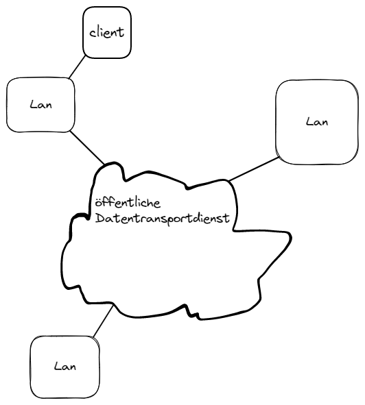
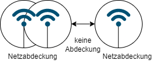

# **Weitverkehrsnetze (Öffentliche Netzt)**
## WAN Wide Area Network

DDE -- DÜE -- Übertragungsweg -- DÜE -- DDE 

DDE = Dynamic Data Exchange (dynamischer Datenaustausch)
DSL Modem etc. 

  

Tafelbild

### Arten von Netzen 
+ PSEN
+ ISDN
+ Kabelfernsehnetz / Unterseekabel
+ Mobilfunk / Satelliten-Netz

#### Intranet  
Intranet ist ein Internes Netz, ein Netzwerk das nur innerhalb eines Unternehmens genutzt wird. MitarbeiterInnen können auf internet Seiten zugreifen.
Nur Leute in der eigenen Organisation 
Intranet --> intern.robotron --> Private IP-Adressen 
 
#### Extranet
Erweiterung des Intranets. Zugang für KundInnen, Zulieferer oder Partner die auf spezielle Interne Informationen zugreifen dürfen.

||Lokales Netz|Weitverkehrsnetz|
|---|---|---|
|Konzept|Übertragung von Sprache, Daten, Videos mit begrenzter Entfernung / in einem begrenzten Bereich|Das gleiche, aber über weite Entfernung|
|Übertragungsraten|100 MBit/s bis 10 GBit/s|2 MBits/s --> 100 GBit/s|
|Eigentum|im Besitz des Benutzers|Im Besitz öffentlicher oder privater Betriebe|

## Dienste
+ Internetdienste --> Server-Applikationen

QoS -> Qualitäf of Service  

+ Dauer des Verbindungsaufbaus
+ Ausfallwarscheinlichkeit
+ Durchsatzrate
+ Priorisierung von Protokollen

## Kernnetz
PDH Plesiochrone Digitale Hierarchie
Multiplexing verfahren für reine Bitströme 

ITU-G 7XX  
E0 64 k Bits  
E1 2048 M Bits  
E2 8448 M Bit/s  
E3 34 368 M Bit/s  
E4 139 264 M Bit/s  
E5 564 992 M Bit/s  

## Verbindungsarten
+ Festverbindung
    + Standleitung / Mietleitung

## Vermittlungsprinzip
|Paketvermittlung|Leitungsvermittlung|
|---|---|
|- Keine dezidierte Verbindung|- Physikalische oder virtuelle verbindung|
|- Daten werden an verschiedenen Stationen zwischengespeichert|- entsprechende Kapazität u. bestimmte Qualität|
|- Eine Garentie für den Datendurchsatz kann nicht gegeben werden --> z.B. Station hat keine Kapazitäten mehr |- Beispiel wäre ein Telefongespräch|

**Vergleich**
|Kennzeichen|Paketvermittlung|Leitungsvermittlung |
|---|---|---|
|Verbindungsaufbau|Nein|Ja|
|Dedizierte Leitung|Nein|Ja|
|Pakete haben gleiche Route|Nein|Ja|
|Verfügbare Bandbreite|Dynamisch|fest, garantiert|
|Zwischenspeicherung|Ja|Nein|
|Abrechnung|Datenmenge|Zeiteinheit|

## Netzneutralität
+ gleiche behandlung von Datenpaketen 

+ Simplex Verbindung die immer in eine richtung geht

+ Halbduplex  Verbindung die in eine richtung geht aber in beide gehen kann

+ Vollduplex: Vollduplex ist eine Form des Duplexing und bezeichnet in der Kommunikationstechnik eine Art der Datenübertragung bei der die Daten gleichzeitig in beide Richtungen übertragen werden.  
Die Übertragung der Kommunikation erfolgt über zwei getrennte, eigenständige Kanäle. Diese werden als Upstream und Downstream bezeichnet. Die beiden Übertragungskanäle ermöglichen das gleichzeitige Hören (Downstream) und Sprechen (Upstream). Jeder Kommunikationsteilnehmer kann Daten in beide Richtungen senden und empfangen.

+ Multiplexing: Multiplexing bedeutet, mehrere Signale oder Informationsströme auf einer Leitung gleichzeitig in Form eines einzigen, komplexen Signals zu übertragen und dann auf der Empfangsseite wieder in separate Signale zu zerlegen.

+ Multiple Access: Vielfachzugriff (von engl. multiple access) bezeichnet in der Nachrichtentechnik eine Reihe von Verfahren zur Aufteilung der Übertragungskapazität eines Übermittlungssystems unter die daran angeschlossenen Stationen.

+ Modulation: Der Begriff Modulation (lat. modulatio = Takt, Rhythmus) beschreibt einen Vorgang in der Nachrichtentechnik, bei dem ein zu übertragendes Nutzsignal (beispielsweise Musik, Sprache, Daten) einen sogenannten Träger verändert (moduliert). Dadurch wird eine hochfrequente Übertragung des niederfrequenten Nutzsignals ermöglicht. Das Sendesignal belegt im Bereich der Trägerfrequenz eine vom Nutzsignal abhängige Bandbreite. Die Nachricht wird empfangsseitig durch einen Demodulator wieder zurückgewonnen.

# **DSL Digital Subscriber Line**
Digital Subscriber Line (DSL, engl. für Digitaler Teilnehmeranschluss) bezeichnet eine Reihe von Übertragungsstandards der Bitübertragungsschicht, bei der Daten mit hohen Übertragungsraten (bis zu 1.000 Mbit/s)[1] über einfache Kupferleitungen wie die Teilnehmeranschlussleitung gesendet und empfangen werden können.
DSL ist den Schicht 1 (Bitübertragung) im OSI Modell angesiedelt.

## ADSL Asymmetric Digital Subscriber Line
Bei ADSL handelt es sich um ein Übertragungsverfahren für einen Breitband-Internet-Anschluss über eine normale Telefonleitung. Der wichtigste Vorteil von ADSL war, dass die vorhandenen Telefonanschlüsse (Analog/ISDN) parallel weiterverwendet werden können.

+ ITU.G.992.1
+ maximale Senderate 1.0 MBit/s
+ maximale Empfangsrate 10 MBit/s

## SDSL Symmetric Digital Subscriber Line

## SSTP

## VDSL

## Aufbau Mobilfunknetz
Funkzellen sollten eine permanente Überlagerung haben.

