
    
    
# Projektmanagement
**Projekte erfolgreich abwickeln**
## Was sind Merkmale eines Projektes?
+ klares Ziel
+ neuartig
+ zeitlich befristet
+ einmalig 
+ begrenzte Ressourcen
+ komplex
+ interdisziplinär
+ risikobehaftet
+ eigene Organisation
## Was ist Projektmanagement?
+ "Gesamtheit von Führungsaufgaben, - organisation, -techniken und -mitteln für die Initiierung, Definition, Planung, Steuerung und den Abschluss von Projekten."  
**DIN-Norm (DIN 69901-5:2009-01)**

+ "Projektmanagement ist die Anwendung von Wissen, Fertigkeiten, Werkzeugen und Methoden auf Projektvorgängen, um die Projektanforderungen zu erfüllen."  
**Project Management Institut (PMI)**

+ Das Projekt führen, koordinieren, steuern und kontrollieren."  
**Gesellschaft für Informatik**

## Erfolgsfaktoren für Projekte
+ Projektidee/Projektumwelt
+ Projektteam
+ Methodik
+ **Projektleiter*In**
+ Informatik
+ Kommunikation
+ Topmanagement

# Teil A - Projekt initialisieren
## Ziele erheben
+ Ist-Analyse
+ Interessengruppen identifizieren: Sponsoren, Nutzer, Anwender, Entscheider, Beeinflusser
## Ziele formulieren
+ eindeutig
+ zweckmäßig
+ schriftlich
## Ziele analysieren
+ "echte" Ziele
+ Projektbezug
+ keine Redundanzen
+ Muss- oder Kann-Ziele
+ Zielkonflikte
## Ziele klassifizieren
+ Systemziele: wirtschaftliche, funktionelle oder soziale Ziele
+ Vorgehensziele: Etappenziele des Projekts
## Ziele operationalisieren
+ messbar nach quantitativen und/oder qualitativen Kriterien
+ Maßstab für Zielreichung
## Ziele gewichten
+ stufenweise Gewichtung
+ Präferenzmatrix
## Ziele dokumentieren
+ Auftrag
+ Projektziele
+ Ansprüche Interessengruppe
+ Zielanalyse
+ Zielstruktur
## Ziele kommunizieren
+ Kick-off-Meeting (Projektstart-Sitzung)
+ Projektsitzungen mit Fortschrittanalysen
+ Projektende mit Zielerreichung
## **Magisches Dreieck**
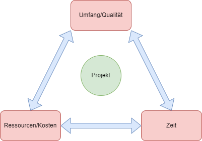
## **Zielkriterien SMART**
|S|Spezifisch|Eindeutige, positive, spezifische Zieldefinition|
|---|---|---|
|**M**|Messbar|Mess- und Vergleichbarkeiten von Zielen|
|**A**|Attraktiv/Akzeptiert|Attraktivität für das Projektteam, das Projektziel zu erreichen|
|**R**|Realistisch|Realistische Erreichbarkeit der Projektziele|
|**T**|Terminiert|Terminierung für Zielerreichung|
## **Lastenheft und Pflichtenheft**
|Das Lastenheft...|Das Pflichtenheft...|
|---|---|
|*enthält die "vom Auftraggeber festgelegten Gesamtheit der Forderungen an die Lieferungen und Leistungen eines Auftragnehmers innerhalb eines Auftrages."*  **DIN-Norm 69901-5:2009-01** |*enthält die "vom Auftragnehmer erarbeiteten Realisierungsvorgaben aufgrund der Umsetzung des vom Auftraggeber vorgegebenen Lastenheftes."*  **DIN-Norm (DIN 69901-5:2009-01** |
|beinhaltet alle Anforderungen des Auftraggebers hinsichtlich des Liefer- und Leistungsumfanges|beschreibt die Realisierung aller Anforderungen des Lastenheftes|
|beschreibt die Anforderungen aus Anwendersicht einschließlich der Randbedingungen, die prüfbar und bewertbar sein müssen.|enthält das Lastenheft|
|wird vom Auftraggeber oder in dessen Auftrag erstellt|detaliert die Anwendervorgaben|
|dient aus Ausschreibungs-, Angebots- und Vertragsgrundlage.|wird in der Regel vom Auftragnehmer erstellt|
|definiert das WAS und Wofür etwas zu lösen ist|beschreibt die systematische Lösung und die konkrete Ausprägung der Systemtechnik|
||bedarf der Genehmigung durch den Auftraggeber|
||stellt die verbindliche Vereinbarung für die Realisierung des Projektes für den Auftraggeber und den Auftragnehmer dar.|
||definiert WIE und WOMIT die Anforderungen realisiert werden|
|*Beschreibung der Anforderungen an das Projekt*|*Beschreibung der konkreten Realisierung*|
## Lastenheft
+ Ist-Analyse und Zielsetzung
+ Produkteinsatz
+ Produktübersicht
+ Funktionale Anforderungen
+ Nichtfunktionale Anforderungen
+ Lieferumfang
+ Abnahmekriterien

Beispiel: Lastenheft für Website Relaunch
+ Business Case
    + Warum ist ein Relaunch der Website notwendig
    + Da dieser Zeit und Geld kostet, braucht es starke Argumente für diesen Schritt
+ Ist-Zustand
    * Dokumentation des aktuellen Status, der konkret verbessert werden soll.
    Die Verbesserungen sollen noch allgemein gehalten werden.
+ Soll-Zustand
    + Dokumentation, was im Allgemeinen verbessert werden soll im Vergleich zum Ist-Status.
    + Z.B. besseres Ranking der Suchbegriffe A B C, Produktkonfigurator
+ Anforderungen an die neue Website
    + Konkrete Auflistung, was die Website leiden können soll OHNE die technische Lösung zu beschreiben.
    + Benutzbarkeit, Änderbarkeit, Übertragbarkeit, Skalierbarkeit
    + komplette, ausführliche Beschreibung der neuen Website
+ Lieferung/Dauer der Umsetzung
    + Erstellung eines Zeitplans, der angemessenen Zeiträume für die jeweiligen Phasen zulässt
+ Besonderheiten & Allgemeine Hinweise
+ Einzusetzende Techniken
    + Falls es harte Randbedingungen gibt.
+ Anlagen
    + PDF Dateien (Tabellen, Zeichnungen, Text, ...)
    + Mitarbeiter haben ihre Anforderungen an die neue Website aufgeschrieben -> spezifiziert und priorisiert
## Pflichtenheft
+ Zielbestimmung
+ Produkteinsatz
+ Produktkoonfiguration
+ Produktfunktionen
+ Produktleistung
+ Qualitätsziele
## Organisatorische Einbindung der Projektarbeit
|Autonome Projektorganisation   = Reine Projektorganisation  = Linien-Projektorganisation|Integrierte Projektorganisation   = Einfluss-Projektorganisation   = Stabs-Projektorganisation|Matrix Projektorganisation|
|---|---|---|
|* Angliederung neben der Linienorganisation als eigenständige Organisationseinheit * Projektteam ist der Projektleitung fachlich und disziplinarisch unterstellt |* Alle Beteiligten bleiben in ihren Abteilungen  * Projekt läuft nebenbei  * Projektleitung nur mit koordinierender Funktion, ohne Weisungsbefugnis  * Fachabteilungen tragen die Verantwortung|* Mischung aus integriertem und autonomen Management  * Projektleitung aus Linienorganisation herausgelöst mit fachlicher Weisungsbefugnis  * Teammitglieder nur temporär dem Projekt zugeordnet|
|Für umfangreiche Projekte, die sehr wichtig und dringend sind|Nur für kleine Projekte mit geringem Umfang und kurzer Dauer bei Unternehmen mit flachen Hierarchien|Üblich in Großunternehmen bei hoher Flexibilität aber großem Koordinationsbedarf|

|Kriterien|Reine Projektorganisation|Stabs-Projektorganisation|Matrix-Projektorganisation|
|---|---|---|---|
|Bedeutung für das Unternehmen|Sehr groß|Gering|Groß|
|||||
# Teil B - Projekt Planen
## Projektphasen-/Vorgehensmodelle
+ Unterschiedliche Phasenmodelle für unterschiedliche Projektprodukte
+ Phasen in Softwareprojekten meist:  
    1. Analyse
    2. Design
    3. Entwicklung
    4. Test
    5. Auslieferung
+ Sequenziell oder iterativ
    + Sequenziell: jede Aktivität muss beendet sein, bevor die nächste anfängt
    + Iterativ: derselbe Arbeitsschritt wird mehrmals durchlaufen und die Ergebnisse des Arbeitsschrittes pro Durchlauf verfeinert und verbessert.
## Wasserfallmodell
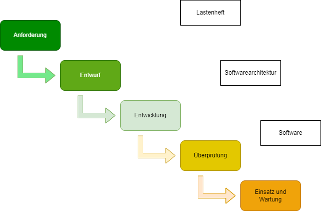
### Eigenschaften
+ Aktivitäten sind in der vorgegebenen Reihenfolge und in der vollen Breite vollständig auszuführen
+ "dokumentgetriebenes" Modell.
+ Sequenzieller (linearer) Ablauf
+ Top-down-Verfahren: vom Allgemeinem zum Speziellen
+ einfach und verständlich
+ Eine Benutzerbeteiligung ist in der Anfangsphase vorgesehen, anschließend erfolgen der Entwurf und die Implementierung ohne Beteiligung des Benutzers bzw. Auftraggebers. Weitere Änderungen stellen Neuaufträge dar.
+ Geeignet für kleine, einfache und klar strukturierte Software-Projekte

|Vorteile|Nachteile|
|---|---|
|Einfache Struktur mit klaren Vorgaben|Starre Reihenfolge und damit wenig Flexibel|
|Sichtbarer Projektfortschritt mithilfe von Meilensteinen|Spätes Erkennen von Umsetzungsfehlern|
|Arbeitsumfang kann mit dem Projektbeginn eingeschätzt werden|Abgrenzung der einzelnen Phasen vor allem in komplexen Projekten schwierig|
|Planungssicherheit und Kontrolle|Schwierig alle Phasen reibungslos nacheinander abzuarbeiten|
|Lösungswege fließen in die Projektplanung mit ein|Bei Fehlern und Änderungen geht es meist zurück in die Entwurfsphase|
|Kalkulation von Zeit-, Budget- und Arbeitsaufwand|Teure Fehlerkontrolle|

## Erweitertes Wasserfallmodell!
.png)

### Eigenschaften
+ Vorteile des klassischen Wasserfallmodells werden genutzt
+ Für mehr Flexibilität: Rucksprungmöglichkeiten in vorhergehende Phase (Iterationen)
+ Entwurfsphase <-> Testphase
+ Entwurfsphase meist agil

## V-Modell
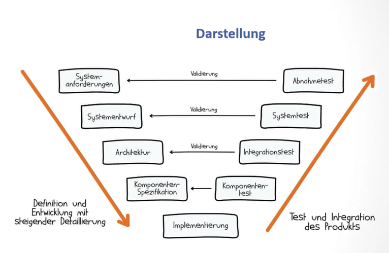
### Eigenschaften
+ Fest definierte Phasen
+ lineares Modell
+ Links: Top-Down
+ Rechts: Bottom-Up

## Spiralmodell
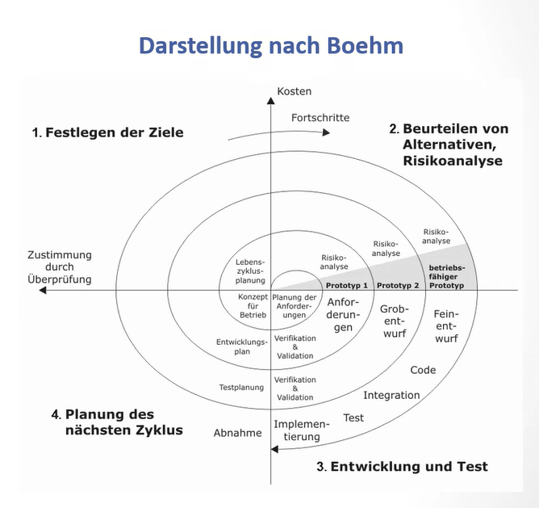
### Eigenschaften
+ Quadranten
    + Festlegung der Ziele
    + Risikoanalyse
    + Entwicklung und Test
    + Planung des nächsten Zyklus
+ Vorteile
    + Iterativer Prozess mit beliebigen Zyklen, der sich auf jedes Projekt anwenden lässt
    + hohe Flexibilität, da die Ziele zu Beginn eines jeden Zyklus neu festgelegt werden
    + Abwägung mehrerer Alternativen und die Bewertung deren Risiko
+ Nachteile
    + durch lineares Vorgehen schlecht zu parallelisieren
    + Hoher Planungsaufwand durch häufige Analyse und neue Festlegung
    + risikoabhängiges Handeln passt nicht zu jedem Software-Projekt

## **Agile Softwareentwicklung**
---

+ Vier Leitsätze aus dem Agilen Manifest von 2001:
    + Individuen und Interaktionen sind wichtiger als Prozesse und Werkzeuge
    + Funktionierende Software ist wichtiger als umfassende Dokumentation
    + Zusammenarbeit mit dem Kunden ist wichtiger als Vertragsverhandlungen
    + Reagieren auf Veränderung ist wichtiger als das Befolgen eines Plans
+ Zum Nachlesen: https://atlassian.com/de/agile

### Scrum - Überblick
+ scrum = englisch für "Gedränge"
+ agiles Projektmanagement-Framework
+ Ansatz: empirisch, inkrementell, iterativ
+ Teams arbeiten als kleine, selbst-organisierte Einheit und bekommen von außen nur eine Richtung vorgegeben, bestimmen aber selbst die Taktik, wie sie ihr gemeinsames Ziel erreichen.
+ umfasst Ereignisse, Artefakten und Rollen, die gemeinsam das Strukturieren und Managen der Teamarbeit unterstützen.
+ Transparenz: Fortschritt und Hindernisse eines Projektes werden regelmäßig und für alle sichtbar aufgezeigt
+ Überprüfung: Projektergebnisse und Funktionalitäten werden regelmäßig abgeliefert und bewertet
+ Anpassung. Anforderungen an das Produkz, Pläne und Vorgehen werden kontinuierlich und detaliert angepasst.

#### Scrum - Verantwortlichkeiten (Rollen)
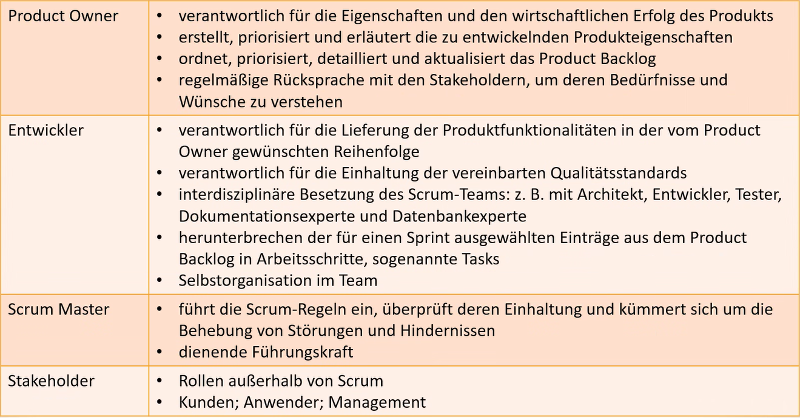
|Rolle|Aufgaben|
|---|---|
|Product Owner|* verantwortlich für die Eigenschaften und den wirtschaftlichen Erfolg des Produkts   * erstellen, priorisiert und erläutert die zu entwickelnden Produkteigenschaften   * ordnet, priorisiert, detailliert und aktualisiert das Product Backlog   * regelmäßige Rücksprache mit den Steakholdern, um deren Bedürfnisse und Wünsche zu verstehen|
|Entwickler|* verantwortlich für die Lieferung der Produktfunktionalitäten in der vom Product Owner gewünschten Reihenfolge  * verantwortlich für die|
|Scrum Master||
|Steakholder||

#### Scrum - Sprints
+ Sprint = Arbeitsabschnitt, in dem ein Inkrement einer Produktfunktionalität implementiert wird
+ Sprints folgen unmittelbar aufeinander
+ während eines Sprints keine Änderungen erlaubt, die das Sprintziel beeinflussen
+ Zeitfenster von ca. einer bis vier Wochen: wird nie verlängert
+ kann abgebrochen werden vom Product Owner
+ besteht aus
    + Spring Planning
    + Daily Scrum
    + Sprint Review
    + Sprint-Retrospektive

#### Scrum - Ereignisse (Events)
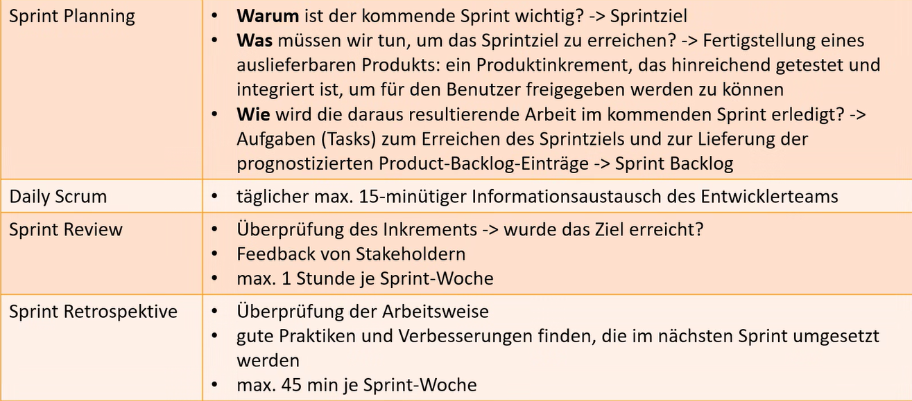
|Bezeichnung|Bedeutung|
|---|---|
|Sprint Planning|* **Warum** ist der kommende Sprint wichtig? -> Sprintziel   * **Was** müssen wir tun, um das Sprintziel zu erreichen? -> Fertigstellung eines |
|Daily Scrum||
|Sprint Review||
|Sprint Retrospektive||

#### Scrum - Artefakte
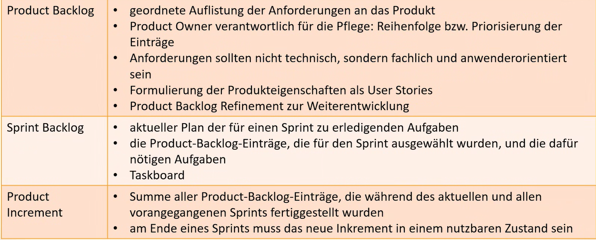
|Bezeichnung|Bedeutung|
|---|---|
|Product Backlog|* geordnete Auflistung der Anforderung an das Produkt  * Product Owner verantwortlich für die Pflege: Reihenfolge bzw. Priorisierung der Einträge  * Anforderungen sollten nicht technisch, sondern fachlich und anwendungsorientiert sein.  * Formulierung der Produkteigenschaften als User Stories  * Product Backlog Refinement zur Weiterentwicklung|
|Sprint Backlog|* aktueller Plan f|
|Product Increment||

#### Scrum - User Stories
+ erwünschte Eigenschaften von User Stories -> Akronym INVEST
    + **I**ndependent - unabhängig. (nicht von anderen User stories abhängig)
    + **N**egotiable - Verhandelbar. (keine Umsetzungsdetails)
    + **V**aluable - nützlich. (Erhöhung des Gebrauchtwerts des Produkts für den Endkunden)
    + **E**stimable - schätzbar. (abschätzbarer Aufwand für die Umsetzung)
    + **S**mall - klein. (überschaubarer Aufwand für die Umsetzung)
    + **T**estable - überprüfbar. (Überprüfung der erfolgreichen Umsetzung mit objektiven Kriterien)

### Kanban

+ Methoden in der Softwareentwicklung, bei der die Anzahl paralleler Arbeiten, der Work in Progress (WiP), begrenzt und somit kürzerer Durchlaufzeiten erreicht und Probleme - insbesondere Engpässe - schnell sichtbar gemacht werden sollen.
+ Vier Grundprinzipien
    + Beginnen mit dem was du gerade tust
    + Vereinbare, dass evolutionäre Veränderung verfolgen wird
    + Respektiere initial bestehende Prozesse / Rollen / Verantwortlichkeiten
    + Ermutige datu. Führung auf jeder Ebene der Organisation zu zeigen.
+ Sechs Kernpraktiken
    + Visualisiere den Fluss der Arbeit
    + Begrenze die Menge angefangener Arbeit
    + Miss und steuere den Fluss
    + Mache die Regeln für den Prozess explizit
    + Implementiere Feedbackzyklen
    + Verwende Modelle, um Chancen für kollaborative Verbesserungen zu erkennen.

### Gemeinsamkeiten von Kanban und Scrum
+ schlank und agil
+ Pull-System
+ begrenzen Work in Progress (WiP)
+ Transparenz, um den Prozess zu verbessern
+ möglichst schnell und möglichst häufig releasefähige Software-Inkremente ausliefern
+ selbstorganisierende Teams
+ Anforderungen werden in kleine Einheiten heruntergebrochen
+ Releaseplan wird immer wieder optimiert, indem empirische Daten ausgewertet werden. (Team-Geschwindigkeit / Durchlaufzeit)
#### Unterschied zwischen Kanban und Scrum
|Kanban|Scrum|
|---|---|
|Iteration optional: unterschiedliche Takte für Planung, Releases und Prozessverbesserung|Iterationen mit gleichen Längen vorgeschrieben|
|Commitments optional|Team commitet sich auf ein Sprintziel|
|Durchlaufzeit (Cycle Time) als Basis- Metrik für Planung und Prozessverbesserung|Team-Geschwindigkeit (Velocity) als Basis-Metrik für Planung und Prozessverbesserung|
|Cros-funktionale Teams optional; Expertenteams erlaubt|Cross-funktionale Teams vorgeschrieben|
|Keine Vorschriften bezüglich der Größe von Anforderungen| Anforderungen so aufgeteilt, dass sie sich innerhalb einer Iteration erledigen lassen|
|WiP direkt limitiert|WiP indirekt limitiert durch die Menge an Anforderungen, die in einen Sprint passen|
|Schätzungen optional|Schätzungen vorgeschrieben|
|Neue Anforderungen können zu jedem Zeitpunkt an das Team gegeben werden, falls Kapazitäten frei sind.|Während eines laufenden Sprints können keine neuen Anforderungen an das Team gegeben werden|
|Gibt keine Rollen vor|Schreibt drei Rollen vor|
|Ein Kanban-Board kann von mehreren Teams und/oder Einzelpersonen geteilt werden|Ein Sprint Backlog gehört einem einzelnen Team, das Produkt Backlog kann zu mehreren Teams gehören|
|Ein Kanban-Board wird kontinuierlich weitergepflegt|Sprint-Backlog wird nach jedem Sprint gelöscht und neu aufgesetzt; Produkt-Backlog wird kontinuierlich weitergepflegt|
|Priorisierung Optional|Alle einträge im Produkt Backlog müssen priorisiert sein|
### Meilensteine
+ Meilensteine schließen eine Projektphase ab 
+ Meilensteine sind Entscheidungspunkte
    + Alle Aktivitäten befinden sich im Plan, die Phase kann abgeschlossen und das Projekt wie geplant fortgesetzt werden.
    + Einige Aktivitäten, die bereits abgeschlossen sein sollten, weisen signifikante Abweichungen auf. Es muss nachgearbeitet werden, um die Phase abschließen zu können.
    + Es sind Ereignisse eingetreten, die eine sinnvolle Projektfortsetzung unmöglich machen; das Projekt wird gestoppt oder eingestellt oder unter anderen Rahmenbedingungen neu aufgestellt.

### Arbeitsbeschreibung
"[Ein Arbeitspaket ist eine] in sich geschlossene Aufgabenstellung, die bis zu einem festgelegten Zeitpunkt mit definiertem Ergebnis auf und Aufwand vollbracht werden kann [.]"  
**DIN-Norm (Din 69901-5:2009-01)

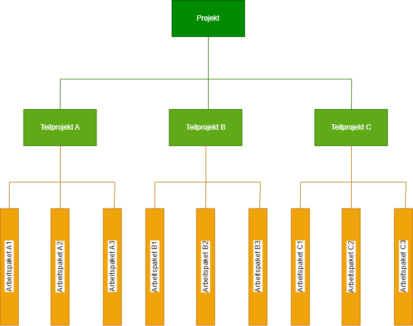

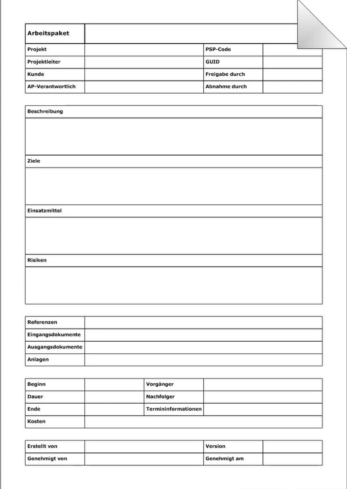
+ Identifikatoren
+ Projektinformationen
+ Beschreibung
+ Ziele
+ Erläuterungen
+ Verantwortlichkeiten
+ Referenzen
+ Risiken
+ Ablaufinformationen
+ Termininformationen
+ Benötigte Ressourcen
+ Kosteninformationen
+ Eingangsdokumente
+ Ausgangsdokumente
+ Anlagen
+ Signaturen

### Ablaufplanung - Vorgangsliste
+ Nach Abschluss der Arbeitspaketfeinplanung wird die Vorgangsliste erstellt. Sie ist eine tabellarische Zusammenstellung aller Arbeitspakete mit ihrer Dauer und ihrer Reihenfolge.
+ "Ein Vorgang ist eine abgegrenzte Arbeitseinheit, die zu einem bestimmten Zeitpunkt begonnen und einem bestimmten späteren Zeitpunkt beendet wird".  
**DIN-Norm (DIN 69900, Teil 1)**

|Nr.|PSP-Code|Vorgangsbezeichnung|Dauer (in Tagen)| Vorgänger|Nachfolger|
|---|---|---|---|---|---|
|1|1.1|Planung|10|-|2;3;4|
|2|1.2|Installation Netzwerk|8|1|5|
|3|1.3|Beschaffung Hardware|5|1|6|
|4|1.4|Beschaffung Software|7|1|6|
|5|1.5|Renovierung|5|2|7|
|6|1.6|Installation Software|6|3;4|7|
|7|1.7|Aufbau Computer|3|5;6|8|
|8|1.8|Test und Übergabe|2|7|-|

#### Ablaufplan - Vorgangsbeziehungen 

|Ende-Anfang|B kann begonnen werden, sobald A beendet worden ist|EA-Beziehung oder Normalfolge|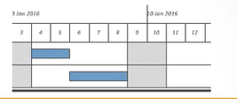|
|---|---|---|---|
|Anfang-Anfang|B kann beendet werden sobald A begonnen worden ist|AA-Beziehung oder Anfangsfolge|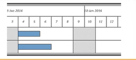|
|Anfang-Ende|B kann beendet werden sobald A begonnen worden ist|AE-Beziehung oder Sprungfolge|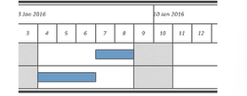|
|Ende-Ende|B kann beendet werden, sobald A beendet worden ist|EE-Beziehung oder Endfolge|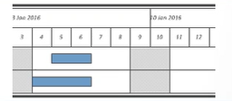|
|Alle Versionen mit Abstand|B kann begonnen werden, sobald A beendet worden und ein bestimmter Zeitabstand verstrichen ist.||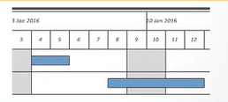|

#### Terminplanung

+ Vorwärtsrechnung (progressiv)
    + Starttermin des Projektes ist vorgegeben
    + Berechnung der frühesten Anfangs- und Endzeitpunkte der einzelnen Vorgänge
    + Endtermin des Projekts wird berechnet
+ Rückwärtsrechnung (retrograd)
    + Endtermin des Projektes liegt fest
    + Berechnung der spätesten Anfangs- Endzeitpunkte der einzelnen Vorgänge
    + Starttermnin des Projektes wird berechnet
+ Darstellungsmöglichkeiten
    + 
    + 

#### Vorgangsknotennetz
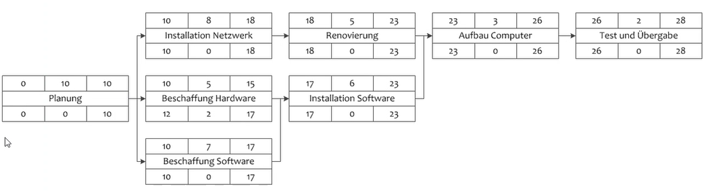
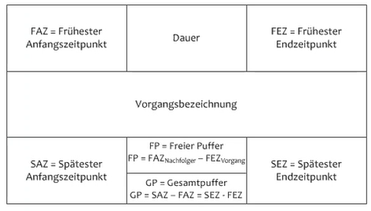

Der **Gesamtpuffer GP** eines Vorgangs ist die Zeitspanne, die ein Vorgang gegenüber seinem frühesten Beginn verschoben werden kann, ohne das Projektende zu gefährden.

Der freie **Puffer FP** ist die Zeit, die den frühestmöglichen Beginn des Nachfolgers nicht gefährdet.
#### Kritischer Pfad
+ Der kritische Pfad, auch kritischer Weg genannt, ist die Kette derjenigen Vorgänge, bei deren zeitlicher Änderung sich der Endtermin des Netzplanes verschiebt. Er wird in einem Netzplan durch eine Kette von Einzel-Aktivitäten bestimmt, deren Gesamtpufferzeit Null ist.
+ Die Gesamtaktivität, die auf dem kritischen Pfad liegen, bestimmen die Gesamtprojektdauer. Alle anderen Aktivitäten können im Rahmen ihrer Pufferzeit zeitlich verschoben oder verlängert werden, ohne die Gesamtprojektdauer zu verändern.
#### Ressourcenplanung
|Vorgehensschritt|Aktivität|
|---|---|
|Bedarf Ermitteln|* Arbeitspaketanalyse: Ressourcen (Person und Sachmittel) ermitteln   * Bedarfsübersicht erstellen|
|Resourcen evaluieren|* Geeignete Mitarbeiter auswählen  * Geeignete Sachmittel auswählen   * Verfügbarkeiten beachten|
|Ressourcenplan erstellen|* Personal und Sachmittel den Arbeitspaketen zuordnen  * Kapazitätsengpässe ermitteln  * Kapazitätenausgleich vornehmen|
#### Kostenplanung
|Vorgehensschritte|Aktivitäten|
|---|---|
|Kosten ermitteln|Berechnung der Kosten für jedes Arbeitspaket   Gliederung der Voraussichtlichen Kosten nach Kostenarten:  * Personalkosten  * Materialkosten  * Betriebsmittelkosten  * Sonstige Kosten|
|Kostenplan aufstellen|Zusammenfassung der Kosten pro Arbeitspaket    Gliederung nach:  * Kostenarten  * Zeitperioden  * Kostenträgern|

# Teil C Projekte realisieren 
## Projektsteuerung
+ Projektvortschritt überwachen
+ Bei Abweichungen oder Probleme in den weiteren Projektverlauf eingreifen
+ **Ist-Situation erheben**
    + Rückmeldung Arbeitsfortschritt
    + Feststellung des Fertigstellungsgrads
+ **Soll/Ist-Vergleich durchführen**
    + Terminvergleich
    + Kostenvergleich
    + Ressourcenvergleich
+ **Abweichungsursachen ermitteln**
    + Sorgfältige Ursachenanalyse
+ **Steuerungsmaßnahmen entwerfen und umsetzen**
    + Strategiebezogen
    + Strukturbezogen
    + Kulturbezogen
    + Planungs-, diagnose- und steuerungs-bezogen
## Risikomanagement
|Vorgehensschritt|Aktivitäten|
|---|---|
|Risiken identifizieren|* Sammeln von potenziellen Risiken (Schwachstellen)  * Einteilen von Risikokategorien|
|Risiken analysieren|Beurteilung anhand von drei Kriterien  * Ursachen für das Eintreten des Risikos  * Eintrittswahrscheinlichkeit  * Tragweite für das Projekt|
|Prophylaktische Maßnahmen planen|Maßnahmen gegen die Eintrittswarscheinlichkeit|
|Frühwarnsystem einrichten|Indikatoren für das Feststellen potenzieller Probleme definieren|
|Eventualmaßnahmen planen|Maßnahmen zur Reduktion des Schadensausmaßes|
|Risiken überwachen|* Regelmäßige Kontrolle der Risiken  * Dokumentation der Risiken|
## Projektdokumentation
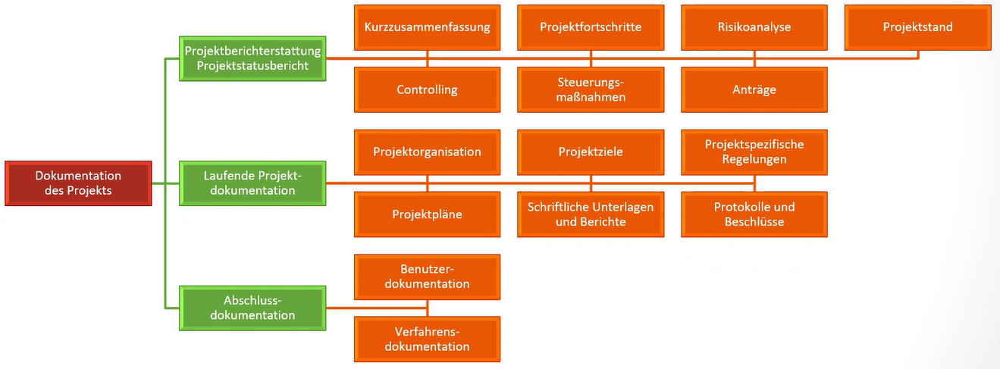
## Projektabschluss
+ Abschlussbericht erstellen
+ Projektabschluss-Workshop durchführen
    + Abschluss der Dokumentation
    + Gegenseitiges Feedback innerhalb des Projektteams
    + Festlegung der weiteren Betreuung
    + Vor- bzw. Nachbereitung der Übergabe an den Auftraggeber
    + Verteilung der gegebenenfalls notwendigen Nacharbeiten
    + Freigabe des Abschlussberichtes
+ Übergabe der Projektergebnisse an den Auftraggeber unter Einbeziehung der Bereiche Qualitätssicherung, Arbeitssicherheit, Umweltschutz, Personal, Betriebsrat, Controlling, andere Fachabteilungen
+ Entlastung Projektteam und Projektleiter
