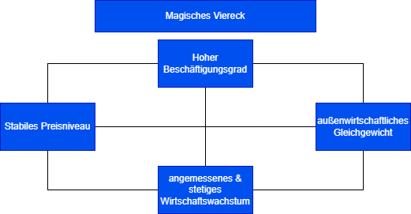
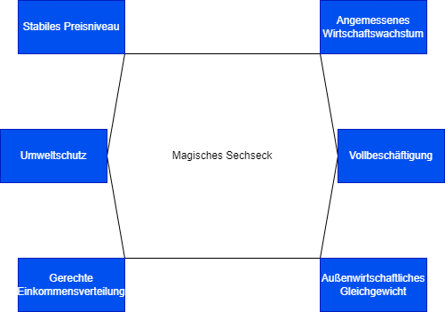
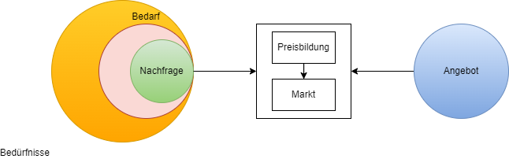
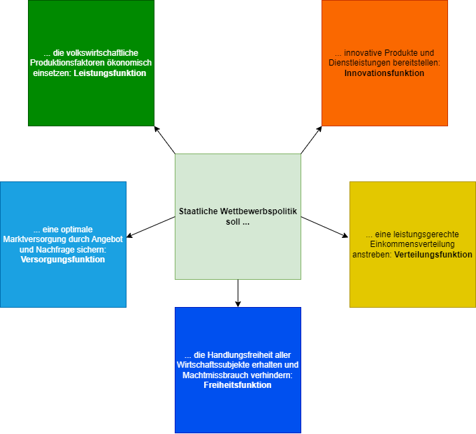

# Volkswirtschaftslehre
+ Unternehmen im Wirtschaftskreislauf
+ Vwl-Gesamtrechnung, einfacher und erweiterter Wirtschaftskreislauf
+ Geld- und Güterströmung, BIP, BNE, Entstehungsrechnung, Verwendungsrechnung
+ System der sozialen MArktwirtschaft, magisches Viereck, magisches Sechseck

## Begriff Marktwirtschaft in der Volkswirtschaftslehre

### Magisches Viereck

### Magisches Sechseck

### Begriff Markt in der Volkswirtschaftslehre

+ **Bedürfnisse**
    + ... sind Mangelempfindungen des Menschen (Trinken gegen   Durst, Essen gegen Hunger)
    + ... sind Triebfeder wirtschaftlichen Handelns
+ **Bedarf**
    + ... ist der Teil der Bedürfnisse, der durch Einkommen gedeckt werden kann.
+ **Nachfrage**
    + ... ist der auf dem Markt erscheinende Bedarf

In der Fachliteratur wird zwischen dem abstrakten und dem konkreten MArkt unterschieden
+ Der **abstrakte Markt** ist eine Zusammenfassung von Angebots- und Nachfragebeziehungen. Er ist der theoretische Ort, am de, sich Angebot und Nachfrage treffen und an dem die Preisbildung stattfindet.
+ Der **konkrete MArkt** ist sachlich, zeitlich und örtlich bestimmt, z.B. die Cebit-Messe im Jahr 20... in Hannover. 

### Marktformen
|Nachfrage/Anbieter|einer|wenige|viele|
|---|---|---|---|
|**einer**|bilaterales Monopol|beschränktes Nachfragemonopol|Nachfragemonopol|
|**wenige**|beschränktes Angebotsmonopol|bilaterales Oligopol|NAchfrageoligopol|
|**viele**|Angebotsmonopol|Angebotsoligopol|Polypol|
Erkläreung:  
mono = ein  
olig = wenig  
poly = viel  

### Bestimmungsgründung der Nachfrage privater Haushalte

### Preisbildung auf dem vollkommenen Markt
Bedingungen des vollkommenen Marktes
+ Viele Anbieter und viele Nachfrager (Polypol)
+ Anbieter und Nachfrager haben vollständige Marktübersicht (Markttransparenz)
+ Anbieter und Nachfrager reagieren auf Marktänderungen ohne zeitliche Verzögerung
+ Das von den Anbietern angebotene Gut ist homogen (Güter unterscheiden sich nicht)
+ Angebot und Nachfrage terffen an einem bestimmten Ort aufeinander (Punktmarkt)
Anbieter und Nachfrager haben keine sachlichten, zeitlichen, räumlichen oder persönlichen Präferenzen.
+ Unter diesen Bedingungen ergibt sich für das angebotene Gut ein Einheitspreis, der von dem einzelnen Anbieter nicht verändert werden kann (Preis=Datum)

### Konjukturzyklus

|Konjukturindikatoren / Konjukturphasen|1. Aufschwung (Anstieg)|2. Boom (Hochkonjuktur)|3. Rezession(Rückgang) Krise(Niedergang)|4. Depression (Talsohle)|
|---|---|---|---|---|

### Geldpolitik der Europäischen Zentralbank
Die Europäische Zentralbank (EZB) ersetzt seit dem 1. Januar 1999 die nationalen Zentralbanken derjenigen Staaten, die an der Währungsunion teilnehmen. Die nationalen Zentralbanken, in Deutschland die Deutsche Bundesbank, bleiben aber erhalten und erfüllen untergeordnete Aufgaben. Die EZB und die nationalen Zentralbanken bilden zusammen das Europäische System der Zentralbanken (ESZB) 
#### Ziele und Aufgaben der EZB

#### Geldpolitische Instrumentarien
Diese Instrumente werden eingesetzt, um die Kreditinstitute und damit die Wirtschaft der einzelnen EU-Staaten mit ausreichender Liquidität (zur Ankurbelung der Konjuktur) zu versorgen bzw. ihnen Liquidität zu entziehen (als Vorbeugung vor Inflation).

#### Offenmarktpolitik
Die EZB beleiht die von den Banken angebotenen Wertpapiere bzw. kauft sie an. Damit stellt sie dem Banksystem Geld zur verfügung. Umgekehrt kann sie den Banken Geld entziehen, indem sie selbst Wertpapiere zu attraktiven Zinsen verkauft als andere Anbieter (Kapitalsammelstellen wie Versicherungen, Bausparkassen).

Beispiel für Offenmarktgeschäfte: Verkäufer von Schuldverschreibungen

#### Mindestreservepolitik
Der EZB-Rat hat beschlossen, dass die Banken einen bestimmten Prozentsatz (höchstens 10% derzeit 1%) ihrer reservepflichtigen Verbindlichkeiten bei der nationalen Zentralbank, verzinslich anlegen müssen. Die höhe der Verzinsung liegt beim Leitzinssatz. 

Diese Pflichteinlage nennt man Mindestreserve und den Prozentsatz Mindestreservesatz. Der EZB-Rat hat das Recht und die Pflicht im Falle von anhaltenden Geldüberschuss oder Geldmangel, den Reservesatz anzupassen.
+ Erhöhung des Reservesatzes
+ Senkung des Reservesatzes

## Kooperation und Konzentration
Gründe von Unternehmenszusammenschlüsse
+ Verringerung hoher Forschungs- und Entwicklungskosten
+ Verbreiterung des Kapitalbasis
+ Streuung des Unternehmerischen Risikos
+ Ausnutzung von Rationalisierungsvorteilen
+ Erhöhung des Auslastungsgrades der Produktionsanlagen
+ Erschließung neuer Beschaffungs- oder Absatzmärkte
+ Begrenzung des Wettbewerbs / Aufteilung von Märkten

### Kooperation
Kooperation liegt vor, wenn wirtschaftlich selbstständige und rechtlich weitgehend selbstständig bleibende Unternehmen sich durch Verträge zur Zusammenarbeit verpflichten.

### Konzentration
Von Konzentration spricht man, wenn die wirtschaftliche Selbstständigkeit aufgegeben wird und die Unternehmen einer umfassenden zentralen Leitung unterstellt werden.

### Formen der Kooperation
+ **Arbeitsgemeinschaft** - beschränkte Zusammenarbeit von Unternehmen in ausgewählten Teilbereichen - in der Regel in Form einer vertraglichen Vereinbarung - z.B. Bildung einer Werbegemeinschaft in einer Fußgängerzone, Die beteiligten Unternehmen behalten ihre rechtliche, größtenteils ihre Wirtschaftliche Selbstständigkeit
+ **Konsortium** - Unternehmen schließen sich für einen begrenzten Zeitraum zusammen, z.B. einer BGB-Gesellschaft, um ein gemeinsames Projekt, z.B. Bau einer Autobahnstrasse durchzuführen. Die wirtschaftliche Selbstständigkeit wird nur in sehr geringem Umfeld begrenzt.
+ **Interessengemeinschaft** - Unternehmen schließen sich zusammen, z.B.in Form einer BGB-Gesellschaft, um gemeinsam unternehmerische Tätigkeitsfelder zu bearbeiten, z.B. gemeinsame Forschung. Die wirtschaftliche Selbstständigkeit wird dadurch nicht eingeschränkt.
+ **Kartell** - ein vertraglicher Zusammenschluss rechtlich selbstständiger Unternehmen, die einen Teil ihrer wirtschaftlichen Selbstständigkeit mit dem Ziel aufgeben, den Wettbewerb zu beeinflussen oder auszuschalten. Der Begriff "Kartell" ist vom lateinischen "charta" abgeleitet und bedeutet Schreiben oder Vereinbarung. 
+ **Konzern** - Zusammenschluss von Unternehmen unter einheitlicher Leistung, die ihre rechtliche Selbstständigkeit beibehalten, ihre wirtschaftliche Selbstständigkeit dagegen völlig verlieren. Prinzipiell kann zwischen Unterordnungs - und Gleichordnungskonzernen unterschieden werden.
+ **Fusion** - ehemals rechtlich und wirtschaftlich selbstständige Unternehmen schließen sich zu einem (neuen) Unternehmen zusammen, z.B. Verschmelzen eines deutschen und ausländischen Automobilunternehmens. Unterschieden werden "freundliche Übernahmen" (mit Einverständnis) und "feindlichen Übernahmen" (gegen den Willen des übernommenen Unternehmens).
+  **Multinationale Unternehmen (Multis)** - Ein multinationales Unternehmen ist ein horizontaler, vertikaler oder anorganischer Zusammenschluss von Unternehmen, die aus international operierenden Einheiten bestehen (Global Players).
+ **Vereinigte Unternehmen (Trust)** -  Ein vereinigtes Unternehmen (Trust) ist ein Zusammenschluss von Unternehmen (Fusion), die ihre rechtliche und wirtschaftliche Selbstständigkeit aufgebaut.

## Ziele und Funktionen staatlicher Wettbewerbspolitik

### Kartellkontrolle und Marktbeherrschung

### Gesetz gegen Wettbewerbsbeschränkungen (GWB)
