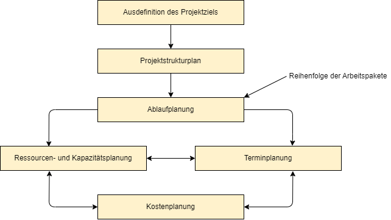

# Konzipieren und Umsetzen von kundenspezifischen Softwareanwendungen

## Was ist ein Projekt?
Beispiele:
+ Hausbau
+ Aufbau einer asiatischen Verkaufsniederlassung
+ Vorbereitung eines Marketing-Events
+ Neueinrichtung Fabrikhalle

## Was sind die Kernaufgaben des Projektmanagements?
+ Terminplanung
+ Kostenplanung
+ Qualitätsplanung
+ Personalmanagement
+ Risikomanagement
+ Change Management
+ Ressourcenmanagement (Konfigurationsmanagement)
+ Projektrolle
+ Projektsteuerung

## Überblick der Planungsschritte

